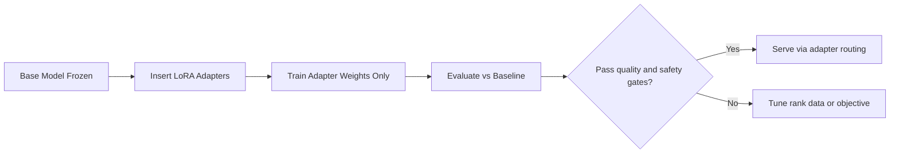
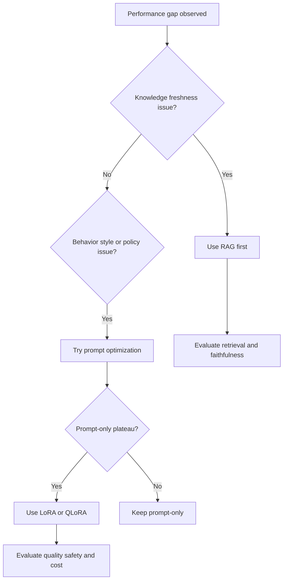
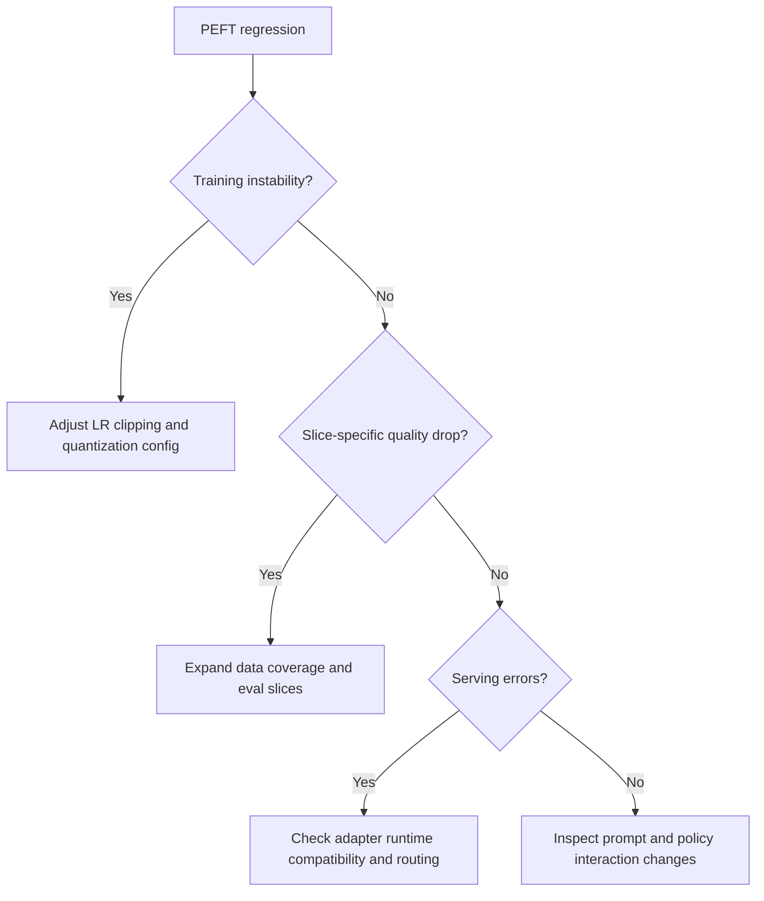

# LoRA and QLoRA Practical Guide

## Why This Matters in 2026
Most teams cannot full-fine-tune large models for every use case. PEFT methods, especially LoRA and QLoRA, let you adapt behavior with lower memory and cost while preserving operational flexibility.

## Mental Model
LoRA learns low-rank updates on top of frozen base weights.

For a weight matrix $W$, LoRA applies:

$$
W' = W + \Delta W, \quad \Delta W = BA
$$

where $A$ and $B$ are low-rank trainable matrices. QLoRA keeps this pattern but quantizes base weights to reduce memory usage during training.

Figure: Practical LoRA adaptation lifecycle.

## 1. Why LoRA Works in Practice
Downstream behavior shifts often lie in lower-dimensional subspaces relative to full parameter space. LoRA exploits this by training compact updates instead of all model weights.

Benefits:
- lower memory footprint
- faster experimentation cycles
- easier adapter-per-task packaging

Limitations:
- insufficient rank may underfit complex task shifts
- poor target-module selection can cap quality

## 2. Target Module Strategy
Common adapter targets include attention projections (`q_proj`, `k_proj`, `v_proj`, `o_proj`) and sometimes feed-forward layers.

Selection guidelines:
- start with attention projections for behavior adaptation
- add FFN targets if task complexity remains unmet
- measure quality gain per additional trainable parameter

## 3. Rank, Alpha, Dropout: Core Knobs
- rank (`r`): adapter capacity
- alpha: effective scaling of update magnitude
- dropout: regularization for adapter overfitting control

Tuning approach:
1. establish prompt-only baseline
2. sweep small rank set
3. validate by slice and safety checks
4. pick minimal rank that meets target

## 4. QLoRA Internals and Caveats
QLoRA quantizes frozen base weights (commonly 4-bit schemes) while training LoRA adapters.

Advantages:
- substantial VRAM reduction
- feasible adaptation on smaller GPUs

Caveats:
- quantization config can affect stability and quality
- optimizer/runtime settings become more sensitive
- not all serving stacks support every adapter-quantization combo equally

## 5. Decision Framework: Prompting vs RAG vs PEFT
Use PEFT when behavior control must be persistent and prompt-only methods plateau.

Do not use PEFT as first choice for frequently changing factual knowledge; use retrieval there.

Figure: Adaptation path selection in production.

## 6. Data and Evaluation Requirements
Adapter quality is data-bound.

Minimum dataset quality bar:
- representative task coverage
- edge and failure cases
- clear output policy examples

Evaluation should include:
- task quality by slice
- safety and refusal behavior
- regression against base model strengths

Without these checks, adapter updates can silently degrade general capability.

## 7. Serving Patterns and Adapter Governance

### Serving Options
- dynamic adapter loading by route/tenant
- merged adapter checkpoints for fixed deployment targets

### Governance
- maintain adapter registry with version metadata
- define compatibility matrix (base model x adapter x quantization)
- enforce rollback path per adapter release

Adapter sprawl without governance causes reliability incidents.

## 8. Cost, Latency, and Reliability Tradeoffs
- training cost: much lower than full fine-tuning
- serving complexity: adapter routing and compatibility management
- reliability risk: many adapters increase operational surface area
- safety risk: each adapter can alter refusal and policy behavior

Treat adapters as production artifacts with full release discipline.

## 9. Debugging Playbook

### Symptom: Adapter improves one slice, hurts others
Likely causes:
- narrow training distribution
- overfitting to style patterns
- insufficient regression coverage

### Symptom: QLoRA unstable training
Likely causes:
- aggressive learning rate
- unsuitable quantization config
- insufficient gradient controls

### Symptom: Serving failures after adapter rollout
Likely causes:
- runtime compatibility mismatch
- incorrect adapter routing
- cache invalidation/version drift

Figure: PEFT troubleshooting flow.

## Practical Implementation Lab (Advanced)
Goal: compare prompt-only, LoRA, and QLoRA under fixed budget with release-safe criteria.

1. Define domain task and eval slices.
2. Run prompt-only baseline.
3. Train LoRA with minimal rank sweep.
4. Train QLoRA variant with same eval protocol.
5. Compare quality, VRAM, latency, and safety metrics.
6. Ship canary with rollback thresholds.

Track:
- quality delta vs baseline
- VRAM and training throughput
- inference latency impact
- safety/refusal regression rate

## Common Pitfalls
- Fine-tuning before proving retrieval/prompt limits.
- No prompt-only baseline for comparison.
- Ignoring adapter lifecycle governance.
- Deploying adapters without safety regression checks.

## Interview Bridge
- Related interview file: [peft-and-rag-questions.md](../interviews/peft-and-rag-questions.md)
- Questions this explainer supports:
  - When is LoRA preferable to RAG?
  - How do you select rank under memory budget?
  - How do you roll out adapters safely in production?

## References
- LoRA paper: https://arxiv.org/abs/2106.09685
- QLoRA paper: https://arxiv.org/abs/2305.14314
- Hugging Face PEFT docs: https://huggingface.co/docs/peft
- vLLM LoRA support: https://docs.vllm.ai/en/latest/features/lora/
