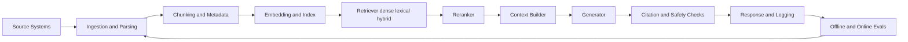
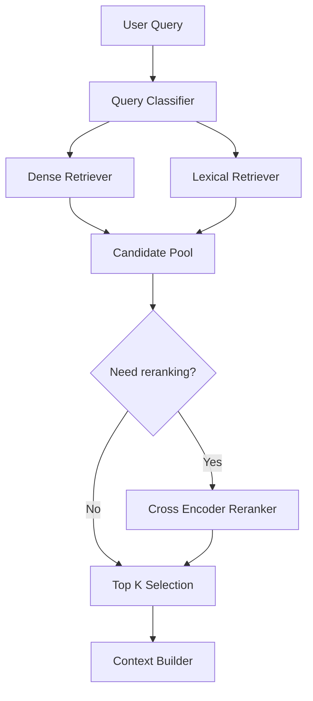
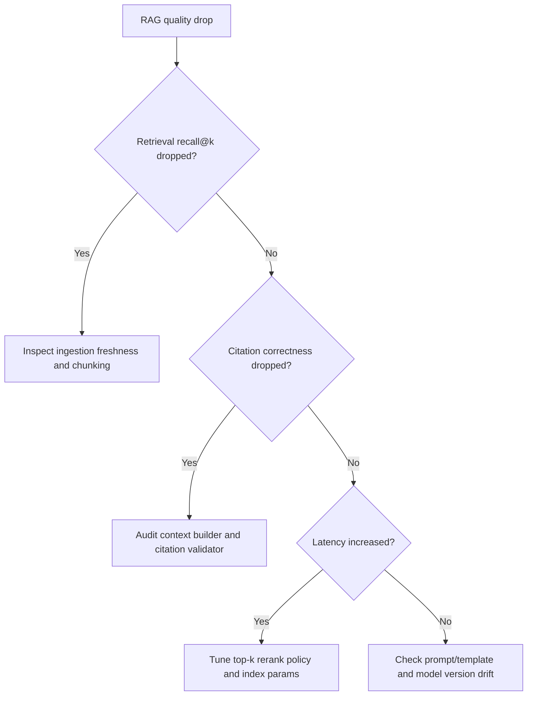

# RAG Pipeline and Retrieval Optimization

## Why This Matters in 2026
Most enterprise GenAI systems are now retrieval-first systems. Teams rarely fail because the generator is weak; they fail because retrieval is noisy, stale, or poorly evaluated. Strong interviews test whether you can reason about retrieval as a data and systems problem, not only as prompt engineering.

## Mental Model: Quality Decomposition
For many RAG systems, end-to-end answer quality can be approximated as:

`Answer quality ~= Retrieval recall@k x Evidence use rate x Generation faithfulness`

If retrieval misses critical evidence, no prompt trick can recover it consistently.

Figure: Closed-loop RAG architecture with continuous evaluation.

## Stage 1: Ingestion Contracts and Data Hygiene

### Canonicalization Pipeline
Before chunking, normalize documents into a canonical schema:
- stable `doc_id`
- versioned `source_timestamp`
- tenant and access labels
- section hierarchy
- raw text plus structural hints (title, heading depth, table flags)

This makes refresh jobs idempotent and enables safe rollbacks.

### Freshness Strategy
Use change-data-capture or scheduled sync based on source volatility:
- high-volatility systems (tickets, incidents): near real-time updates
- medium-volatility docs (wikis): hourly or daily
- low-volatility policy docs: periodic snapshot

Track ingestion lag as a first-class metric.

## Stage 2: Chunking Design (The Highest-Leverage Knob)

### Chunking Patterns
- Fixed-window: simple and fast, good baseline.
- Semantic chunking: split by section boundaries and discourse markers.
- Hierarchical chunking: store parent-child links for retrieval and citation.

### Overlap and Boundary Tradeoffs
Too little overlap creates context fracture. Too much overlap increases index size and duplicate evidence. A practical workflow:
1. Start with moderate overlap (for example 10-20 percent of chunk length).
2. Measure recall@k and duplicate-context rate.
3. Tune overlap and chunk size jointly.

### Metadata Is Not Optional
Attach metadata that supports filtering and attribution:
- tenant
- product/component
- language
- recency bucket
- confidence or approval status

Without metadata, multi-tenant correctness and compliance become brittle.

## Stage 3: Embeddings and Index Strategy

### Embedding Model Selection
Choose by:
- domain alignment (general vs legal vs code)
- multilingual behavior
- latency and cost per query
- vector dimension and memory footprint

Re-embed only after proving uplift on a fixed eval set.

### ANN Index Tradeoffs
- HNSW: strong recall-latency tradeoff at moderate scale.
- IVF/IVF-PQ: better memory efficiency at large scale, higher tuning complexity.
- Flat index: useful for smaller corpora or gold-standard recall baselines.

Index tuning parameters (for example `efSearch`, `nprobe`) should be part of experiment tracking, not ad hoc runtime tweaks.

## Stage 4: Retrieval Policy and Hybrid Search

### Dense + Lexical Fusion
Dense retrieval handles semantic matching. Lexical retrieval captures exact strings, IDs, error codes, and acronyms. Enterprise traffic usually needs both.

Common fusion patterns:
- weighted score fusion
- reciprocal rank fusion
- query-dependent routing (keyword-heavy queries use stronger lexical weight)

Figure: Hybrid retrieval with conditional reranking.

### Query Rewriting
Query rewriting improves retrieval for underspecified prompts:
- resolve pronouns using conversation state
- expand domain abbreviations
- generate alternate lexical forms

Guardrail: log rewritten queries and keep a bypass path for debugging.

## Stage 5: Reranking and Context Construction

### Reranking Where It Matters
Run expensive reranking selectively:
- ambiguous queries
- high-impact user journeys
- low-confidence first-pass retrieval

### Context Builder Rules
High-quality context builders enforce:
- diversity (avoid near-duplicate chunks)
- source balancing (avoid one noisy document dominating)
- token budget partitioning (reserve budget for user question and system constraints)

## Stage 6: Grounding, Citation, and Answer Policies
Require model behavior that is observable and auditable:
- cite chunk IDs or document anchors
- abstain when evidence is missing
- separate facts from inference

Post-generation checks should validate that cited evidence exists and is compatible with answer claims.

## Stage 7: Evaluation Stack

### Retrieval Metrics
- recall@k: did we fetch relevant evidence?
- precision@k: how noisy is top-k?
- MRR/nDCG: are strong candidates near top ranks?

### Generation and Grounding Metrics
- faithfulness to provided context
- citation correctness
- answer completeness
- harmful or policy-violating content rate

### Slice-Based Evaluation
Always break metrics by slices:
- tenant
- language
- query type (how-to, troubleshooting, policy)
- freshness sensitivity

Aggregate averages hide failure pockets.

## Debugging Playbook

### Symptom: Good retrieval metrics, weak final answers
Likely causes:
- context builder ordering errors
- prompt does not force evidence use
- generation model too weak for synthesis

### Symptom: Great offline metrics, poor production outcomes
Likely causes:
- user query distribution shifted
- stale index
- template drift between eval and runtime

### Symptom: High citation rate, low faithfulness
Likely causes:
- model cites unrelated chunks
- citation checks validate format only, not semantic alignment

Figure: Practical diagnosis tree for RAG regressions.

## Practical Implementation Lab (Advanced)
Goal: ship a regression-safe hybrid RAG stack with measurable quality gains.

1. Build ingestion with document versioning and metadata schema.
2. Run baseline dense retriever and save offline metrics by slice.
3. Add lexical retriever and score fusion.
4. Add conditional reranker with query-class routing.
5. Add citation validator and abstention checks.
6. Integrate eval gate in CI before deployment.

Track at minimum:
- retrieval recall@k and precision@k
- citation correctness rate
- faithfulness pass rate
- p95 latency and token cost

## Interview Bridge
- Related interview file: [peft-and-rag-questions.md](../interviews/peft-and-rag-questions.md)
- Questions this explainer helps answer:
  - How do you choose chunking and top-k jointly?
  - When is reranking worth the latency cost?
  - How do you isolate ingestion issues from generation issues?

## References
- RAG original paper: https://arxiv.org/abs/2005.11401
- ColBERT (late interaction retrieval): https://arxiv.org/abs/2004.12832
- BEIR benchmark: https://arxiv.org/abs/2104.08663
- LlamaIndex optimization basics: https://developers.llamaindex.ai/python/framework/optimizing/basic_strategies/basic_strategies/
- Pinecone RAG explainer: https://www.pinecone.io/learn/retrieval-augmented-generation/
- Milvus overview: https://milvus.io/docs/overview.md
