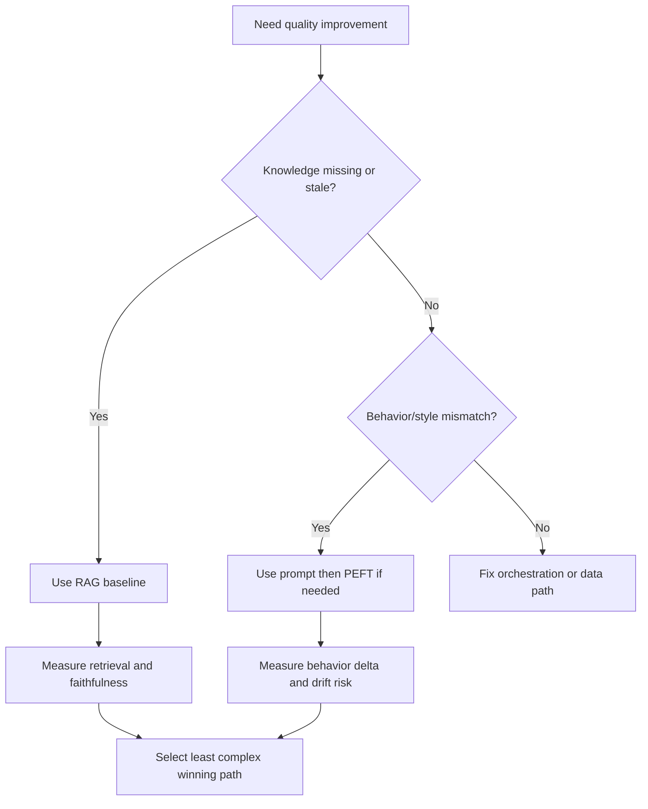

# PEFT and RAG Interview Questions

## Scope
This file targets high-depth interviews on adaptation strategy, retrieval architecture, and production-safe optimization.

## How To Use This File
- Practice top questions with four layers:
  1. short answer
  2. deep answer
  3. follow-up ladder
  4. anti-pattern answer to avoid
- Use retrieval metrics and rollout controls in every systems answer.

## Interviewer Probe Map
- Can you separate knowledge problems from behavior problems?
- Can you debug RAG by stage instead of guessing at prompts?
- Can you justify cost, latency, and quality tradeoffs with metrics?



Figure: Adaptation choice path for interviews and design rounds.

## Question Clusters
- Foundations: Q1 to Q10
- Systems and Rollout: Q11 to Q20
- Debugging and Incidents: Q21 to Q28

## Foundations

### Q1: Prompting vs RAG vs LoRA decision
What interviewer is probing:
- Strategy selection under changing constraints.

Short answer:
Use prompting for lightweight behavior shaping, RAG for dynamic knowledge grounding, and LoRA/PEFT for durable behavior adaptation when prompt-only performance plateaus.

Deep answer:
1. Classify gap: missing facts, weak reasoning pattern, or style/control issue.
2. Start with the least invasive option that can be evaluated quickly.
3. If facts are stale or private, choose RAG first.
4. If behavior is consistently wrong despite strong context, evaluate PEFT.
5. Define rollback criteria before rollout.

Follow-up ladder:
- How would you compare options with the same latency budget?
- When is PEFT a mistake for enterprise knowledge tasks?

Anti-pattern answer:
"Fine-tune first because it is more powerful" without diagnosing problem type.

### Q2: How do you choose LoRA rank?
What interviewer is probing:
- Practical PEFT tuning and overfitting awareness.

Short answer:
Treat rank as a capacity knob: increase until marginal quality gain flattens relative to latency and memory cost.

Deep answer:
Run a small rank sweep (for example low, medium, high) on a fixed eval set. Track quality gain, variance across slices, and inference overhead. Prefer the smallest rank that meets target metrics and remains stable across domains.

Follow-up ladder:
- What signs indicate rank is too low?
- How do you detect PEFT overfitting on narrow data?

Anti-pattern answer:
Choosing rank by convention with no eval evidence.

### Q3: Diagnose weak RAG faithfulness
What interviewer is probing:
- Retrieval-first debugging discipline.

Short answer:
Separate retrieval quality from generation behavior before changing prompts or models.

Deep answer:
1. Measure retrieval recall@k and precision@k on failing queries.
2. Validate citation correctness and context ordering.
3. Inspect chunk boundaries and metadata filters.
4. Add or tune reranker only if first-pass retrieval is noisy.
5. Tighten grounded prompting and abstention policy.

Follow-up ladder:
- If recall is high but faithfulness is low, where do you look next?
- What online metric catches this regression early?

Anti-pattern answer:
Blindly increasing top-k and token budget.

### Q4: When should you use hybrid retrieval?
What interviewer is probing:
- Dense and lexical tradeoff reasoning.

Short answer:
Use hybrid when traffic includes IDs, product names, acronyms, or exact-match constraints that dense retrieval misses.

Deep answer:
Dense handles semantic recall, lexical preserves exact constraints. Enterprise corpora usually require both. Use rank fusion and evaluate by query slice. Hybrid should be justified by measurable gains on ID-heavy and troubleshooting queries.

### Q5: How do you build a RAG eval set?
What interviewer is probing:
- Evaluation design and regression safety.

Short answer:
Create a slice-balanced set with gold evidence references and expected answer properties.

Deep answer:
Include high-frequency tasks, edge cases, and adversarial prompts. Label relevant chunks and define graders for retrieval and faithfulness. Keep the set versioned and tie each production change to eval deltas.

### Q6: Why can larger chunks hurt relevance?
What interviewer is probing:
- Chunking granularity intuition.

### Q7: How do you reduce RAG latency without quality collapse?
What interviewer is probing:
- Optimization under SLO pressure.

### Q8: Context-window expansion vs better retrieval quality
What interviewer is probing:
- Cost-aware architecture judgment.

### Q9: Multi-tenant access control in RAG
What interviewer is probing:
- Security and isolation in retrieval systems.

### Q10: Metadata schema for traceable citations
What interviewer is probing:
- Data modeling for auditability.

## Systems and Rollout

### Q11: Embedding model migration plan with low risk
What interviewer is probing:
- Safe migration design.

### Q12: ANN index parameter tuning strategy
What interviewer is probing:
- Recall-latency tuning under constraints.

### Q13: Retrieval latency budget decomposition
What interviewer is probing:
- Component-level performance ownership.

### Q14: Query rewriting policy and safety controls
What interviewer is probing:
- Correctness and observability of query transforms.

### Q15: When PEFT beats prompt-only methods
What interviewer is probing:
- Long-term adaptation strategy.

### Q16: QLoRA production caveats
What interviewer is probing:
- Quantization plus adaptation risk awareness.

### Q17: Offline improvements but online regressions
What interviewer is probing:
- Distribution-shift diagnosis.

### Q18: Citation verification architecture
What interviewer is probing:
- Grounding enforcement beyond formatting checks.

### Q19: Cold-start strategy for new corpus
What interviewer is probing:
- Pragmatic bootstrapping decisions.

### Q20: Multilingual retrieval architecture choices
What interviewer is probing:
- Cross-language search quality reasoning.

## Debugging and Incidents

### Q21: Faithfulness dropped but recall@k is stable
What interviewer is probing:
- Stage isolation discipline.

### Q22: Recall dropped after ingestion pipeline change
What interviewer is probing:
- Data pipeline regression debugging.

### Q23: Increasing top-k made answers worse
What interviewer is probing:
- Context-noise tradeoff understanding.

### Q24: Reranker helps offline but hurts p95 online
What interviewer is probing:
- Production gating and selective routing.

### Q25: Model returns citations that look valid but are wrong
What interviewer is probing:
- Semantic citation verification design.

### Q26: Tenant leakage incident in retrieval logs
What interviewer is probing:
- Incident handling and containment.

### Q27: Is regression from model swap or retriever drift?
What interviewer is probing:
- Layered attribution methodology.

### Q28: Rollback criteria for RAG deployment
What interviewer is probing:
- Operational discipline under pressure.

```mermaid
flowchart TD
    A[RAG Failure Reported] --> B{Recall@k dropped?}
    B -- Yes --> C[Inspect ingestion freshness chunking filters]
    B -- No --> D{Citation correctness dropped?}
    D -- Yes --> E[Audit context builder and citation validator]
    D -- No --> F{Latency spike?}
    F -- Yes --> G[Tune top-k rerank thresholds and index params]
    F -- No --> H[Inspect prompt template and model changes]
```

Figure: Fast triage path for retrieval and grounding incidents.

## Rapid-Fire Round
- Two signs reranking is worth its latency tax.
- Three causes of citation mismatch despite high recall.
- One case where PEFT clearly outperforms prompt-only adaptation.
- Two reasons query rewriting can reduce trust if unobserved.

## Company Emphasis
- Amazon:
  - explicit cost and operational ownership.
  - measurable rollback criteria.
- Google:
  - stronger retrieval metric fluency and ablation rigor.
  - deeper follow-ups on embedding/index tradeoffs.
- Startup:
  - fast iterative loops and pragmatic architecture decisions.
  - clear prioritization under small-team constraints.

## References
- [lora-and-qlora-practical-guide.md](../explainers/lora-and-qlora-practical-guide.md)
- [rag-pipeline-and-retrieval-optimization.md](../explainers/rag-pipeline-and-retrieval-optimization.md)
- RAG paper: https://arxiv.org/abs/2005.11401
- BEIR benchmark: https://arxiv.org/abs/2104.08663
