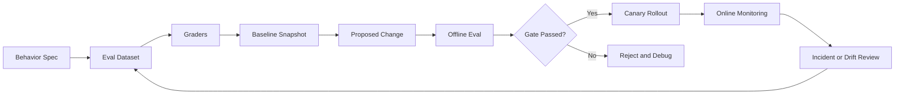
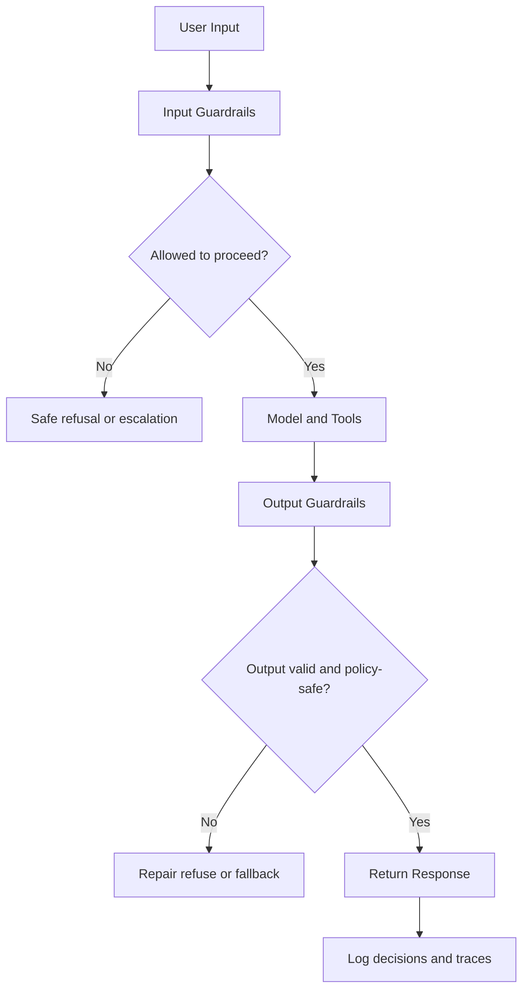

# Evals, Regression Testing, and Guardrails

## Why This Matters in 2026
In modern GenAI stacks, every meaningful change can shift quality, cost, and safety at the same time. Teams that ship safely are eval-driven teams: they define expected behavior, measure it continuously, and gate deployment with explicit risk policies.

## Operating Model
Treat evals as product infrastructure, not side experiments.

Figure: Continuous evaluation and release gate loop.

## 1. Behavior Specification Before Metrics
Start by writing expected behavior in testable language.

Good specification dimensions:
- task success criteria
- acceptable refusal behavior
- policy boundaries
- output format guarantees
- latency and cost constraints

If specification is ambiguous, metrics become noisy and easy to game.

## 2. Eval Dataset Design

### Dataset Buckets
- Representative bucket: common production traffic.
- Edge bucket: uncommon but valid tasks.
- Adversarial bucket: prompt injection, policy evasion, malformed inputs.
- High-impact bucket: workflows with strict correctness requirements.

### Labeling Strategy
Use layered labels:
- binary pass/fail for critical checks
- rubric scores for nuanced quality
- evidence labels for retrieval-grounded tasks

Version the dataset and track change logs to avoid benchmark drift.

## 3. Grader Architecture

### Deterministic Graders
Use for schema, exact fields, citation format, and safety regex checks.

### Model-Judge Graders
Use for coherence, relevance, and faithfulness, but calibrate regularly against human-reviewed subsets.

### Human Review
Reserve for high-risk domains and ambiguous failures.

Practical rule: at least one deterministic guard should exist for each critical failure class.

## 4. Regression Gates in CI

### Gate Policy Template
Define three regions:
- pass: deploy allowed automatically
- warning: manual review required
- fail: deployment blocked

Gate across multiple dimensions:
- quality pass rate
- safety violation rate
- latency budget impact
- cost per request impact

Avoid single-score gates; they mask tradeoff failures.

### Statistical Discipline
For small eval sets, require confidence-aware interpretation. Use confidence intervals or bootstrap sampling for unstable metrics. Do not overreact to tiny deltas without variance context.

## 5. Guardrail Architecture

Figure: Layered runtime guardrails around model execution.

### Input Guardrails
- prompt injection and exfiltration pattern checks
- tool permission checks
- tenant and data access validation

### Output Guardrails
- JSON/schema validation
- policy violation checks
- grounding/citation checks for RAG flows

### Tool Guardrails
- allowlist tools and arguments
- max tool iterations
- timeout and budget caps

## 6. Prompt Injection and Tool Safety
Prompt injection is often a trust-boundary problem, not just a prompt wording problem.

Defensive patterns:
- treat external documents as untrusted
- never allow instructions in retrieved text to override system policy
- separate control-plane instructions from data-plane content
- require explicit policy checks before tool execution

## 7. Online Monitoring and Drift Detection
Monitor by slice and release version:
- pass/fail rate by scenario class
- refusal and abstention trends
- safety violation rate
- p95 latency and token cost
- tool-call error rate

Trigger alerts on shifts, not only absolute thresholds.

## 8. Incident Response Playbook

When a regression is detected:
1. Freeze rollout and compare against last-known-good build.
2. Attribute failure layer: prompt, model, retrieval, tooling, or guardrail.
3. Run targeted replay set for the failing slice.
4. Roll back or hotfix based on pre-defined policy.
5. Add incident cases to permanent eval dataset.

A mature team treats each incident as dataset expansion, not just a one-time fix.

## Practical Implementation Lab (Advanced)
Goal: ship a CI-gated eval and guardrail stack for a tool-calling RAG assistant.

1. Write behavior spec and risk classes.
2. Build JSONL eval dataset with representative, edge, and adversarial buckets.
3. Implement deterministic plus model-judge graders.
4. Add multi-metric gate in GitHub Actions.
5. Add input/output/tool guardrails in serving path.
6. Add online drift dashboard and incident replay suite.

Minimum metrics:
- overall pass rate and per-slice pass rate
- safety violation rate
- false-positive guardrail rate
- p95 latency impact from guardrails
- rollback frequency by release

## Common Pitfalls
- Evaluating only averages without slice analysis.
- Using one grader for all failure modes.
- Shipping guardrails without false-positive monitoring.
- Treating evals as optional during release pressure.

## Interview Bridge
- Related interview file: [agents-evals-and-safety-questions.md](../interviews/agents-evals-and-safety-questions.md)
- Questions this explainer supports:
  - How do you design a gate policy that balances quality and safety?
  - How do you calibrate model-judge graders?
  - How do you turn incidents into permanent regression tests?

## References
- OpenAI eval guidance: https://platform.openai.com/docs/guides/evals
- OpenAI eval framework: https://github.com/openai/evals
- NIST AI RMF: https://www.nist.gov/itl/ai-risk-management-framework
- Prompting risks and adversarial prompting: https://www.promptingguide.ai/risks
