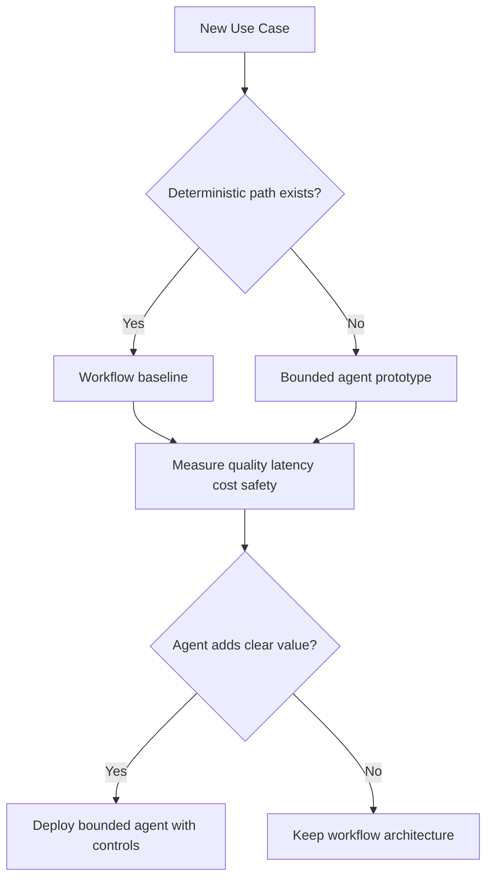
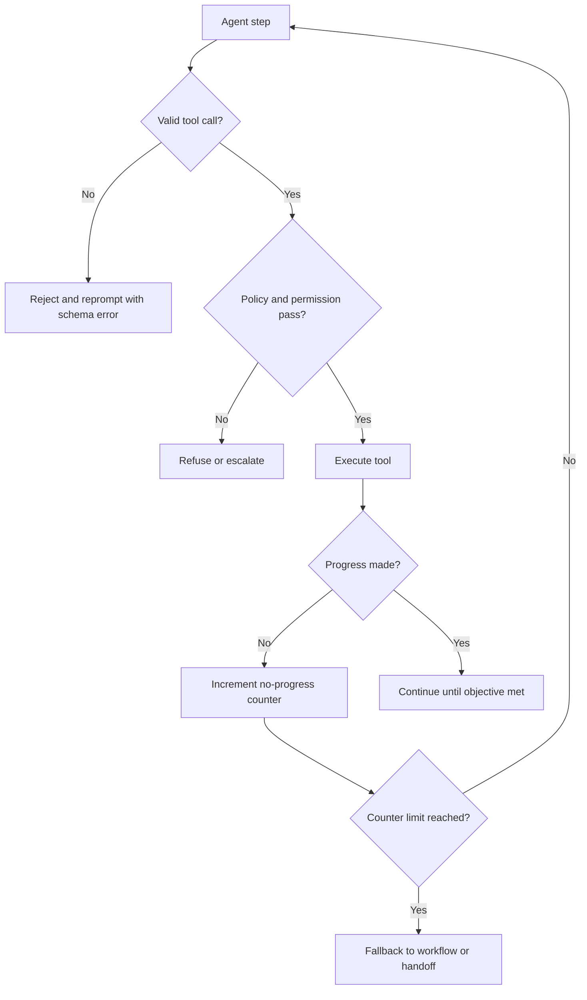

# Workflows vs Agents and Tool Calling

## Why This Matters in 2026
Teams often over-apply autonomous agents where deterministic workflows are faster, safer, and cheaper. Strong GenAI engineers are judged on architecture restraint: choosing the minimum autonomy needed to meet quality goals.

## Autonomy Ladder
Choose the least complex pattern that satisfies requirements:
1. single-turn model call
2. deterministic workflow with fixed routing
3. bounded agent with dynamic planning and tool use

Move up only when evaluation shows measurable improvement.

Figure: Architecture decision path for workflow versus agent.

## 1. Deterministic Workflows

### Strengths
- predictable latency and cost
- simple observability and audits
- easier compliance and rollback

### Best Fit
- known task states and transitions
- high-risk business operations
- strict schema/output requirements

### Design Pattern
Use explicit state machine transitions with policy checks at each step.

## 2. Agents and Dynamic Planning

### Strengths
- handles ambiguous tasks
- adapts to unknown intermediate states
- supports exploratory workflows

### Risks
- tool loop amplification
- compounding errors across steps
- harder attribution and debugging

A good production agent is never unconstrained; it is autonomy with hard limits.

## 3. Tool Contract Design
Tool-calling reliability depends on strong contracts:
- clear tool purpose
- strict argument schema
- deterministic error semantics
- explicit side-effect policy

Add pre-execution validation and post-execution sanity checks. Never allow tool side effects from unvalidated arguments.

## 4. Execution Guards and Halting Policy
Minimum runtime controls:
- max steps
- max tool calls
- max token budget
- per-step timeout
- explicit halt condition when no progress

Progress can be defined as state delta, evidence gain, or objective completion confidence.

## 5. Safety and Security Boundaries
Treat retrieved content and tool outputs as untrusted inputs.

Controls:
- permissioned tool allowlist
- argument-level policy enforcement
- tenant data boundary checks
- refusal/escalation path on ambiguous sensitive actions

Prompt instructions alone are insufficient for tool safety.

## 6. Evaluation Strategy
Evaluate at trajectory level, not only final answer.

Track:
- task completion quality
- tool-call efficiency
- loop/abort rate
- policy violation rate
- latency and token budget adherence

Use replay sets from real failures as permanent regression coverage.

## 7. Production Deployment Pattern
Recommended rollout:
1. workflow baseline in production
2. bounded agent in shadow/canary
3. compare with same workload slices
4. promote only if quality lift justifies extra risk and cost

Keep deterministic fallback path active even after agent launch.

## 8. Failure Modes and Mitigations

Common failures:
- wrong tool selection
- malformed arguments
- repeated low-value calls
- silent policy bypass through tool chain

Mitigations:
- tool schema hardening
- action-level validation
- no-progress detection and forced fallback
- mandatory trace logs per tool step

Figure: Bounded tool-calling loop with policy and progress guards.

## 9. Debugging Playbook

### Symptom: High success offline, poor production quality
Likely causes:
- eval dataset not representative
- missing real-world edge-case tools
- different tool latency/error behavior in production

### Symptom: Cost spikes after enabling agent mode
Likely causes:
- missing tool/token caps
- no-progress loops
- retrieval over-expansion per step

### Symptom: Safety incidents despite refusal prompts
Likely causes:
- tool policy checks outside trusted boundary
- insufficient argument validation
- indirect prompt injection through retrieved content

## Practical Implementation Lab (Advanced)
Goal: build a workflow-first assistant and a bounded-agent variant, then compare with governance metrics.

1. Implement deterministic workflow baseline.
2. Implement bounded agent with same tools.
3. Add strict tool schemas and policy middleware.
4. Add step/budget/timeout/no-progress guards.
5. Run both systems on same task slices.
6. Gate rollout by quality, safety, latency, and cost thresholds.

Track:
- task success rate
- tool calls per task
- loop and fallback rate
- policy violation rate
- p95 latency and token spend

## Common Pitfalls
- Starting with agents before proving workflow limits.
- Vague tool docs and weak schema contracts.
- Missing hard execution caps.
- No fallback or incident replay strategy.

## Interview Bridge
- Related interview file: [agents-evals-and-safety-questions.md](../interviews/agents-evals-and-safety-questions.md)
- Questions this explainer supports:
  - Which criteria choose workflow vs agent?
  - How do you stop tool loops safely?
  - How do you evaluate multi-step tool-use quality?

## References
- Anthropic guide on effective agents: https://www.anthropic.com/engineering/building-effective-agents
- ReAct paper: https://arxiv.org/abs/2210.03629
- Prompting guide agents: https://www.promptingguide.ai/agents
