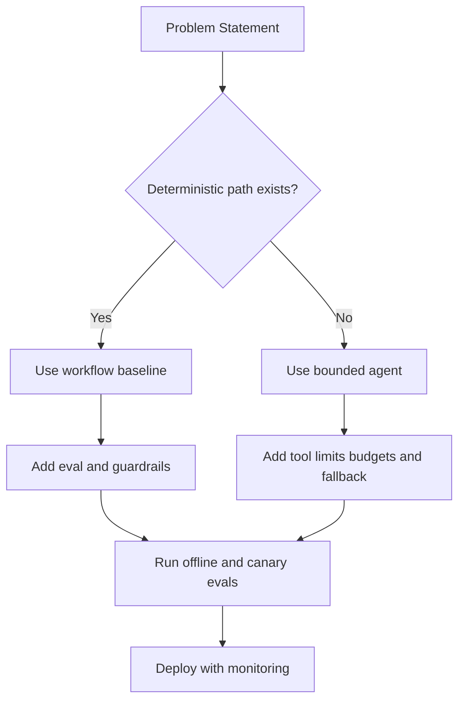
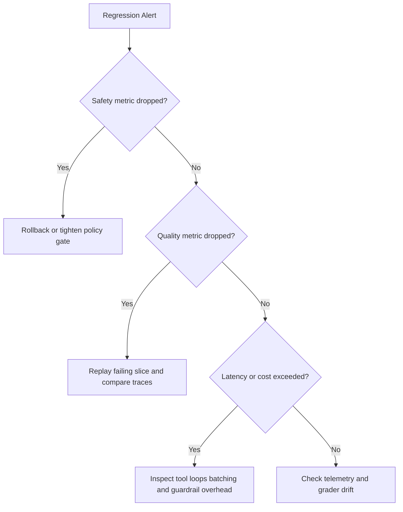

# Agents, Evals, and Safety Interview Questions

## Scope
This file prepares advanced interviews on workflow versus agent decisions, reliability controls, and safety governance under production constraints.

## How To Use This File
- For top questions, answer in four layers:
  1. short answer
  2. deep answer
  3. follow-up ladder
  4. anti-pattern answer to avoid
- Always anchor answers in measurable controls: eval metrics, budgets, and rollback criteria.

## Interviewer Probe Map
- Can you avoid unnecessary autonomy and still deliver quality?
- Can you evaluate multi-step behavior beyond single-turn accuracy?
- Can you defend safety controls without breaking usability?



Figure: Architecture selection path for workflow and agent systems.

## Question Clusters
- Architecture and Control: Q1 to Q10
- Evals and Governance: Q11 to Q20
- Incidents and Debugging: Q21 to Q30

## Architecture and Control

### Q1: Workflow versus agent for a given product
What interviewer is probing:
- Judgment on autonomy, risk, and operational complexity.

Direct answer:
Default to workflows for deterministic tasks. Use agents only when uncertainty handling creates measurable product gain.

Deep answer:
1. Classify task determinism, tool-call variability, and error impact.
2. Build a workflow baseline with explicit states.
3. Introduce agent autonomy only where baseline fails on defined metrics.
4. Add hard limits: max steps, max tool calls, budget caps, timeout policy.
5. Define fallback path and human handoff.

Follow-up variants:
- Which metric proves an agent is worth its complexity?
- How do you prevent hidden tool loops?

Common mistakes and red flags:
"Agents are the future, so use agents everywhere."

Sample code or pseudocode (when relevant):
```text
# Interview outline
1) Validate inputs and constraints
2) Apply core strategy
3) Add failure handling and observability hooks
```
### Q2: Preventing infinite tool loops
What interviewer is probing:
- Failure containment and runtime safety.

Direct answer:
Use bounded execution with progress checks and deterministic fallback.

Deep answer:
Implement max-iteration and max-tool-call limits per request. Add progress heuristics (state delta, confidence delta, or objective completion checks). If progress stalls, trigger fallback template or escalation. Log loop signatures for replay tests.

Follow-up variants:
- How do you distinguish a hard task from a looping failure?
- Which logs are required for forensic replay?

Common mistakes and red flags:
Increasing max iterations without diagnosis.

Sample code or pseudocode (when relevant):
```text
# Interview outline
1) Validate inputs and constraints
2) Apply core strategy
3) Add failure handling and observability hooks
```
### Q3: Eval design for multi-step agents
What interviewer is probing:
- Ability to evaluate trajectories, not only outputs.

Direct answer:
Score both final outcome and intermediate behavior quality.

Deep answer:
Create eval cases with expected end state plus acceptable tool trajectory constraints. Grade final correctness, tool-call efficiency, policy compliance, and refusal correctness. Track per-step failure classes to avoid "final answer only" blind spots.

Common mistakes and red flags:
- Naming tools or algorithms without mapping them to constraints.
- Ignoring edge cases, failure modes, or rollback triggers.
- Skipping metrics needed to prove the design works in production.

Follow-up variants:
- What changes if throughput doubles or latency budget is cut in half?
- Which single metric would trigger rollback after deployment?

Sample code or pseudocode (when relevant):
```text
# Interview outline
1) Validate inputs and constraints
2) Apply core strategy
3) Add failure handling and observability hooks
```
### Q4: Prompt injection defense in tool-calling systems
What interviewer is probing:
- Security controls and trust boundaries.

Direct answer:
Treat external content as untrusted data and enforce tool policies outside the model prompt.

Deep answer:
Separate control-plane instructions from data-plane text. Never execute tool commands based only on retrieved content instructions. Use allowlisted tools, argument validation, and policy checks before execution. Add post-tool verification for sensitive operations.

Common mistakes and red flags:
- Naming tools or algorithms without mapping them to constraints.
- Ignoring edge cases, failure modes, or rollback triggers.
- Skipping metrics needed to prove the design works in production.

Follow-up variants:
- What changes if throughput doubles or latency budget is cut in half?
- Which single metric would trigger rollback after deployment?

Sample code or pseudocode (when relevant):
```text
# Interview outline
1) Validate inputs and constraints
2) Apply core strategy
3) Add failure handling and observability hooks
```
### Q5: CI gating for LLM and prompt changes
What interviewer is probing:
- Release discipline and regression prevention.

Direct answer:
Block deployment when quality, safety, latency, or cost thresholds regress.

Deep answer:
Run offline eval suite in CI on every model/prompt/tooling change. Gate with multi-metric policy and confidence-aware thresholds. Require manual review for borderline changes and record release decisions for auditability.

Common mistakes and red flags:
- Naming tools or algorithms without mapping them to constraints.
- Ignoring edge cases, failure modes, or rollback triggers.
- Skipping metrics needed to prove the design works in production.

Follow-up variants:
- What changes if throughput doubles or latency budget is cut in half?
- Which single metric would trigger rollback after deployment?

Sample code or pseudocode (when relevant):
```text
# Interview outline
1) Validate inputs and constraints
2) Apply core strategy
3) Add failure handling and observability hooks
```
### Q6: False positives in guardrails
What interviewer is probing:
- Balancing safety with user experience.

Direct answer:
Use a clear, constraint-first decision for false positives in guardrails, then state one production tradeoff (latency, cost, or reliability).

Deep answer:
1. State assumptions, constraints, and success metric.
2. Explain the chosen design or algorithm and why alternatives are weaker.
3. Cover failure handling, observability, and rollback criteria.

Common mistakes and red flags:
- Naming tools or algorithms without mapping them to constraints.
- Ignoring edge cases, failure modes, or rollback triggers.
- Skipping metrics needed to prove the design works in production.

Follow-up variants:
- What changes if throughput doubles or latency budget is cut in half?
- Which single metric would trigger rollback after deployment?

Sample code or pseudocode (when relevant):
```text
# Interview outline
1) Validate inputs and constraints
2) Apply core strategy
3) Add failure handling and observability hooks
```
### Q7: Tool permission model for enterprise agents
What interviewer is probing:
- Principle-of-least-privilege design.

Direct answer:
Use a clear, constraint-first decision for tool permission model for enterprise agents, then state one production tradeoff (latency, cost, or reliability).

Deep answer:
1. State assumptions, constraints, and success metric.
2. Explain the chosen design or algorithm and why alternatives are weaker.
3. Cover failure handling, observability, and rollback criteria.

Common mistakes and red flags:
- Naming tools or algorithms without mapping them to constraints.
- Ignoring edge cases, failure modes, or rollback triggers.
- Skipping metrics needed to prove the design works in production.

Follow-up variants:
- What changes if throughput doubles or latency budget is cut in half?
- Which single metric would trigger rollback after deployment?

Sample code or pseudocode (when relevant):
```text
# Interview outline
1) Validate inputs and constraints
2) Apply core strategy
3) Add failure handling and observability hooks
```
### Q8: Designing reliable fallback behaviors
What interviewer is probing:
- Graceful degradation strategy.

Direct answer:
Use a clear, constraint-first decision for designing reliable fallback behaviors, then state one production tradeoff (latency, cost, or reliability).

Deep answer:
1. State assumptions, constraints, and success metric.
2. Explain the chosen design or algorithm and why alternatives are weaker.
3. Cover failure handling, observability, and rollback criteria.

Common mistakes and red flags:
- Naming tools or algorithms without mapping them to constraints.
- Ignoring edge cases, failure modes, or rollback triggers.
- Skipping metrics needed to prove the design works in production.

Follow-up variants:
- What changes if throughput doubles or latency budget is cut in half?
- Which single metric would trigger rollback after deployment?

Sample code or pseudocode (when relevant):
```text
# Interview outline
1) Validate inputs and constraints
2) Apply core strategy
3) Add failure handling and observability hooks
```
### Q9: Structured output reliability in agent chains
What interviewer is probing:
- Parsing robustness and schema control.

Direct answer:
Use a clear, constraint-first decision for structured output reliability in agent chains, then state one production tradeoff (latency, cost, or reliability).

Deep answer:
1. State assumptions, constraints, and success metric.
2. Explain the chosen design or algorithm and why alternatives are weaker.
3. Cover failure handling, observability, and rollback criteria.

Common mistakes and red flags:
- Naming tools or algorithms without mapping them to constraints.
- Ignoring edge cases, failure modes, or rollback triggers.
- Skipping metrics needed to prove the design works in production.

Follow-up variants:
- What changes if throughput doubles or latency budget is cut in half?
- Which single metric would trigger rollback after deployment?

Sample code or pseudocode (when relevant):
```text
# Interview outline
1) Validate inputs and constraints
2) Apply core strategy
3) Add failure handling and observability hooks
```
### Q10: Human-in-the-loop trigger policies
What interviewer is probing:
- Escalation design and risk management.

## Evals and Governance

Direct answer:
Use a clear, constraint-first decision for human-in-the-loop trigger policies, then state one production tradeoff (latency, cost, or reliability).

Deep answer:
1. State assumptions, constraints, and success metric.
2. Explain the chosen design or algorithm and why alternatives are weaker.
3. Cover failure handling, observability, and rollback criteria.

Common mistakes and red flags:
- Naming tools or algorithms without mapping them to constraints.
- Ignoring edge cases, failure modes, or rollback triggers.
- Skipping metrics needed to prove the design works in production.

Follow-up variants:
- What changes if throughput doubles or latency budget is cut in half?
- Which single metric would trigger rollback after deployment?

Sample code or pseudocode (when relevant):
```text
# Interview outline
1) Validate inputs and constraints
2) Apply core strategy
3) Add failure handling and observability hooks
```
### Q11: Building a high-signal eval set with limited budget
What interviewer is probing:
- Prioritization and dataset design.

Direct answer:
Use a clear, constraint-first decision for building a high-signal eval set with limited budget, then state one production tradeoff (latency, cost, or reliability).

Deep answer:
1. State assumptions, constraints, and success metric.
2. Explain the chosen design or algorithm and why alternatives are weaker.
3. Cover failure handling, observability, and rollback criteria.

Common mistakes and red flags:
- Naming tools or algorithms without mapping them to constraints.
- Ignoring edge cases, failure modes, or rollback triggers.
- Skipping metrics needed to prove the design works in production.

Follow-up variants:
- What changes if throughput doubles or latency budget is cut in half?
- Which single metric would trigger rollback after deployment?

Sample code or pseudocode (when relevant):
```text
# Interview outline
1) Validate inputs and constraints
2) Apply core strategy
3) Add failure handling and observability hooks
```
### Q12: Deterministic graders vs model-judge graders
What interviewer is probing:
- Grader reliability and calibration knowledge.

Direct answer:
Use a clear, constraint-first decision for deterministic graders vs model-judge graders, then state one production tradeoff (latency, cost, or reliability).

Deep answer:
1. State assumptions, constraints, and success metric.
2. Explain the chosen design or algorithm and why alternatives are weaker.
3. Cover failure handling, observability, and rollback criteria.

Common mistakes and red flags:
- Naming tools or algorithms without mapping them to constraints.
- Ignoring edge cases, failure modes, or rollback triggers.
- Skipping metrics needed to prove the design works in production.

Follow-up variants:
- What changes if throughput doubles or latency budget is cut in half?
- Which single metric would trigger rollback after deployment?

Sample code or pseudocode (when relevant):
```text
# Interview outline
1) Validate inputs and constraints
2) Apply core strategy
3) Add failure handling and observability hooks
```
### Q13: Slice-based metrics for safety drift
What interviewer is probing:
- Monitoring granularity and hidden-failure detection.

Direct answer:
Use a clear, constraint-first decision for slice-based metrics for safety drift, then state one production tradeoff (latency, cost, or reliability).

Deep answer:
1. State assumptions, constraints, and success metric.
2. Explain the chosen design or algorithm and why alternatives are weaker.
3. Cover failure handling, observability, and rollback criteria.

Common mistakes and red flags:
- Naming tools or algorithms without mapping them to constraints.
- Ignoring edge cases, failure modes, or rollback triggers.
- Skipping metrics needed to prove the design works in production.

Follow-up variants:
- What changes if throughput doubles or latency budget is cut in half?
- Which single metric would trigger rollback after deployment?

Sample code or pseudocode (when relevant):
```text
# Interview outline
1) Validate inputs and constraints
2) Apply core strategy
3) Add failure handling and observability hooks
```
### Q14: Gate policy for high-risk product surfaces
What interviewer is probing:
- Governance maturity.

Direct answer:
Use a clear, constraint-first decision for gate policy for high-risk product surfaces, then state one production tradeoff (latency, cost, or reliability).

Deep answer:
1. State assumptions, constraints, and success metric.
2. Explain the chosen design or algorithm and why alternatives are weaker.
3. Cover failure handling, observability, and rollback criteria.

Common mistakes and red flags:
- Naming tools or algorithms without mapping them to constraints.
- Ignoring edge cases, failure modes, or rollback triggers.
- Skipping metrics needed to prove the design works in production.

Follow-up variants:
- What changes if throughput doubles or latency budget is cut in half?
- Which single metric would trigger rollback after deployment?

Sample code or pseudocode (when relevant):
```text
# Interview outline
1) Validate inputs and constraints
2) Apply core strategy
3) Add failure handling and observability hooks
```
### Q15: Measuring refusal quality, not just refusal rate
What interviewer is probing:
- UX-aware safety reasoning.

Direct answer:
Use a clear, constraint-first decision for measuring refusal quality, not just refusal rate, then state one production tradeoff (latency, cost, or reliability).

Deep answer:
1. State assumptions, constraints, and success metric.
2. Explain the chosen design or algorithm and why alternatives are weaker.
3. Cover failure handling, observability, and rollback criteria.

Common mistakes and red flags:
- Naming tools or algorithms without mapping them to constraints.
- Ignoring edge cases, failure modes, or rollback triggers.
- Skipping metrics needed to prove the design works in production.

Follow-up variants:
- What changes if throughput doubles or latency budget is cut in half?
- Which single metric would trigger rollback after deployment?

Sample code or pseudocode (when relevant):
```text
# Interview outline
1) Validate inputs and constraints
2) Apply core strategy
3) Add failure handling and observability hooks
```
### Q16: Adversarial eval generation process
What interviewer is probing:
- Red-team and robustness mindset.

Direct answer:
Use a clear, constraint-first decision for adversarial eval generation process, then state one production tradeoff (latency, cost, or reliability).

Deep answer:
1. State assumptions, constraints, and success metric.
2. Explain the chosen design or algorithm and why alternatives are weaker.
3. Cover failure handling, observability, and rollback criteria.

Common mistakes and red flags:
- Naming tools or algorithms without mapping them to constraints.
- Ignoring edge cases, failure modes, or rollback triggers.
- Skipping metrics needed to prove the design works in production.

Follow-up variants:
- What changes if throughput doubles or latency budget is cut in half?
- Which single metric would trigger rollback after deployment?

Sample code or pseudocode (when relevant):
```text
# Interview outline
1) Validate inputs and constraints
2) Apply core strategy
3) Add failure handling and observability hooks
```
### Q17: Canary strategy for agent upgrades
What interviewer is probing:
- Controlled rollout discipline.

Direct answer:
Use a clear, constraint-first decision for canary strategy for agent upgrades, then state one production tradeoff (latency, cost, or reliability).

Deep answer:
1. State assumptions, constraints, and success metric.
2. Explain the chosen design or algorithm and why alternatives are weaker.
3. Cover failure handling, observability, and rollback criteria.

Common mistakes and red flags:
- Naming tools or algorithms without mapping them to constraints.
- Ignoring edge cases, failure modes, or rollback triggers.
- Skipping metrics needed to prove the design works in production.

Follow-up variants:
- What changes if throughput doubles or latency budget is cut in half?
- Which single metric would trigger rollback after deployment?

Sample code or pseudocode (when relevant):
```text
# Interview outline
1) Validate inputs and constraints
2) Apply core strategy
3) Add failure handling and observability hooks
```
### Q18: Audit trail requirements for regulated environments
What interviewer is probing:
- Compliance and traceability awareness.

Direct answer:
Use a clear, constraint-first decision for audit trail requirements for regulated environments, then state one production tradeoff (latency, cost, or reliability).

Deep answer:
1. State assumptions, constraints, and success metric.
2. Explain the chosen design or algorithm and why alternatives are weaker.
3. Cover failure handling, observability, and rollback criteria.

Common mistakes and red flags:
- Naming tools or algorithms without mapping them to constraints.
- Ignoring edge cases, failure modes, or rollback triggers.
- Skipping metrics needed to prove the design works in production.

Follow-up variants:
- What changes if throughput doubles or latency budget is cut in half?
- Which single metric would trigger rollback after deployment?

Sample code or pseudocode (when relevant):
```text
# Interview outline
1) Validate inputs and constraints
2) Apply core strategy
3) Add failure handling and observability hooks
```
### Q19: Policy versioning and backward compatibility
What interviewer is probing:
- Change management reliability.

Direct answer:
Use a clear, constraint-first decision for policy versioning and backward compatibility, then state one production tradeoff (latency, cost, or reliability).

Deep answer:
1. State assumptions, constraints, and success metric.
2. Explain the chosen design or algorithm and why alternatives are weaker.
3. Cover failure handling, observability, and rollback criteria.

Common mistakes and red flags:
- Naming tools or algorithms without mapping them to constraints.
- Ignoring edge cases, failure modes, or rollback triggers.
- Skipping metrics needed to prove the design works in production.

Follow-up variants:
- What changes if throughput doubles or latency budget is cut in half?
- Which single metric would trigger rollback after deployment?

Sample code or pseudocode (when relevant):
```text
# Interview outline
1) Validate inputs and constraints
2) Apply core strategy
3) Add failure handling and observability hooks
```
### Q20: Cost-aware evaluation cadence
What interviewer is probing:
- Balancing rigor with compute budget.

## Incidents and Debugging

Direct answer:
Use a clear, constraint-first decision for cost-aware evaluation cadence, then state one production tradeoff (latency, cost, or reliability).

Deep answer:
1. State assumptions, constraints, and success metric.
2. Explain the chosen design or algorithm and why alternatives are weaker.
3. Cover failure handling, observability, and rollback criteria.

Common mistakes and red flags:
- Naming tools or algorithms without mapping them to constraints.
- Ignoring edge cases, failure modes, or rollback triggers.
- Skipping metrics needed to prove the design works in production.

Follow-up variants:
- What changes if throughput doubles or latency budget is cut in half?
- Which single metric would trigger rollback after deployment?

Sample code or pseudocode (when relevant):
```text
# Interview outline
1) Validate inputs and constraints
2) Apply core strategy
3) Add failure handling and observability hooks
```
### Q21: Safety regression after prompt update
What interviewer is probing:
- Fast triage and rollback readiness.

Direct answer:
Use a clear, constraint-first decision for safety regression after prompt update, then state one production tradeoff (latency, cost, or reliability).

Deep answer:
1. State assumptions, constraints, and success metric.
2. Explain the chosen design or algorithm and why alternatives are weaker.
3. Cover failure handling, observability, and rollback criteria.

Common mistakes and red flags:
- Naming tools or algorithms without mapping them to constraints.
- Ignoring edge cases, failure modes, or rollback triggers.
- Skipping metrics needed to prove the design works in production.

Follow-up variants:
- What changes if throughput doubles or latency budget is cut in half?
- Which single metric would trigger rollback after deployment?

Sample code or pseudocode (when relevant):
```text
# Interview outline
1) Validate inputs and constraints
2) Apply core strategy
3) Add failure handling and observability hooks
```
### Q22: Agent success rate drops after tool API change
What interviewer is probing:
- Dependency-aware diagnosis.

Direct answer:
Use a clear, constraint-first decision for agent success rate drops after tool api change, then state one production tradeoff (latency, cost, or reliability).

Deep answer:
1. State assumptions, constraints, and success metric.
2. Explain the chosen design or algorithm and why alternatives are weaker.
3. Cover failure handling, observability, and rollback criteria.

Common mistakes and red flags:
- Naming tools or algorithms without mapping them to constraints.
- Ignoring edge cases, failure modes, or rollback triggers.
- Skipping metrics needed to prove the design works in production.

Follow-up variants:
- What changes if throughput doubles or latency budget is cut in half?
- Which single metric would trigger rollback after deployment?

Sample code or pseudocode (when relevant):
```text
# Interview outline
1) Validate inputs and constraints
2) Apply core strategy
3) Add failure handling and observability hooks
```
### Q23: p95 latency spike with stable quality metrics
What interviewer is probing:
- Performance bottleneck localization.

Direct answer:
Use a clear, constraint-first decision for p95 latency spike with stable quality metrics, then state one production tradeoff (latency, cost, or reliability).

Deep answer:
1. State assumptions, constraints, and success metric.
2. Explain the chosen design or algorithm and why alternatives are weaker.
3. Cover failure handling, observability, and rollback criteria.

Common mistakes and red flags:
- Naming tools or algorithms without mapping them to constraints.
- Ignoring edge cases, failure modes, or rollback triggers.
- Skipping metrics needed to prove the design works in production.

Follow-up variants:
- What changes if throughput doubles or latency budget is cut in half?
- Which single metric would trigger rollback after deployment?

Sample code or pseudocode (when relevant):
```text
# Interview outline
1) Validate inputs and constraints
2) Apply core strategy
3) Add failure handling and observability hooks
```
### Q24: High refusal rate but no policy violation drop
What interviewer is probing:
- Overblocking detection.

Direct answer:
Use a clear, constraint-first decision for high refusal rate but no policy violation drop, then state one production tradeoff (latency, cost, or reliability).

Deep answer:
1. State assumptions, constraints, and success metric.
2. Explain the chosen design or algorithm and why alternatives are weaker.
3. Cover failure handling, observability, and rollback criteria.

Common mistakes and red flags:
- Naming tools or algorithms without mapping them to constraints.
- Ignoring edge cases, failure modes, or rollback triggers.
- Skipping metrics needed to prove the design works in production.

Follow-up variants:
- What changes if throughput doubles or latency budget is cut in half?
- Which single metric would trigger rollback after deployment?

Sample code or pseudocode (when relevant):
```text
# Interview outline
1) Validate inputs and constraints
2) Apply core strategy
3) Add failure handling and observability hooks
```
### Q25: Output schema failures in multi-step workflows
What interviewer is probing:
- Robust output contract design.

Direct answer:
Use a clear, constraint-first decision for output schema failures in multi-step workflows, then state one production tradeoff (latency, cost, or reliability).

Deep answer:
1. State assumptions, constraints, and success metric.
2. Explain the chosen design or algorithm and why alternatives are weaker.
3. Cover failure handling, observability, and rollback criteria.

Common mistakes and red flags:
- Naming tools or algorithms without mapping them to constraints.
- Ignoring edge cases, failure modes, or rollback triggers.
- Skipping metrics needed to prove the design works in production.

Follow-up variants:
- What changes if throughput doubles or latency budget is cut in half?
- Which single metric would trigger rollback after deployment?

Sample code or pseudocode (when relevant):
```text
# Interview outline
1) Validate inputs and constraints
2) Apply core strategy
3) Add failure handling and observability hooks
```
### Q26: Incident where model leaked internal prompt hints
What interviewer is probing:
- Confidentiality controls and containment.

Direct answer:
Use a clear, constraint-first decision for incident where model leaked internal prompt hints, then state one production tradeoff (latency, cost, or reliability).

Deep answer:
1. State assumptions, constraints, and success metric.
2. Explain the chosen design or algorithm and why alternatives are weaker.
3. Cover failure handling, observability, and rollback criteria.

Common mistakes and red flags:
- Naming tools or algorithms without mapping them to constraints.
- Ignoring edge cases, failure modes, or rollback triggers.
- Skipping metrics needed to prove the design works in production.

Follow-up variants:
- What changes if throughput doubles or latency budget is cut in half?
- Which single metric would trigger rollback after deployment?

Sample code or pseudocode (when relevant):
```text
# Interview outline
1) Validate inputs and constraints
2) Apply core strategy
3) Add failure handling and observability hooks
```
### Q27: Agent appears to complete tasks but business KPI drops
What interviewer is probing:
- Metric alignment and objective mismatch.

Direct answer:
Use a clear, constraint-first decision for agent appears to complete tasks but business kpi drops, then state one production tradeoff (latency, cost, or reliability).

Deep answer:
1. State assumptions, constraints, and success metric.
2. Explain the chosen design or algorithm and why alternatives are weaker.
3. Cover failure handling, observability, and rollback criteria.

Common mistakes and red flags:
- Naming tools or algorithms without mapping them to constraints.
- Ignoring edge cases, failure modes, or rollback triggers.
- Skipping metrics needed to prove the design works in production.

Follow-up variants:
- What changes if throughput doubles or latency budget is cut in half?
- Which single metric would trigger rollback after deployment?

Sample code or pseudocode (when relevant):
```text
# Interview outline
1) Validate inputs and constraints
2) Apply core strategy
3) Add failure handling and observability hooks
```
### Q28: Online quality drops but offline eval remains stable
What interviewer is probing:
- Distribution shift and observability gaps.

Direct answer:
Use a clear, constraint-first decision for online quality drops but offline eval remains stable, then state one production tradeoff (latency, cost, or reliability).

Deep answer:
1. State assumptions, constraints, and success metric.
2. Explain the chosen design or algorithm and why alternatives are weaker.
3. Cover failure handling, observability, and rollback criteria.

Common mistakes and red flags:
- Naming tools or algorithms without mapping them to constraints.
- Ignoring edge cases, failure modes, or rollback triggers.
- Skipping metrics needed to prove the design works in production.

Follow-up variants:
- What changes if throughput doubles or latency budget is cut in half?
- Which single metric would trigger rollback after deployment?

Sample code or pseudocode (when relevant):
```text
# Interview outline
1) Validate inputs and constraints
2) Apply core strategy
3) Add failure handling and observability hooks
```
### Q29: Tool execution succeeds but answers remain incorrect
What interviewer is probing:
- Planning and synthesis failure attribution.

Direct answer:
Use a clear, constraint-first decision for tool execution succeeds but answers remain incorrect, then state one production tradeoff (latency, cost, or reliability).

Deep answer:
1. State assumptions, constraints, and success metric.
2. Explain the chosen design or algorithm and why alternatives are weaker.
3. Cover failure handling, observability, and rollback criteria.

Common mistakes and red flags:
- Naming tools or algorithms without mapping them to constraints.
- Ignoring edge cases, failure modes, or rollback triggers.
- Skipping metrics needed to prove the design works in production.

Follow-up variants:
- What changes if throughput doubles or latency budget is cut in half?
- Which single metric would trigger rollback after deployment?

Sample code or pseudocode (when relevant):
```text
# Interview outline
1) Validate inputs and constraints
2) Apply core strategy
3) Add failure handling and observability hooks
```
### Q30: Post-incident hardening plan
What interviewer is probing:
- Learning loop and prevention strategy.



Figure: Incident triage path for agent quality and safety regressions.

## Rapid-Fire Round
- Three online metrics that reveal safety drift early.
- Two reasons model-judge graders may mislead.
- One concrete fallback policy for failed tool plans.
- Two indicators an agent should be replaced with workflow logic.

## Company Emphasis
- Amazon:
  - operational controls, rollback speed, incident ownership.
  - clear metrics tied to customer impact.
- Google:
  - deeper evaluation methodology and safety calibration.
  - stronger reasoning on architecture limits.
- Startup:
  - fast deployment loops with minimal but effective controls.
  - practical reliability improvements under resource constraints.

## References
- [workflows-vs-agents-and-tool-calling.md](../explainers/workflows-vs-agents-and-tool-calling.md)
- [evals-regression-testing-and-guardrails.md](../explainers/evals-regression-testing-and-guardrails.md)
- OpenAI eval guidance: https://platform.openai.com/docs/guides/evals

Direct answer:
Use a clear, constraint-first decision for post-incident hardening plan, then state one production tradeoff (latency, cost, or reliability).

Deep answer:
1. State assumptions, constraints, and success metric.
2. Explain the chosen design or algorithm and why alternatives are weaker.
3. Cover failure handling, observability, and rollback criteria.

Common mistakes and red flags:
- Naming tools or algorithms without mapping them to constraints.
- Ignoring edge cases, failure modes, or rollback triggers.
- Skipping metrics needed to prove the design works in production.

Follow-up variants:
- What changes if throughput doubles or latency budget is cut in half?
- Which single metric would trigger rollback after deployment?

Sample code or pseudocode (when relevant):
```text
# Interview outline
1) Validate inputs and constraints
2) Apply core strategy
3) Add failure handling and observability hooks
```
