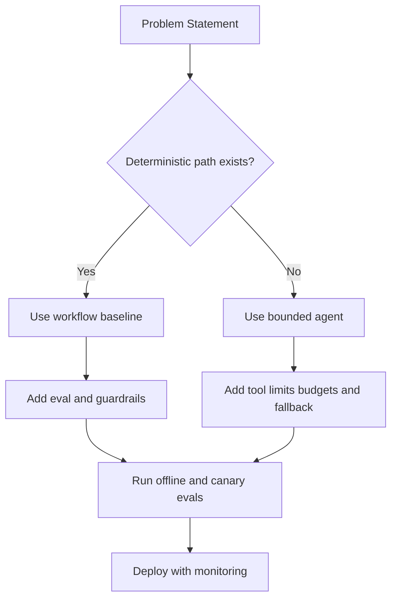
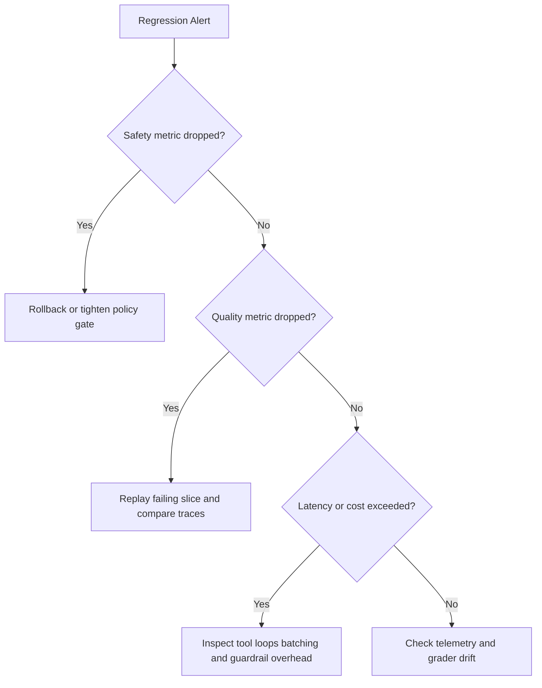

# Agents, Evals, and Safety Interview Questions

## Scope
This file prepares advanced interviews on workflow versus agent decisions, reliability controls, and safety governance under production constraints.

## How To Use This File
- For top questions, answer in four layers:
  1. short answer
  2. deep answer
  3. follow-up ladder
  4. anti-pattern answer to avoid
- Always anchor answers in measurable controls: eval metrics, budgets, and rollback criteria.

## Interviewer Probe Map
- Can you avoid unnecessary autonomy and still deliver quality?
- Can you evaluate multi-step behavior beyond single-turn accuracy?
- Can you defend safety controls without breaking usability?

Figure: Architecture selection path for workflow and agent systems.

## Question Clusters
- Architecture and Control: Q1 to Q10
- Evals and Governance: Q11 to Q20
- Incidents and Debugging: Q21 to Q30

## Architecture and Control

### Q1: Workflow versus agent for a given product
What interviewer is probing:
- Judgment on autonomy, risk, and operational complexity.

Short answer:
Default to workflows for deterministic tasks. Use agents only when uncertainty handling creates measurable product gain.

Deep answer:
1. Classify task determinism, tool-call variability, and error impact.
2. Build a workflow baseline with explicit states.
3. Introduce agent autonomy only where baseline fails on defined metrics.
4. Add hard limits: max steps, max tool calls, budget caps, timeout policy.
5. Define fallback path and human handoff.

Follow-up ladder:
- Which metric proves an agent is worth its complexity?
- How do you prevent hidden tool loops?

Anti-pattern answer:
"Agents are the future, so use agents everywhere."

### Q2: Preventing infinite tool loops
What interviewer is probing:
- Failure containment and runtime safety.

Short answer:
Use bounded execution with progress checks and deterministic fallback.

Deep answer:
Implement max-iteration and max-tool-call limits per request. Add progress heuristics (state delta, confidence delta, or objective completion checks). If progress stalls, trigger fallback template or escalation. Log loop signatures for replay tests.

Follow-up ladder:
- How do you distinguish a hard task from a looping failure?
- Which logs are required for forensic replay?

Anti-pattern answer:
Increasing max iterations without diagnosis.

### Q3: Eval design for multi-step agents
What interviewer is probing:
- Ability to evaluate trajectories, not only outputs.

Short answer:
Score both final outcome and intermediate behavior quality.

Deep answer:
Create eval cases with expected end state plus acceptable tool trajectory constraints. Grade final correctness, tool-call efficiency, policy compliance, and refusal correctness. Track per-step failure classes to avoid "final answer only" blind spots.

### Q4: Prompt injection defense in tool-calling systems
What interviewer is probing:
- Security controls and trust boundaries.

Short answer:
Treat external content as untrusted data and enforce tool policies outside the model prompt.

Deep answer:
Separate control-plane instructions from data-plane text. Never execute tool commands based only on retrieved content instructions. Use allowlisted tools, argument validation, and policy checks before execution. Add post-tool verification for sensitive operations.

### Q5: CI gating for LLM and prompt changes
What interviewer is probing:
- Release discipline and regression prevention.

Short answer:
Block deployment when quality, safety, latency, or cost thresholds regress.

Deep answer:
Run offline eval suite in CI on every model/prompt/tooling change. Gate with multi-metric policy and confidence-aware thresholds. Require manual review for borderline changes and record release decisions for auditability.

### Q6: False positives in guardrails
What interviewer is probing:
- Balancing safety with user experience.

### Q7: Tool permission model for enterprise agents
What interviewer is probing:
- Principle-of-least-privilege design.

### Q8: Designing reliable fallback behaviors
What interviewer is probing:
- Graceful degradation strategy.

### Q9: Structured output reliability in agent chains
What interviewer is probing:
- Parsing robustness and schema control.

### Q10: Human-in-the-loop trigger policies
What interviewer is probing:
- Escalation design and risk management.

## Evals and Governance

### Q11: Building a high-signal eval set with limited budget
What interviewer is probing:
- Prioritization and dataset design.

### Q12: Deterministic graders vs model-judge graders
What interviewer is probing:
- Grader reliability and calibration knowledge.

### Q13: Slice-based metrics for safety drift
What interviewer is probing:
- Monitoring granularity and hidden-failure detection.

### Q14: Gate policy for high-risk product surfaces
What interviewer is probing:
- Governance maturity.

### Q15: Measuring refusal quality, not just refusal rate
What interviewer is probing:
- UX-aware safety reasoning.

### Q16: Adversarial eval generation process
What interviewer is probing:
- Red-team and robustness mindset.

### Q17: Canary strategy for agent upgrades
What interviewer is probing:
- Controlled rollout discipline.

### Q18: Audit trail requirements for regulated environments
What interviewer is probing:
- Compliance and traceability awareness.

### Q19: Policy versioning and backward compatibility
What interviewer is probing:
- Change management reliability.

### Q20: Cost-aware evaluation cadence
What interviewer is probing:
- Balancing rigor with compute budget.

## Incidents and Debugging

### Q21: Safety regression after prompt update
What interviewer is probing:
- Fast triage and rollback readiness.

### Q22: Agent success rate drops after tool API change
What interviewer is probing:
- Dependency-aware diagnosis.

### Q23: p95 latency spike with stable quality metrics
What interviewer is probing:
- Performance bottleneck localization.

### Q24: High refusal rate but no policy violation drop
What interviewer is probing:
- Overblocking detection.

### Q25: Output schema failures in multi-step workflows
What interviewer is probing:
- Robust output contract design.

### Q26: Incident where model leaked internal prompt hints
What interviewer is probing:
- Confidentiality controls and containment.

### Q27: Agent appears to complete tasks but business KPI drops
What interviewer is probing:
- Metric alignment and objective mismatch.

### Q28: Online quality drops but offline eval remains stable
What interviewer is probing:
- Distribution shift and observability gaps.

### Q29: Tool execution succeeds but answers remain incorrect
What interviewer is probing:
- Planning and synthesis failure attribution.

### Q30: Post-incident hardening plan
What interviewer is probing:
- Learning loop and prevention strategy.

Figure: Incident triage path for agent quality and safety regressions.

## Rapid-Fire Round
- Three online metrics that reveal safety drift early.
- Two reasons model-judge graders may mislead.
- One concrete fallback policy for failed tool plans.
- Two indicators an agent should be replaced with workflow logic.

## Company Emphasis
- Amazon:
  - operational controls, rollback speed, incident ownership.
  - clear metrics tied to customer impact.
- Google:
  - deeper evaluation methodology and safety calibration.
  - stronger reasoning on architecture limits.
- Startup:
  - fast deployment loops with minimal but effective controls.
  - practical reliability improvements under resource constraints.

## References
- [workflows-vs-agents-and-tool-calling.md](../explainers/workflows-vs-agents-and-tool-calling.md)
- [evals-regression-testing-and-guardrails.md](../explainers/evals-regression-testing-and-guardrails.md)
- OpenAI eval guidance: https://platform.openai.com/docs/guides/evals
