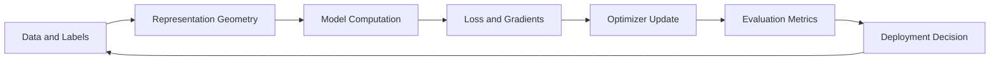
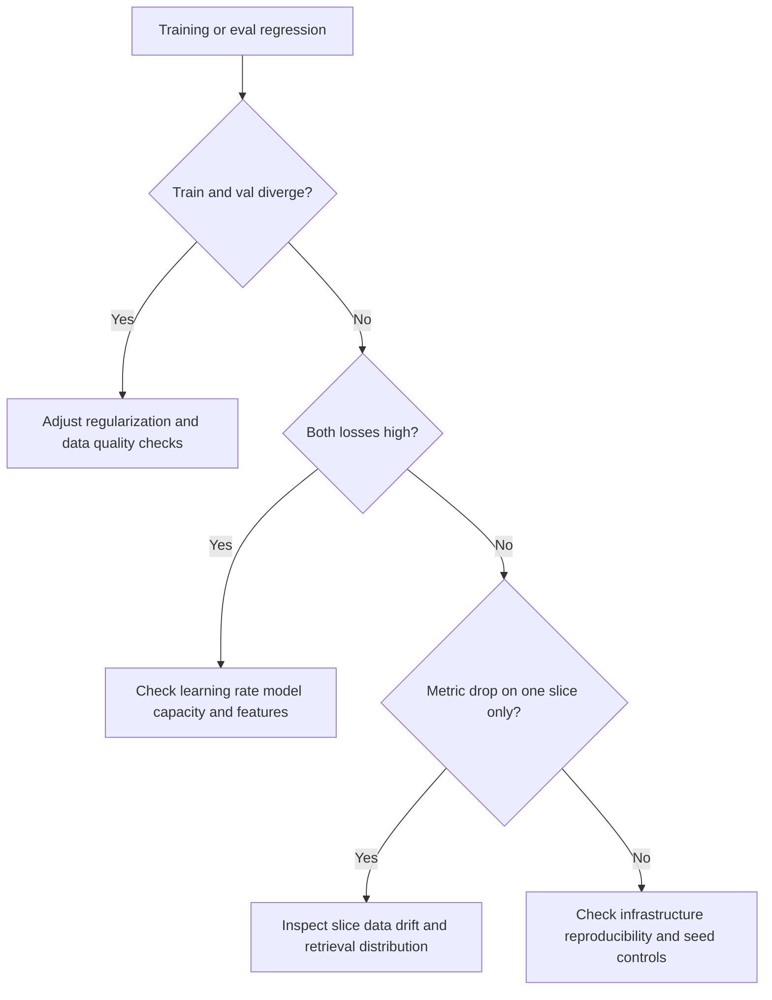

# Linear Algebra and Optimization for LLM Engineers

## Why This Matters in 2026
Interviewers do not require theorem-heavy derivations for most GenAI roles, but they do require engineering-grade intuition: what geometric signals embeddings carry, how optimization dynamics affect stability, and how to debug learning behavior from curves and metrics.

## Mental Model
Three connected lenses explain most practical ML issues:
1. Geometry: where representations live and how similarity is measured.
2. Computation: where matrix operations dominate runtime and memory.
3. Optimization: how gradients, schedulers, and regularizers move parameters over time.

Figure: Closed learning loop from data to deployment decision.

## 1. Vector Geometry and Similarity

### Dot Product vs Cosine Similarity
For vectors $x$ and $y$:

$$
	ext{dot}(x,y)=x^Ty, \quad
\cos(x,y)=\frac{x^Ty}{\|x\|\|y\|}
$$

Dot product mixes direction and magnitude. Cosine isolates directional alignment and is often more stable for semantic retrieval where vector norms vary across examples.

### Practical Implication
Do not assume one metric is always best. Evaluate by domain slice:
- short keyword queries
- long natural-language queries
- multilingual queries

## 2. Matrix Multiplication and Transformer Cost
Most transformer compute cost is matrix multiplication in attention and FFN layers.

In attention, score construction scales roughly with sequence length squared:

$$
	ext{Attention}(Q,K,V)=\text{softmax}\left(\frac{QK^T}{\sqrt{d_k}}\right)V
$$

This links math directly to serving cost:
- longer contexts increase prefill compute sharply
- large hidden sizes increase memory and FLOPs

Shape discipline is mandatory. Many runtime bugs are shape mismatches across batch/sequence/head dimensions.

## 3. Gradients and Optimization Dynamics

### Gradient Intuition
Gradient indicates local steepest ascent of loss; optimization takes steps in negative gradient direction.

### Learning Rate and Stability
If learning rate is too high, optimization oscillates or diverges. If too low, convergence is slow and may stall in poor regions.

### Batch Size and Gradient Noise
Small batches add stochastic noise that can help escape sharp minima but increase variance. Larger batches stabilize gradients but may generalize worse without schedule tuning.

## 4. AdamW, SGD, and Regularization

### AdamW in Practice
AdamW is popular for LLM adaptation because it converges reliably with less manual tuning than vanilla SGD.

### When SGD Still Matters
SGD or momentum SGD can offer strong generalization in some regimes, but often requires more schedule and hyperparameter tuning.

### Regularization Controls
- weight decay: discourages large weights and helps generalization
- gradient clipping: prevents unstable gradient spikes
- early stopping: reduces overfitting under noisy labels

## 5. Diagnosing Learning Curves

### Common Patterns
- train loss down, validation loss up: overfitting
- both losses high and flat: underfitting or optimization issue
- erratic validation: data quality or distribution shift

### Response Strategy
1. Verify data pipeline and label quality.
2. Adjust learning rate schedule and regularization.
3. Re-run with fixed seeds and compare confidence bounds.

## 6. Metric Selection Under Business Risk
Metric choice should match product risk:
- precision-heavy when false positives are costly
- recall-heavy when misses are critical
- F1 for balanced tradeoff in imbalanced labels
- calibration/error bars for decision confidence

For generative systems, combine automatic scores with human or model-judge checks and slice analysis.

## 7. Optimization in Fine-Tuning and PEFT Context
Practical questions:
- when prompt engineering saturates, do we move to PEFT?
- what learning-rate schedule protects base behavior?
- how do we detect adaptation drift early?

Treat optimizer settings as production configuration, not one-time experiment artifacts.

## Debugging Decision Tree

Figure: Structured diagnosis path for optimization regressions.

## Practical Implementation Lab (Advanced)
Goal: build a mini training and retrieval diagnostics harness.

1. Compute embeddings and evaluate cosine vs dot-product by query slice.
2. Train small model variants with AdamW and SGD under same budget.
3. Sweep learning rate and weight decay minimally.
4. Add gradient norm tracking and clipping experiments.
5. Plot train/val curves with confidence intervals across seeds.
6. Publish a one-page decision memo with selected config and risks.

Track:
- retrieval precision@k by slice
- train/validation gap
- gradient norm distribution
- stability across random seeds

## Common Pitfalls
- Over-indexing on one metric without slice analysis.
- Confusing training accuracy with deployment readiness.
- Ignoring variance when comparing runs.
- Treating optimizer defaults as universally optimal.

## Interview Bridge
- Related interview file: [ml-dl-fundamentals-questions.md](../interviews/ml-dl-fundamentals-questions.md)
- Questions this explainer supports:
  - Why cosine can outperform dot product in retrieval.
  - How to diagnose overfitting and optimization instability.
  - When and how to move from prompt updates to fine-tuning.

## References
- Hugging Face LLM course: https://huggingface.co/learn/llm-course/chapter1/1
- Attention Is All You Need: https://arxiv.org/abs/1706.03762
- AdamW (PyTorch docs): https://pytorch.org/docs/stable/generated/torch.optim.AdamW.html
- Deep Learning Book, optimization chapter: https://www.deeplearningbook.org/
