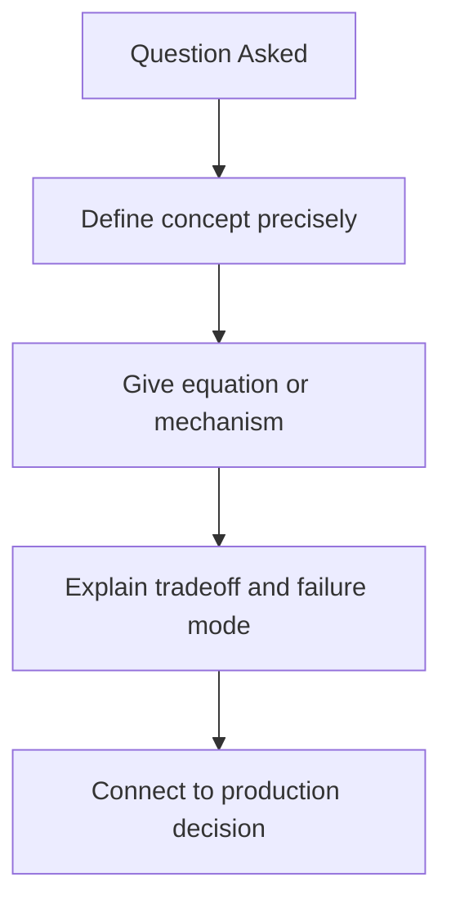
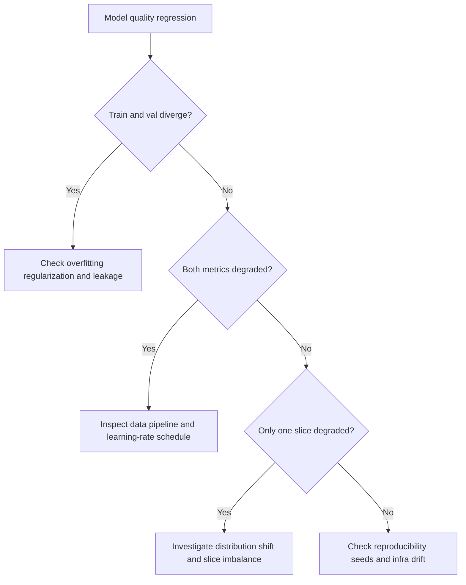

# ML and DL Fundamentals Interview Questions

## Scope
This file targets advanced math and optimization reasoning needed for LLM and GenAI engineering interviews.

## How To Use This File
- Practice top questions with four layers:
  1. short answer
  2. deep answer
  3. follow-up ladder
  4. anti-pattern answer to avoid
- Tie every theoretical point to debugging or production implications.

## Interviewer Probe Map
- Can you explain why methods work, not only definitions?
- Can you diagnose training/evaluation failures from metrics?
- Can you choose tradeoffs under compute and data constraints?

Figure: Strong answer structure for ML/DL interview questions.

## Question Clusters
- Geometry and Core Concepts: Q1 to Q10
- Optimization and Metrics: Q11 to Q20
- Debugging and Reliability: Q21 to Q28

## Geometry and Core Concepts

### Q1: Why cosine similarity for embeddings?
What interviewer is probing:
- Geometry intuition for retrieval tasks.

Short answer:
Cosine compares direction while ignoring vector magnitude, which is often better for semantic similarity.

Deep answer:
Dot product mixes direction and norm effects. In embedding systems, norm can vary for reasons unrelated to semantic closeness. Cosine normalization reduces this variance and often improves ranking stability. Still, dot product may work better when magnitude carries signal and embeddings are intentionally norm-encoded.

Follow-up ladder:
- When is dot product preferable?
- How would you evaluate this choice by query slice?

Anti-pattern answer:
"Cosine is always better" with no domain caveat.

### Q2: Explain overfitting from learning curves
What interviewer is probing:
- Practical diagnosis from train/validation behavior.

Short answer:
Overfitting appears when training improves while validation stagnates or degrades.

Deep answer:
Inspect train/val loss and task metrics together. Divergence suggests model memorization or data mismatch. Mitigation sequence: check data leakage, apply regularization, adjust model capacity, and use early stopping. Validate each change with fixed seeds and confidence-aware comparison.

Follow-up ladder:
- What if both train and validation are poor?
- How do you separate data quality issues from optimization issues?

Anti-pattern answer:
Lowering learning rate only, without data diagnostics.

### Q3: AdamW vs SGD in fine-tuning
What interviewer is probing:
- Optimizer tradeoff and tuning burden awareness.

Short answer:
AdamW usually converges faster and more stably in LLM adaptation; SGD may generalize well but often needs more tuning.

Deep answer:
AdamW decouples weight decay and handles sparse/noisy gradients robustly. SGD can still be useful in some regimes with strong schedule tuning. Selection should be based on convergence speed, stability across seeds, and final validation behavior under fixed compute budget.

### Q4: Batch size effects on optimization
What interviewer is probing:
- Gradient noise and convergence tradeoffs.

### Q5: Precision, recall, and F1 under imbalanced labels
What interviewer is probing:
- Metric selection based on business risk.

### Q6: Why gradient clipping helps unstable training
What interviewer is probing:
- Gradient explosion control.

### Q7: Weight decay intuition in large models
What interviewer is probing:
- Regularization mechanism understanding.

### Q8: Bias-variance tradeoff in modern deep learning
What interviewer is probing:
- Conceptual clarity beyond textbook slogans.

### Q9: How sequence length affects transformer compute
What interviewer is probing:
- Complexity intuition tied to architecture.

### Q10: Calibration vs raw accuracy
What interviewer is probing:
- Decision reliability for downstream systems.

## Optimization and Metrics

### Q11: Learning-rate warmup and scheduler design
What interviewer is probing:
- Stability and convergence control.

### Q12: Early stopping criteria design
What interviewer is probing:
- Preventing overfit without premature stop.

### Q13: Gradient accumulation under memory constraints
What interviewer is probing:
- Practical training engineering tradeoffs.

### Q14: Choosing loss functions for noisy labels
What interviewer is probing:
- Robust optimization decisions.

### Q15: A/B testing model updates with small eval sets
What interviewer is probing:
- Statistical caution and confidence framing.

### Q16: Interpreting precision@k vs recall@k in retrieval
What interviewer is probing:
- Ranking metric tradeoffs.

### Q17: nDCG and MRR use cases
What interviewer is probing:
- Metric-task alignment understanding.

### Q18: Why one global score can hide regressions
What interviewer is probing:
- Slice-based evaluation rigor.

### Q19: Selecting threshold for binary decisions
What interviewer is probing:
- ROC/PR tradeoffs with product constraints.

### Q20: Detecting label leakage and train/val contamination
What interviewer is probing:
- Experiment hygiene and validity.

## Debugging and Reliability

### Q21: Validation metric drops after data refresh
What interviewer is probing:
- Data drift and pipeline debugging.

### Q22: Run-to-run variance is too high
What interviewer is probing:
- Reproducibility and stochasticity control.

### Q23: Model improves offline but worsens online
What interviewer is probing:
- Distribution-shift diagnosis.

### Q24: Training diverges intermittently
What interviewer is probing:
- Numerical stability and hyperparameter bounds.

### Q25: Good loss curves but poor downstream product KPI
What interviewer is probing:
- Objective mismatch awareness.

### Q26: Metric improvements only in easy slices
What interviewer is probing:
- Hidden regression detection.

### Q27: Choosing rollback criteria after optimization changes
What interviewer is probing:
- Operational release discipline.

### Q28: Postmortem plan after recurring optimization regressions
What interviewer is probing:
- Long-term prevention mindset.

Figure: ML optimization triage path for interview debugging rounds.

## Rapid-Fire Round
- One reason to prefer cosine over dot product.
- Two signs of label leakage.
- One trigger for applying gradient clipping.
- Two indicators your eval set is not representative.

## Company Emphasis
- Amazon:
  - practical diagnostics and metric-driven decisions.
  - explicit impact on business KPIs.
- Google:
  - deeper mathematical rigor and follow-up depth.
  - stronger requirement for first-principles reasoning.
- Startup:
  - fast and reliable problem isolation.
  - clear tradeoffs under limited compute budgets.

## References
- [linear-algebra-and-optimization-for-llms.md](../explainers/linear-algebra-and-optimization-for-llms.md)
- AdamW docs: https://pytorch.org/docs/stable/generated/torch.optim.AdamW.html
- Attention Is All You Need: https://arxiv.org/abs/1706.03762
