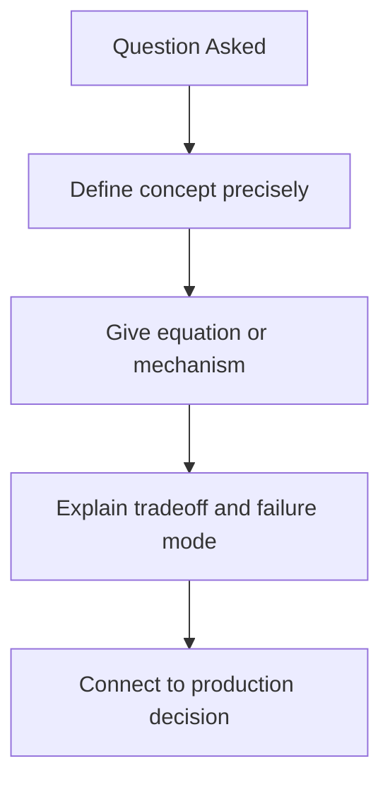
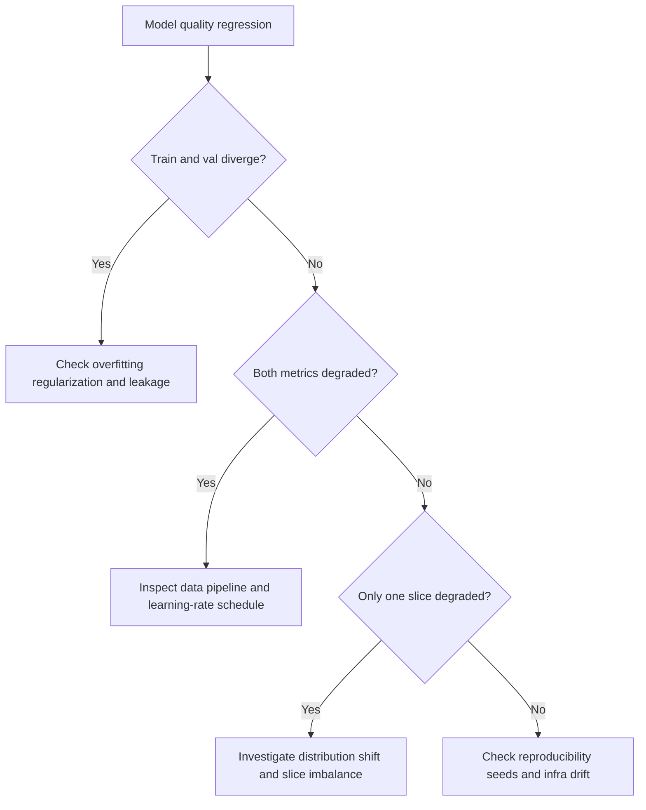

# ML and DL Fundamentals Interview Questions

## Scope
This file targets advanced math and optimization reasoning needed for LLM and GenAI engineering interviews.

## How To Use This File
- Practice top questions with four layers:
  1. short answer
  2. deep answer
  3. follow-up ladder
  4. anti-pattern answer to avoid
- Tie every theoretical point to debugging or production implications.

## Interviewer Probe Map
- Can you explain why methods work, not only definitions?
- Can you diagnose training/evaluation failures from metrics?
- Can you choose tradeoffs under compute and data constraints?



Figure: Strong answer structure for ML/DL interview questions.

## Question Clusters
- Geometry and Core Concepts: Q1 to Q10
- Optimization and Metrics: Q11 to Q20
- Debugging and Reliability: Q21 to Q28

## Geometry and Core Concepts

### Q1: Why cosine similarity for embeddings?
What interviewer is probing:
- Geometry intuition for retrieval tasks.

Direct answer:
Cosine compares direction while ignoring vector magnitude, which is often better for semantic similarity.

Deep answer:
Dot product mixes direction and norm effects. In embedding systems, norm can vary for reasons unrelated to semantic closeness. Cosine normalization reduces this variance and often improves ranking stability. Still, dot product may work better when magnitude carries signal and embeddings are intentionally norm-encoded.

Follow-up variants:
- When is dot product preferable?
- How would you evaluate this choice by query slice?

Common mistakes and red flags:
"Cosine is always better" with no domain caveat.

Sample code or pseudocode (when relevant):
```text
# Interview outline
1) Validate inputs and constraints
2) Apply core strategy
3) Add failure handling and observability hooks
```
### Q2: Explain overfitting from learning curves
What interviewer is probing:
- Practical diagnosis from train/validation behavior.

Direct answer:
Overfitting appears when training improves while validation stagnates or degrades.

Deep answer:
Inspect train/val loss and task metrics together. Divergence suggests model memorization or data mismatch. Mitigation sequence: check data leakage, apply regularization, adjust model capacity, and use early stopping. Validate each change with fixed seeds and confidence-aware comparison.

Follow-up variants:
- What if both train and validation are poor?
- How do you separate data quality issues from optimization issues?

Common mistakes and red flags:
Lowering learning rate only, without data diagnostics.

Sample code or pseudocode (when relevant):
```text
# Interview outline
1) Validate inputs and constraints
2) Apply core strategy
3) Add failure handling and observability hooks
```
### Q3: AdamW vs SGD in fine-tuning
What interviewer is probing:
- Optimizer tradeoff and tuning burden awareness.

Direct answer:
AdamW usually converges faster and more stably in LLM adaptation; SGD may generalize well but often needs more tuning.

Deep answer:
AdamW decouples weight decay and handles sparse/noisy gradients robustly. SGD can still be useful in some regimes with strong schedule tuning. Selection should be based on convergence speed, stability across seeds, and final validation behavior under fixed compute budget.

Common mistakes and red flags:
- Naming tools or algorithms without mapping them to constraints.
- Ignoring edge cases, failure modes, or rollback triggers.
- Skipping metrics needed to prove the design works in production.

Follow-up variants:
- What changes if throughput doubles or latency budget is cut in half?
- Which single metric would trigger rollback after deployment?

Sample code or pseudocode (when relevant):
```text
# Interview outline
1) Validate inputs and constraints
2) Apply core strategy
3) Add failure handling and observability hooks
```
### Q4: Batch size effects on optimization
What interviewer is probing:
- Gradient noise and convergence tradeoffs.

Direct answer:
Use a clear, constraint-first decision for batch size effects on optimization, then state one production tradeoff (latency, cost, or reliability).

Deep answer:
1. State assumptions, constraints, and success metric.
2. Explain the chosen design or algorithm and why alternatives are weaker.
3. Cover failure handling, observability, and rollback criteria.

Common mistakes and red flags:
- Naming tools or algorithms without mapping them to constraints.
- Ignoring edge cases, failure modes, or rollback triggers.
- Skipping metrics needed to prove the design works in production.

Follow-up variants:
- What changes if throughput doubles or latency budget is cut in half?
- Which single metric would trigger rollback after deployment?

Sample code or pseudocode (when relevant):
```text
# Interview outline
1) Validate inputs and constraints
2) Apply core strategy
3) Add failure handling and observability hooks
```
### Q5: Precision, recall, and F1 under imbalanced labels
What interviewer is probing:
- Metric selection based on business risk.

Direct answer:
Use a clear, constraint-first decision for precision, recall, and f1 under imbalanced labels, then state one production tradeoff (latency, cost, or reliability).

Deep answer:
1. State assumptions, constraints, and success metric.
2. Explain the chosen design or algorithm and why alternatives are weaker.
3. Cover failure handling, observability, and rollback criteria.

Common mistakes and red flags:
- Naming tools or algorithms without mapping them to constraints.
- Ignoring edge cases, failure modes, or rollback triggers.
- Skipping metrics needed to prove the design works in production.

Follow-up variants:
- What changes if throughput doubles or latency budget is cut in half?
- Which single metric would trigger rollback after deployment?

Sample code or pseudocode (when relevant):
```text
# Interview outline
1) Validate inputs and constraints
2) Apply core strategy
3) Add failure handling and observability hooks
```
### Q6: Why gradient clipping helps unstable training
What interviewer is probing:
- Gradient explosion control.

Direct answer:
Use a clear, constraint-first decision for why gradient clipping helps unstable training, then state one production tradeoff (latency, cost, or reliability).

Deep answer:
1. State assumptions, constraints, and success metric.
2. Explain the chosen design or algorithm and why alternatives are weaker.
3. Cover failure handling, observability, and rollback criteria.

Common mistakes and red flags:
- Naming tools or algorithms without mapping them to constraints.
- Ignoring edge cases, failure modes, or rollback triggers.
- Skipping metrics needed to prove the design works in production.

Follow-up variants:
- What changes if throughput doubles or latency budget is cut in half?
- Which single metric would trigger rollback after deployment?

Sample code or pseudocode (when relevant):
```text
# Interview outline
1) Validate inputs and constraints
2) Apply core strategy
3) Add failure handling and observability hooks
```
### Q7: Weight decay intuition in large models
What interviewer is probing:
- Regularization mechanism understanding.

Direct answer:
Use a clear, constraint-first decision for weight decay intuition in large models, then state one production tradeoff (latency, cost, or reliability).

Deep answer:
1. State assumptions, constraints, and success metric.
2. Explain the chosen design or algorithm and why alternatives are weaker.
3. Cover failure handling, observability, and rollback criteria.

Common mistakes and red flags:
- Naming tools or algorithms without mapping them to constraints.
- Ignoring edge cases, failure modes, or rollback triggers.
- Skipping metrics needed to prove the design works in production.

Follow-up variants:
- What changes if throughput doubles or latency budget is cut in half?
- Which single metric would trigger rollback after deployment?

Sample code or pseudocode (when relevant):
```text
# Interview outline
1) Validate inputs and constraints
2) Apply core strategy
3) Add failure handling and observability hooks
```
### Q8: Bias-variance tradeoff in modern deep learning
What interviewer is probing:
- Conceptual clarity beyond textbook slogans.

Direct answer:
Use a clear, constraint-first decision for bias-variance tradeoff in modern deep learning, then state one production tradeoff (latency, cost, or reliability).

Deep answer:
1. State assumptions, constraints, and success metric.
2. Explain the chosen design or algorithm and why alternatives are weaker.
3. Cover failure handling, observability, and rollback criteria.

Common mistakes and red flags:
- Naming tools or algorithms without mapping them to constraints.
- Ignoring edge cases, failure modes, or rollback triggers.
- Skipping metrics needed to prove the design works in production.

Follow-up variants:
- What changes if throughput doubles or latency budget is cut in half?
- Which single metric would trigger rollback after deployment?

Sample code or pseudocode (when relevant):
```text
# Interview outline
1) Validate inputs and constraints
2) Apply core strategy
3) Add failure handling and observability hooks
```
### Q9: How sequence length affects transformer compute
What interviewer is probing:
- Complexity intuition tied to architecture.

Direct answer:
Use a clear, constraint-first decision for how sequence length affects transformer compute, then state one production tradeoff (latency, cost, or reliability).

Deep answer:
1. State assumptions, constraints, and success metric.
2. Explain the chosen design or algorithm and why alternatives are weaker.
3. Cover failure handling, observability, and rollback criteria.

Common mistakes and red flags:
- Naming tools or algorithms without mapping them to constraints.
- Ignoring edge cases, failure modes, or rollback triggers.
- Skipping metrics needed to prove the design works in production.

Follow-up variants:
- What changes if throughput doubles or latency budget is cut in half?
- Which single metric would trigger rollback after deployment?

Sample code or pseudocode (when relevant):
```text
# Interview outline
1) Validate inputs and constraints
2) Apply core strategy
3) Add failure handling and observability hooks
```
### Q10: Calibration vs raw accuracy
What interviewer is probing:
- Decision reliability for downstream systems.

## Optimization and Metrics

Direct answer:
Use a clear, constraint-first decision for calibration vs raw accuracy, then state one production tradeoff (latency, cost, or reliability).

Deep answer:
1. State assumptions, constraints, and success metric.
2. Explain the chosen design or algorithm and why alternatives are weaker.
3. Cover failure handling, observability, and rollback criteria.

Common mistakes and red flags:
- Naming tools or algorithms without mapping them to constraints.
- Ignoring edge cases, failure modes, or rollback triggers.
- Skipping metrics needed to prove the design works in production.

Follow-up variants:
- What changes if throughput doubles or latency budget is cut in half?
- Which single metric would trigger rollback after deployment?

Sample code or pseudocode (when relevant):
```text
# Interview outline
1) Validate inputs and constraints
2) Apply core strategy
3) Add failure handling and observability hooks
```
### Q11: Learning-rate warmup and scheduler design
What interviewer is probing:
- Stability and convergence control.

Direct answer:
Use a clear, constraint-first decision for learning-rate warmup and scheduler design, then state one production tradeoff (latency, cost, or reliability).

Deep answer:
1. State assumptions, constraints, and success metric.
2. Explain the chosen design or algorithm and why alternatives are weaker.
3. Cover failure handling, observability, and rollback criteria.

Common mistakes and red flags:
- Naming tools or algorithms without mapping them to constraints.
- Ignoring edge cases, failure modes, or rollback triggers.
- Skipping metrics needed to prove the design works in production.

Follow-up variants:
- What changes if throughput doubles or latency budget is cut in half?
- Which single metric would trigger rollback after deployment?

Sample code or pseudocode (when relevant):
```text
# Interview outline
1) Validate inputs and constraints
2) Apply core strategy
3) Add failure handling and observability hooks
```
### Q12: Early stopping criteria design
What interviewer is probing:
- Preventing overfit without premature stop.

Direct answer:
Use a clear, constraint-first decision for early stopping criteria design, then state one production tradeoff (latency, cost, or reliability).

Deep answer:
1. State assumptions, constraints, and success metric.
2. Explain the chosen design or algorithm and why alternatives are weaker.
3. Cover failure handling, observability, and rollback criteria.

Common mistakes and red flags:
- Naming tools or algorithms without mapping them to constraints.
- Ignoring edge cases, failure modes, or rollback triggers.
- Skipping metrics needed to prove the design works in production.

Follow-up variants:
- What changes if throughput doubles or latency budget is cut in half?
- Which single metric would trigger rollback after deployment?

Sample code or pseudocode (when relevant):
```text
# Interview outline
1) Validate inputs and constraints
2) Apply core strategy
3) Add failure handling and observability hooks
```
### Q13: Gradient accumulation under memory constraints
What interviewer is probing:
- Practical training engineering tradeoffs.

Direct answer:
Use a clear, constraint-first decision for gradient accumulation under memory constraints, then state one production tradeoff (latency, cost, or reliability).

Deep answer:
1. State assumptions, constraints, and success metric.
2. Explain the chosen design or algorithm and why alternatives are weaker.
3. Cover failure handling, observability, and rollback criteria.

Common mistakes and red flags:
- Naming tools or algorithms without mapping them to constraints.
- Ignoring edge cases, failure modes, or rollback triggers.
- Skipping metrics needed to prove the design works in production.

Follow-up variants:
- What changes if throughput doubles or latency budget is cut in half?
- Which single metric would trigger rollback after deployment?

Sample code or pseudocode (when relevant):
```text
# Interview outline
1) Validate inputs and constraints
2) Apply core strategy
3) Add failure handling and observability hooks
```
### Q14: Choosing loss functions for noisy labels
What interviewer is probing:
- Robust optimization decisions.

Direct answer:
Use a clear, constraint-first decision for choosing loss functions for noisy labels, then state one production tradeoff (latency, cost, or reliability).

Deep answer:
1. State assumptions, constraints, and success metric.
2. Explain the chosen design or algorithm and why alternatives are weaker.
3. Cover failure handling, observability, and rollback criteria.

Common mistakes and red flags:
- Naming tools or algorithms without mapping them to constraints.
- Ignoring edge cases, failure modes, or rollback triggers.
- Skipping metrics needed to prove the design works in production.

Follow-up variants:
- What changes if throughput doubles or latency budget is cut in half?
- Which single metric would trigger rollback after deployment?

Sample code or pseudocode (when relevant):
```text
# Interview outline
1) Validate inputs and constraints
2) Apply core strategy
3) Add failure handling and observability hooks
```
### Q15: A/B testing model updates with small eval sets
What interviewer is probing:
- Statistical caution and confidence framing.

Direct answer:
Use a clear, constraint-first decision for a/b testing model updates with small eval sets, then state one production tradeoff (latency, cost, or reliability).

Deep answer:
1. State assumptions, constraints, and success metric.
2. Explain the chosen design or algorithm and why alternatives are weaker.
3. Cover failure handling, observability, and rollback criteria.

Common mistakes and red flags:
- Naming tools or algorithms without mapping them to constraints.
- Ignoring edge cases, failure modes, or rollback triggers.
- Skipping metrics needed to prove the design works in production.

Follow-up variants:
- What changes if throughput doubles or latency budget is cut in half?
- Which single metric would trigger rollback after deployment?

Sample code or pseudocode (when relevant):
```text
# Interview outline
1) Validate inputs and constraints
2) Apply core strategy
3) Add failure handling and observability hooks
```
### Q16: Interpreting precision@k vs recall@k in retrieval
What interviewer is probing:
- Ranking metric tradeoffs.

Direct answer:
Use a clear, constraint-first decision for interpreting precision@k vs recall@k in retrieval, then state one production tradeoff (latency, cost, or reliability).

Deep answer:
1. State assumptions, constraints, and success metric.
2. Explain the chosen design or algorithm and why alternatives are weaker.
3. Cover failure handling, observability, and rollback criteria.

Common mistakes and red flags:
- Naming tools or algorithms without mapping them to constraints.
- Ignoring edge cases, failure modes, or rollback triggers.
- Skipping metrics needed to prove the design works in production.

Follow-up variants:
- What changes if throughput doubles or latency budget is cut in half?
- Which single metric would trigger rollback after deployment?

Sample code or pseudocode (when relevant):
```text
# Interview outline
1) Validate inputs and constraints
2) Apply core strategy
3) Add failure handling and observability hooks
```
### Q17: nDCG and MRR use cases
What interviewer is probing:
- Metric-task alignment understanding.

Direct answer:
Use a clear, constraint-first decision for ndcg and mrr use cases, then state one production tradeoff (latency, cost, or reliability).

Deep answer:
1. State assumptions, constraints, and success metric.
2. Explain the chosen design or algorithm and why alternatives are weaker.
3. Cover failure handling, observability, and rollback criteria.

Common mistakes and red flags:
- Naming tools or algorithms without mapping them to constraints.
- Ignoring edge cases, failure modes, or rollback triggers.
- Skipping metrics needed to prove the design works in production.

Follow-up variants:
- What changes if throughput doubles or latency budget is cut in half?
- Which single metric would trigger rollback after deployment?

Sample code or pseudocode (when relevant):
```text
# Interview outline
1) Validate inputs and constraints
2) Apply core strategy
3) Add failure handling and observability hooks
```
### Q18: Why one global score can hide regressions
What interviewer is probing:
- Slice-based evaluation rigor.

Direct answer:
Use a clear, constraint-first decision for why one global score can hide regressions, then state one production tradeoff (latency, cost, or reliability).

Deep answer:
1. State assumptions, constraints, and success metric.
2. Explain the chosen design or algorithm and why alternatives are weaker.
3. Cover failure handling, observability, and rollback criteria.

Common mistakes and red flags:
- Naming tools or algorithms without mapping them to constraints.
- Ignoring edge cases, failure modes, or rollback triggers.
- Skipping metrics needed to prove the design works in production.

Follow-up variants:
- What changes if throughput doubles or latency budget is cut in half?
- Which single metric would trigger rollback after deployment?

Sample code or pseudocode (when relevant):
```text
# Interview outline
1) Validate inputs and constraints
2) Apply core strategy
3) Add failure handling and observability hooks
```
### Q19: Selecting threshold for binary decisions
What interviewer is probing:
- ROC/PR tradeoffs with product constraints.

Direct answer:
Use a clear, constraint-first decision for selecting threshold for binary decisions, then state one production tradeoff (latency, cost, or reliability).

Deep answer:
1. State assumptions, constraints, and success metric.
2. Explain the chosen design or algorithm and why alternatives are weaker.
3. Cover failure handling, observability, and rollback criteria.

Common mistakes and red flags:
- Naming tools or algorithms without mapping them to constraints.
- Ignoring edge cases, failure modes, or rollback triggers.
- Skipping metrics needed to prove the design works in production.

Follow-up variants:
- What changes if throughput doubles or latency budget is cut in half?
- Which single metric would trigger rollback after deployment?

Sample code or pseudocode (when relevant):
```text
# Interview outline
1) Validate inputs and constraints
2) Apply core strategy
3) Add failure handling and observability hooks
```
### Q20: Detecting label leakage and train/val contamination
What interviewer is probing:
- Experiment hygiene and validity.

## Debugging and Reliability

Direct answer:
Use a clear, constraint-first decision for detecting label leakage and train/val contamination, then state one production tradeoff (latency, cost, or reliability).

Deep answer:
1. State assumptions, constraints, and success metric.
2. Explain the chosen design or algorithm and why alternatives are weaker.
3. Cover failure handling, observability, and rollback criteria.

Common mistakes and red flags:
- Naming tools or algorithms without mapping them to constraints.
- Ignoring edge cases, failure modes, or rollback triggers.
- Skipping metrics needed to prove the design works in production.

Follow-up variants:
- What changes if throughput doubles or latency budget is cut in half?
- Which single metric would trigger rollback after deployment?

Sample code or pseudocode (when relevant):
```text
# Interview outline
1) Validate inputs and constraints
2) Apply core strategy
3) Add failure handling and observability hooks
```
### Q21: Validation metric drops after data refresh
What interviewer is probing:
- Data drift and pipeline debugging.

Direct answer:
Use a clear, constraint-first decision for validation metric drops after data refresh, then state one production tradeoff (latency, cost, or reliability).

Deep answer:
1. State assumptions, constraints, and success metric.
2. Explain the chosen design or algorithm and why alternatives are weaker.
3. Cover failure handling, observability, and rollback criteria.

Common mistakes and red flags:
- Naming tools or algorithms without mapping them to constraints.
- Ignoring edge cases, failure modes, or rollback triggers.
- Skipping metrics needed to prove the design works in production.

Follow-up variants:
- What changes if throughput doubles or latency budget is cut in half?
- Which single metric would trigger rollback after deployment?

Sample code or pseudocode (when relevant):
```text
# Interview outline
1) Validate inputs and constraints
2) Apply core strategy
3) Add failure handling and observability hooks
```
### Q22: Run-to-run variance is too high
What interviewer is probing:
- Reproducibility and stochasticity control.

Direct answer:
Use a clear, constraint-first decision for run-to-run variance is too high, then state one production tradeoff (latency, cost, or reliability).

Deep answer:
1. State assumptions, constraints, and success metric.
2. Explain the chosen design or algorithm and why alternatives are weaker.
3. Cover failure handling, observability, and rollback criteria.

Common mistakes and red flags:
- Naming tools or algorithms without mapping them to constraints.
- Ignoring edge cases, failure modes, or rollback triggers.
- Skipping metrics needed to prove the design works in production.

Follow-up variants:
- What changes if throughput doubles or latency budget is cut in half?
- Which single metric would trigger rollback after deployment?

Sample code or pseudocode (when relevant):
```text
# Interview outline
1) Validate inputs and constraints
2) Apply core strategy
3) Add failure handling and observability hooks
```
### Q23: Model improves offline but worsens online
What interviewer is probing:
- Distribution-shift diagnosis.

Direct answer:
Use a clear, constraint-first decision for model improves offline but worsens online, then state one production tradeoff (latency, cost, or reliability).

Deep answer:
1. State assumptions, constraints, and success metric.
2. Explain the chosen design or algorithm and why alternatives are weaker.
3. Cover failure handling, observability, and rollback criteria.

Common mistakes and red flags:
- Naming tools or algorithms without mapping them to constraints.
- Ignoring edge cases, failure modes, or rollback triggers.
- Skipping metrics needed to prove the design works in production.

Follow-up variants:
- What changes if throughput doubles or latency budget is cut in half?
- Which single metric would trigger rollback after deployment?

Sample code or pseudocode (when relevant):
```text
# Interview outline
1) Validate inputs and constraints
2) Apply core strategy
3) Add failure handling and observability hooks
```
### Q24: Training diverges intermittently
What interviewer is probing:
- Numerical stability and hyperparameter bounds.

Direct answer:
Use a clear, constraint-first decision for training diverges intermittently, then state one production tradeoff (latency, cost, or reliability).

Deep answer:
1. State assumptions, constraints, and success metric.
2. Explain the chosen design or algorithm and why alternatives are weaker.
3. Cover failure handling, observability, and rollback criteria.

Common mistakes and red flags:
- Naming tools or algorithms without mapping them to constraints.
- Ignoring edge cases, failure modes, or rollback triggers.
- Skipping metrics needed to prove the design works in production.

Follow-up variants:
- What changes if throughput doubles or latency budget is cut in half?
- Which single metric would trigger rollback after deployment?

Sample code or pseudocode (when relevant):
```text
# Interview outline
1) Validate inputs and constraints
2) Apply core strategy
3) Add failure handling and observability hooks
```
### Q25: Good loss curves but poor downstream product KPI
What interviewer is probing:
- Objective mismatch awareness.

Direct answer:
Use a clear, constraint-first decision for good loss curves but poor downstream product kpi, then state one production tradeoff (latency, cost, or reliability).

Deep answer:
1. State assumptions, constraints, and success metric.
2. Explain the chosen design or algorithm and why alternatives are weaker.
3. Cover failure handling, observability, and rollback criteria.

Common mistakes and red flags:
- Naming tools or algorithms without mapping them to constraints.
- Ignoring edge cases, failure modes, or rollback triggers.
- Skipping metrics needed to prove the design works in production.

Follow-up variants:
- What changes if throughput doubles or latency budget is cut in half?
- Which single metric would trigger rollback after deployment?

Sample code or pseudocode (when relevant):
```text
# Interview outline
1) Validate inputs and constraints
2) Apply core strategy
3) Add failure handling and observability hooks
```
### Q26: Metric improvements only in easy slices
What interviewer is probing:
- Hidden regression detection.

Direct answer:
Use a clear, constraint-first decision for metric improvements only in easy slices, then state one production tradeoff (latency, cost, or reliability).

Deep answer:
1. State assumptions, constraints, and success metric.
2. Explain the chosen design or algorithm and why alternatives are weaker.
3. Cover failure handling, observability, and rollback criteria.

Common mistakes and red flags:
- Naming tools or algorithms without mapping them to constraints.
- Ignoring edge cases, failure modes, or rollback triggers.
- Skipping metrics needed to prove the design works in production.

Follow-up variants:
- What changes if throughput doubles or latency budget is cut in half?
- Which single metric would trigger rollback after deployment?

Sample code or pseudocode (when relevant):
```text
# Interview outline
1) Validate inputs and constraints
2) Apply core strategy
3) Add failure handling and observability hooks
```
### Q27: Choosing rollback criteria after optimization changes
What interviewer is probing:
- Operational release discipline.

Direct answer:
Use a clear, constraint-first decision for choosing rollback criteria after optimization changes, then state one production tradeoff (latency, cost, or reliability).

Deep answer:
1. State assumptions, constraints, and success metric.
2. Explain the chosen design or algorithm and why alternatives are weaker.
3. Cover failure handling, observability, and rollback criteria.

Common mistakes and red flags:
- Naming tools or algorithms without mapping them to constraints.
- Ignoring edge cases, failure modes, or rollback triggers.
- Skipping metrics needed to prove the design works in production.

Follow-up variants:
- What changes if throughput doubles or latency budget is cut in half?
- Which single metric would trigger rollback after deployment?

Sample code or pseudocode (when relevant):
```text
# Interview outline
1) Validate inputs and constraints
2) Apply core strategy
3) Add failure handling and observability hooks
```
### Q28: Postmortem plan after recurring optimization regressions
What interviewer is probing:
- Long-term prevention mindset.



Figure: ML optimization triage path for interview debugging rounds.

## Rapid-Fire Round
- One reason to prefer cosine over dot product.
- Two signs of label leakage.
- One trigger for applying gradient clipping.
- Two indicators your eval set is not representative.

## Company Emphasis
- Amazon:
  - practical diagnostics and metric-driven decisions.
  - explicit impact on business KPIs.
- Google:
  - deeper mathematical rigor and follow-up depth.
  - stronger requirement for first-principles reasoning.
- Startup:
  - fast and reliable problem isolation.
  - clear tradeoffs under limited compute budgets.

## References
- [linear-algebra-and-optimization-for-llms.md](../explainers/linear-algebra-and-optimization-for-llms.md)
- AdamW docs: https://pytorch.org/docs/stable/generated/torch.optim.AdamW.html
- Attention Is All You Need: https://arxiv.org/abs/1706.03762

Direct answer:
Use a clear, constraint-first decision for postmortem plan after recurring optimization regressions, then state one production tradeoff (latency, cost, or reliability).

Deep answer:
1. State assumptions, constraints, and success metric.
2. Explain the chosen design or algorithm and why alternatives are weaker.
3. Cover failure handling, observability, and rollback criteria.

Common mistakes and red flags:
- Naming tools or algorithms without mapping them to constraints.
- Ignoring edge cases, failure modes, or rollback triggers.
- Skipping metrics needed to prove the design works in production.

Follow-up variants:
- What changes if throughput doubles or latency budget is cut in half?
- Which single metric would trigger rollback after deployment?

Sample code or pseudocode (when relevant):
```text
# Interview outline
1) Validate inputs and constraints
2) Apply core strategy
3) Add failure handling and observability hooks
```
