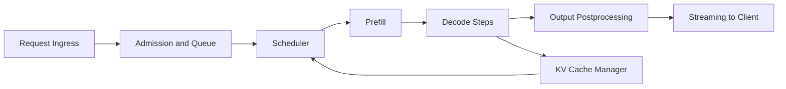
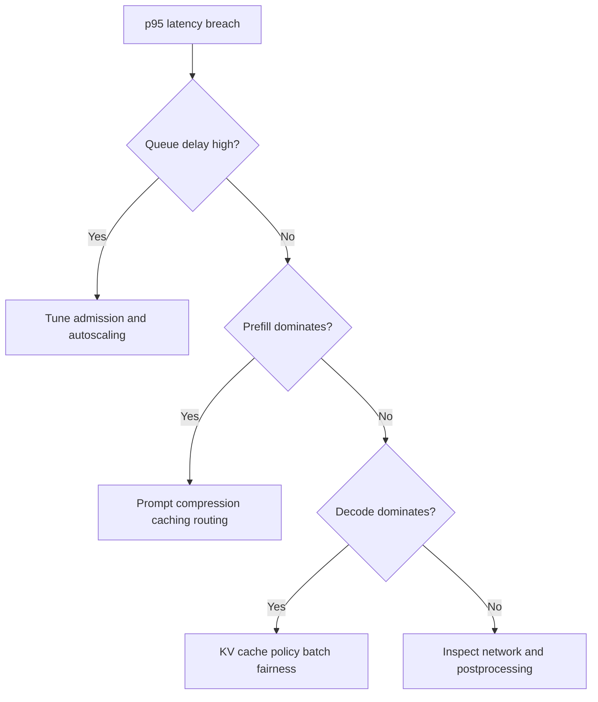

# vLLM Serving, Latency, and Cost Tradeoffs

## Why This Matters in 2026
LLM production engineering is now about balancing three constraints at once: quality, latency, and unit economics. vLLM is a common open serving runtime because it improves GPU utilization with continuous batching and efficient KV-cache management. Interviews expect you to explain these mechanics and the operational tradeoffs.

## Latency Budget Mental Model
End-to-end request latency can be decomposed into:

`Total latency ~= queue + prefill + decode + postprocessing + network`

Most systems teams over-focus on model runtime and miss queueing and scheduling effects.

Figure: Runtime flow for a typical vLLM-serving request.

## 1. Prefill and Decode Are Different Workloads

### Prefill Phase
- processes prompt tokens in parallel
- typically compute-heavy
- sensitive to prompt length distribution

### Decode Phase
- generates token-by-token
- often memory-bandwidth and cache-access constrained
- sensitive to output length and concurrency

Optimization requires knowing which phase dominates your real traffic mix.

## 2. Continuous Batching and Scheduler Behavior
vLLM improves utilization by admitting requests continuously instead of waiting for static batches.

Benefits:
- better GPU occupancy
- higher throughput under bursty load

Risks:
- tail latency inflation if admission policy is not tuned
- unfairness between short and long requests

Monitor both throughput and per-length-slice latency to avoid hidden regressions.

## 3. PagedAttention and KV Cache Management
PagedAttention reduces memory fragmentation pressure by organizing KV-cache pages more efficiently.

Operational implications:
- higher sustainable concurrency at long contexts
- fewer OOM-style failures from fragmented allocations
- better decode stability under mixed request lengths

Still, cache growth remains a primary capacity constraint and must be controlled with request limits and scheduling policy.

## 4. Throughput, Tail Latency, and Queueing

### Why p50 Can Look Great While p95 Fails
When utilization approaches saturation, queueing delay grows nonlinearly. This often appears as stable p50 and rapidly worsening p95/p99.

### Practical Controls
- cap max context and output lengths by tier
- isolate heavy requests into separate pools
- apply admission control during traffic spikes
- tune batching aggressiveness with SLO-aware policies

Figure: Tail-latency diagnosis path for serving incidents.

## 5. Quantization and Model Routing Strategy

### Quantization
Lower precision can improve speed and memory efficiency, but quality may degrade on specific tasks.

Safe rollout pattern:
1. establish quality baseline by slice
2. benchmark latency and throughput gains
3. canary deploy with rollback thresholds
4. monitor online drift and incident rates

### Model Routing
Use smaller models for low-complexity traffic and larger models for hard queries. This can reduce cost significantly while preserving quality when routing is accurate.

## 6. Cost Engineering
Track cost using both GPU-time and token metrics:
- cost per 1k output tokens
- cost per successful request
- wasted-token ratio (retrieved but unused context)

A useful optimization lens:
- reduce unnecessary input tokens first
- then improve scheduling and cache hit rates
- then evaluate model-size changes

## 7. Production Observability
Minimum dashboard dimensions:
- p50/p95/p99 latency
- queue delay percentile
- prefill and decode token throughput
- GPU memory pressure and cache utilization
- error rate by failure class
- cost per request and per token

Always break down metrics by prompt length and response length buckets.

## 8. Rollout and Reliability Playbook

### Deployment Guardrails
- canary traffic split with automatic rollback
- regression gates on quality + latency + safety
- model/version trace IDs in every response log

### Incident Response
1. freeze rollout
2. identify whether issue is scheduling, model, prompt, or retrieval path
3. replay failing traffic slice
4. roll back or isolate heavy traffic pool
5. add incident case to eval suite

## Practical Implementation Lab (Advanced)
Goal: compare two serving configurations and ship one with evidence-based gating.

1. Define workload matrix by prompt/output length and concurrency.
2. Benchmark baseline vLLM config.
3. Apply one optimization (quantization, scheduler tuning, or routing).
4. Re-run load tests and quality evals.
5. Canary deploy and monitor for 24-48 hours.

Track:
- throughput tokens/sec
- p95 and p99 latency
- quality pass rate by slice
- cost per successful request
- rollback trigger rate

## Common Pitfalls
- Optimizing only average latency while ignoring tail behavior.
- Benchmarking with unrealistic request distributions.
- Applying quantization without quality regression checks.
- Ignoring queue delay in total latency analysis.

## Interview Bridge
- Related interview file: [llm-production-and-system-design-questions.md](../interviews/llm-production-and-system-design-questions.md)
- Questions this explainer supports:
  - How do you trade off throughput and p95 SLO?
  - How do you roll out quantization safely?
  - Which signals trigger immediate rollback?

## References
- vLLM docs: https://docs.vllm.ai/en/latest/
- vLLM PagedAttention post: https://blog.vllm.ai/2023/06/20/vllm.html
- vLLM quantization docs: https://docs.vllm.ai/en/latest/features/quantization/
- DistServe paper: https://arxiv.org/abs/2401.09670
