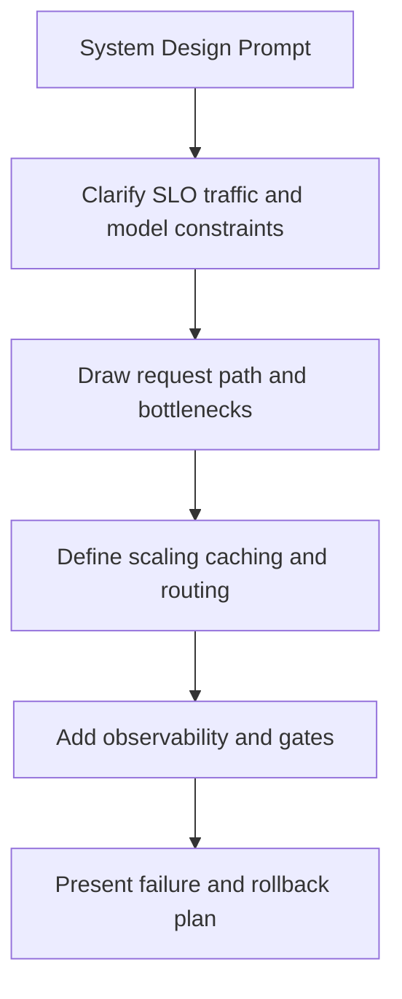
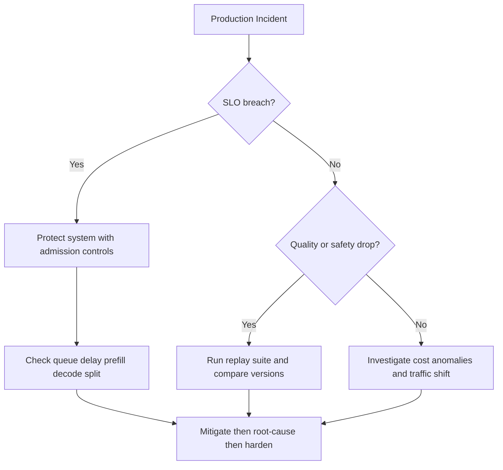

# LLM Production and System Design Interview Questions

## Scope
This file prepares advanced system design interviews for LLM serving, scaling, reliability, and cost governance.

## How To Use This File
- Practice top questions in four layers:
  1. short answer
  2. deep answer
  3. follow-up ladder
  4. anti-pattern answer to avoid
- Use explicit latency and cost budgets in architecture answers.

## Interviewer Probe Map
- Can you design for p95 latency and throughput simultaneously?
- Can you defend reliability and rollback strategy under incidents?
- Can you optimize cost without hidden quality regressions?



Figure: Recommended answer sequence for production system design rounds.

## Question Clusters
- Architecture and Performance: Q1 to Q12
- Reliability and Operations: Q13 to Q22
- Incident Debugging and Optimization: Q23 to Q32

## Architecture and Performance

### Q1: Design LLM serving for high QPS under latency SLO
What interviewer is probing:
- End-to-end architecture clarity and bottleneck awareness.

Direct answer:
Define constraints first, then design admission control, dynamic batching, cache strategy, and autoscaling to hit p95 SLO with rollback safety.

Deep answer:
1. Clarify SLO, QPS, token length distribution, and acceptable quality floor.
2. Build request path: API gateway -> queue -> scheduler -> model runtime -> postprocessing.
3. Separate traffic pools by request weight to protect tail latency.
4. Add caching strategy (prompt-prefix, retrieval cache where safe).
5. Add autoscaling triggers based on queue delay and GPU utilization.
6. Define rollback and fallback behavior if SLO or quality fails.

Follow-up variants:
- Which component usually dominates p95 at high concurrency?
- How do you avoid starvation of short requests?

Common mistakes and red flags:
"Just add more GPUs" without queueing and policy design.

Sample code or pseudocode (when relevant):
```text
# Interview outline
1) Validate inputs and constraints
2) Apply core strategy
3) Add failure handling and observability hooks
```
### Q2: Throughput versus tail latency tuning
What interviewer is probing:
- Queueing theory intuition in practical systems.

Direct answer:
Aggressive batching increases throughput but can hurt p95/p99; tune with SLO-aware admission and request-class isolation.

Deep answer:
Tune scheduler using workload slices, not global averages. Use separate queues for heavy prompts, cap max context/output by tier, and track queue delay independently from runtime latency. Optimize for stable p95 under realistic spikes.

Common mistakes and red flags:
- Naming tools or algorithms without mapping them to constraints.
- Ignoring edge cases, failure modes, or rollback triggers.
- Skipping metrics needed to prove the design works in production.

Follow-up variants:
- What changes if throughput doubles or latency budget is cut in half?
- Which single metric would trigger rollback after deployment?

Sample code or pseudocode (when relevant):
```text
# Interview outline
1) Validate inputs and constraints
2) Apply core strategy
3) Add failure handling and observability hooks
```
### Q3: Quantization rollout strategy
What interviewer is probing:
- Safe optimization process and risk controls.

Direct answer:
Quantization is a release, not a toggle: benchmark, canary, monitor, rollback.

Deep answer:
Establish baseline quality and latency per traffic slice. Apply quantization in staging and run regression evals. Canary with strict rollback thresholds for quality, safety, and p95 drift. Keep shadow logs for postmortem attribution.

Common mistakes and red flags:
- Naming tools or algorithms without mapping them to constraints.
- Ignoring edge cases, failure modes, or rollback triggers.
- Skipping metrics needed to prove the design works in production.

Follow-up variants:
- What changes if throughput doubles or latency budget is cut in half?
- Which single metric would trigger rollback after deployment?

Sample code or pseudocode (when relevant):
```text
# Interview outline
1) Validate inputs and constraints
2) Apply core strategy
3) Add failure handling and observability hooks
```
### Q4: Multi-region reliability design
What interviewer is probing:
- Disaster recovery and failover thinking.

Direct answer:
Use active-active or active-passive based on cost/risk profile, with health-based routing and region-aware fallback.

Deep answer:
Design region isolation boundaries, replicate critical metadata/state safely, and define failover triggers. Ensure model/version parity and consistent policy configs across regions. Test failover using controlled chaos drills.

Common mistakes and red flags:
- Naming tools or algorithms without mapping them to constraints.
- Ignoring edge cases, failure modes, or rollback triggers.
- Skipping metrics needed to prove the design works in production.

Follow-up variants:
- What changes if throughput doubles or latency budget is cut in half?
- Which single metric would trigger rollback after deployment?

Sample code or pseudocode (when relevant):
```text
# Interview outline
1) Validate inputs and constraints
2) Apply core strategy
3) Add failure handling and observability hooks
```
### Q5: Reduce serving cost by 30 percent without quality drop
What interviewer is probing:
- Cost engineering prioritization.

Direct answer:
First remove wasted tokens and routing inefficiencies, then evaluate model/precision changes with strict quality gates.

Deep answer:
1. Profile cost per successful request and per token.
2. Reduce prompt/context waste and improve cache hit rate.
3. Add model routing for simple vs complex queries.
4. Evaluate quantization only after data-path waste is reduced.
5. Gate every change with quality and safety regressions.

Common mistakes and red flags:
- Naming tools or algorithms without mapping them to constraints.
- Ignoring edge cases, failure modes, or rollback triggers.
- Skipping metrics needed to prove the design works in production.

Follow-up variants:
- What changes if throughput doubles or latency budget is cut in half?
- Which single metric would trigger rollback after deployment?

Sample code or pseudocode (when relevant):
```text
# Interview outline
1) Validate inputs and constraints
2) Apply core strategy
3) Add failure handling and observability hooks
```
### Q6: Deployment gate design with GitHub Actions
What interviewer is probing:
- CI/CD discipline for GenAI.

Direct answer:
Use a clear, constraint-first decision for deployment gate design with github actions, then state one production tradeoff (latency, cost, or reliability).

Deep answer:
1. State assumptions, constraints, and success metric.
2. Explain the chosen design or algorithm and why alternatives are weaker.
3. Cover failure handling, observability, and rollback criteria.

Common mistakes and red flags:
- Naming tools or algorithms without mapping them to constraints.
- Ignoring edge cases, failure modes, or rollback triggers.
- Skipping metrics needed to prove the design works in production.

Follow-up variants:
- What changes if throughput doubles or latency budget is cut in half?
- Which single metric would trigger rollback after deployment?

Sample code or pseudocode (when relevant):
```text
# Interview outline
1) Validate inputs and constraints
2) Apply core strategy
3) Add failure handling and observability hooks
```
### Q7: Designing streaming UX under strict latency budgets
What interviewer is probing:
- User-perceived latency reasoning.

Direct answer:
Use a clear, constraint-first decision for designing streaming ux under strict latency budgets, then state one production tradeoff (latency, cost, or reliability).

Deep answer:
1. State assumptions, constraints, and success metric.
2. Explain the chosen design or algorithm and why alternatives are weaker.
3. Cover failure handling, observability, and rollback criteria.

Common mistakes and red flags:
- Naming tools or algorithms without mapping them to constraints.
- Ignoring edge cases, failure modes, or rollback triggers.
- Skipping metrics needed to prove the design works in production.

Follow-up variants:
- What changes if throughput doubles or latency budget is cut in half?
- Which single metric would trigger rollback after deployment?

Sample code or pseudocode (when relevant):
```text
# Interview outline
1) Validate inputs and constraints
2) Apply core strategy
3) Add failure handling and observability hooks
```
### Q8: Admission control strategy during traffic spikes
What interviewer is probing:
- Overload protection and graceful degradation.

Direct answer:
Use a clear, constraint-first decision for admission control strategy during traffic spikes, then state one production tradeoff (latency, cost, or reliability).

Deep answer:
1. State assumptions, constraints, and success metric.
2. Explain the chosen design or algorithm and why alternatives are weaker.
3. Cover failure handling, observability, and rollback criteria.

Common mistakes and red flags:
- Naming tools or algorithms without mapping them to constraints.
- Ignoring edge cases, failure modes, or rollback triggers.
- Skipping metrics needed to prove the design works in production.

Follow-up variants:
- What changes if throughput doubles or latency budget is cut in half?
- Which single metric would trigger rollback after deployment?

Sample code or pseudocode (when relevant):
```text
# Interview outline
1) Validate inputs and constraints
2) Apply core strategy
3) Add failure handling and observability hooks
```
### Q9: Prefix caching opportunities and pitfalls
What interviewer is probing:
- Cache efficacy and correctness boundaries.

Direct answer:
Use a clear, constraint-first decision for prefix caching opportunities and pitfalls, then state one production tradeoff (latency, cost, or reliability).

Deep answer:
1. State assumptions, constraints, and success metric.
2. Explain the chosen design or algorithm and why alternatives are weaker.
3. Cover failure handling, observability, and rollback criteria.

Common mistakes and red flags:
- Naming tools or algorithms without mapping them to constraints.
- Ignoring edge cases, failure modes, or rollback triggers.
- Skipping metrics needed to prove the design works in production.

Follow-up variants:
- What changes if throughput doubles or latency budget is cut in half?
- Which single metric would trigger rollback after deployment?

Sample code or pseudocode (when relevant):
```text
# Interview outline
1) Validate inputs and constraints
2) Apply core strategy
3) Add failure handling and observability hooks
```
### Q10: Model routing for multilingual and code-heavy workloads
What interviewer is probing:
- Product-aware architecture selection.

Direct answer:
Use a clear, constraint-first decision for model routing for multilingual and code-heavy workloads, then state one production tradeoff (latency, cost, or reliability).

Deep answer:
1. State assumptions, constraints, and success metric.
2. Explain the chosen design or algorithm and why alternatives are weaker.
3. Cover failure handling, observability, and rollback criteria.

Common mistakes and red flags:
- Naming tools or algorithms without mapping them to constraints.
- Ignoring edge cases, failure modes, or rollback triggers.
- Skipping metrics needed to prove the design works in production.

Follow-up variants:
- What changes if throughput doubles or latency budget is cut in half?
- Which single metric would trigger rollback after deployment?

Sample code or pseudocode (when relevant):
```text
# Interview outline
1) Validate inputs and constraints
2) Apply core strategy
3) Add failure handling and observability hooks
```
### Q11: Capacity planning for quarterly growth
What interviewer is probing:
- Forecasting and headroom planning.

Direct answer:
Use a clear, constraint-first decision for capacity planning for quarterly growth, then state one production tradeoff (latency, cost, or reliability).

Deep answer:
1. State assumptions, constraints, and success metric.
2. Explain the chosen design or algorithm and why alternatives are weaker.
3. Cover failure handling, observability, and rollback criteria.

Common mistakes and red flags:
- Naming tools or algorithms without mapping them to constraints.
- Ignoring edge cases, failure modes, or rollback triggers.
- Skipping metrics needed to prove the design works in production.

Follow-up variants:
- What changes if throughput doubles or latency budget is cut in half?
- Which single metric would trigger rollback after deployment?

Sample code or pseudocode (when relevant):
```text
# Interview outline
1) Validate inputs and constraints
2) Apply core strategy
3) Add failure handling and observability hooks
```
### Q12: Build vs buy for managed inference services
What interviewer is probing:
- Platform strategy and total-cost reasoning.

## Reliability and Operations

Direct answer:
Use a clear, constraint-first decision for build vs buy for managed inference services, then state one production tradeoff (latency, cost, or reliability).

Deep answer:
1. State assumptions, constraints, and success metric.
2. Explain the chosen design or algorithm and why alternatives are weaker.
3. Cover failure handling, observability, and rollback criteria.

Common mistakes and red flags:
- Naming tools or algorithms without mapping them to constraints.
- Ignoring edge cases, failure modes, or rollback triggers.
- Skipping metrics needed to prove the design works in production.

Follow-up variants:
- What changes if throughput doubles or latency budget is cut in half?
- Which single metric would trigger rollback after deployment?

Sample code or pseudocode (when relevant):
```text
# Interview outline
1) Validate inputs and constraints
2) Apply core strategy
3) Add failure handling and observability hooks
```
### Q13: SLO and error-budget design for LLM APIs
What interviewer is probing:
- Reliability ownership maturity.

Direct answer:
Use a clear, constraint-first decision for slo and error-budget design for llm apis, then state one production tradeoff (latency, cost, or reliability).

Deep answer:
1. State assumptions, constraints, and success metric.
2. Explain the chosen design or algorithm and why alternatives are weaker.
3. Cover failure handling, observability, and rollback criteria.

Common mistakes and red flags:
- Naming tools or algorithms without mapping them to constraints.
- Ignoring edge cases, failure modes, or rollback triggers.
- Skipping metrics needed to prove the design works in production.

Follow-up variants:
- What changes if throughput doubles or latency budget is cut in half?
- Which single metric would trigger rollback after deployment?

Sample code or pseudocode (when relevant):
```text
# Interview outline
1) Validate inputs and constraints
2) Apply core strategy
3) Add failure handling and observability hooks
```
### Q14: Golden signals for LLM serving health
What interviewer is probing:
- Observability completeness.

Direct answer:
Use a clear, constraint-first decision for golden signals for llm serving health, then state one production tradeoff (latency, cost, or reliability).

Deep answer:
1. State assumptions, constraints, and success metric.
2. Explain the chosen design or algorithm and why alternatives are weaker.
3. Cover failure handling, observability, and rollback criteria.

Common mistakes and red flags:
- Naming tools or algorithms without mapping them to constraints.
- Ignoring edge cases, failure modes, or rollback triggers.
- Skipping metrics needed to prove the design works in production.

Follow-up variants:
- What changes if throughput doubles or latency budget is cut in half?
- Which single metric would trigger rollback after deployment?

Sample code or pseudocode (when relevant):
```text
# Interview outline
1) Validate inputs and constraints
2) Apply core strategy
3) Add failure handling and observability hooks
```
### Q15: Rollback criteria after model swap
What interviewer is probing:
- Operational decision discipline.

Direct answer:
Use a clear, constraint-first decision for rollback criteria after model swap, then state one production tradeoff (latency, cost, or reliability).

Deep answer:
1. State assumptions, constraints, and success metric.
2. Explain the chosen design or algorithm and why alternatives are weaker.
3. Cover failure handling, observability, and rollback criteria.

Common mistakes and red flags:
- Naming tools or algorithms without mapping them to constraints.
- Ignoring edge cases, failure modes, or rollback triggers.
- Skipping metrics needed to prove the design works in production.

Follow-up variants:
- What changes if throughput doubles or latency budget is cut in half?
- Which single metric would trigger rollback after deployment?

Sample code or pseudocode (when relevant):
```text
# Interview outline
1) Validate inputs and constraints
2) Apply core strategy
3) Add failure handling and observability hooks
```
### Q16: Config drift prevention across environments
What interviewer is probing:
- Release consistency controls.

Direct answer:
Use a clear, constraint-first decision for config drift prevention across environments, then state one production tradeoff (latency, cost, or reliability).

Deep answer:
1. State assumptions, constraints, and success metric.
2. Explain the chosen design or algorithm and why alternatives are weaker.
3. Cover failure handling, observability, and rollback criteria.

Common mistakes and red flags:
- Naming tools or algorithms without mapping them to constraints.
- Ignoring edge cases, failure modes, or rollback triggers.
- Skipping metrics needed to prove the design works in production.

Follow-up variants:
- What changes if throughput doubles or latency budget is cut in half?
- Which single metric would trigger rollback after deployment?

Sample code or pseudocode (when relevant):
```text
# Interview outline
1) Validate inputs and constraints
2) Apply core strategy
3) Add failure handling and observability hooks
```
### Q17: Safe schema evolution for tool-call outputs
What interviewer is probing:
- Compatibility and integration stability.

Direct answer:
Use a clear, constraint-first decision for safe schema evolution for tool-call outputs, then state one production tradeoff (latency, cost, or reliability).

Deep answer:
1. State assumptions, constraints, and success metric.
2. Explain the chosen design or algorithm and why alternatives are weaker.
3. Cover failure handling, observability, and rollback criteria.

Common mistakes and red flags:
- Naming tools or algorithms without mapping them to constraints.
- Ignoring edge cases, failure modes, or rollback triggers.
- Skipping metrics needed to prove the design works in production.

Follow-up variants:
- What changes if throughput doubles or latency budget is cut in half?
- Which single metric would trigger rollback after deployment?

Sample code or pseudocode (when relevant):
```text
# Interview outline
1) Validate inputs and constraints
2) Apply core strategy
3) Add failure handling and observability hooks
```
### Q18: Securing multi-tenant inference endpoints
What interviewer is probing:
- Isolation and access-control design.

Direct answer:
Use a clear, constraint-first decision for securing multi-tenant inference endpoints, then state one production tradeoff (latency, cost, or reliability).

Deep answer:
1. State assumptions, constraints, and success metric.
2. Explain the chosen design or algorithm and why alternatives are weaker.
3. Cover failure handling, observability, and rollback criteria.

Common mistakes and red flags:
- Naming tools or algorithms without mapping them to constraints.
- Ignoring edge cases, failure modes, or rollback triggers.
- Skipping metrics needed to prove the design works in production.

Follow-up variants:
- What changes if throughput doubles or latency budget is cut in half?
- Which single metric would trigger rollback after deployment?

Sample code or pseudocode (when relevant):
```text
# Interview outline
1) Validate inputs and constraints
2) Apply core strategy
3) Add failure handling and observability hooks
```
### Q19: Cost anomaly detection playbook
What interviewer is probing:
- FinOps plus observability integration.

Direct answer:
Use a clear, constraint-first decision for cost anomaly detection playbook, then state one production tradeoff (latency, cost, or reliability).

Deep answer:
1. State assumptions, constraints, and success metric.
2. Explain the chosen design or algorithm and why alternatives are weaker.
3. Cover failure handling, observability, and rollback criteria.

Common mistakes and red flags:
- Naming tools or algorithms without mapping them to constraints.
- Ignoring edge cases, failure modes, or rollback triggers.
- Skipping metrics needed to prove the design works in production.

Follow-up variants:
- What changes if throughput doubles or latency budget is cut in half?
- Which single metric would trigger rollback after deployment?

Sample code or pseudocode (when relevant):
```text
# Interview outline
1) Validate inputs and constraints
2) Apply core strategy
3) Add failure handling and observability hooks
```
### Q20: Evaluating autoscaling policies on GPUs
What interviewer is probing:
- Scaling dynamics and metric selection.

Direct answer:
Use a clear, constraint-first decision for evaluating autoscaling policies on gpus, then state one production tradeoff (latency, cost, or reliability).

Deep answer:
1. State assumptions, constraints, and success metric.
2. Explain the chosen design or algorithm and why alternatives are weaker.
3. Cover failure handling, observability, and rollback criteria.

Common mistakes and red flags:
- Naming tools or algorithms without mapping them to constraints.
- Ignoring edge cases, failure modes, or rollback triggers.
- Skipping metrics needed to prove the design works in production.

Follow-up variants:
- What changes if throughput doubles or latency budget is cut in half?
- Which single metric would trigger rollback after deployment?

Sample code or pseudocode (when relevant):
```text
# Interview outline
1) Validate inputs and constraints
2) Apply core strategy
3) Add failure handling and observability hooks
```
### Q21: Release checklist for high-risk model upgrades
What interviewer is probing:
- Governance and launch discipline.

Direct answer:
Use a clear, constraint-first decision for release checklist for high-risk model upgrades, then state one production tradeoff (latency, cost, or reliability).

Deep answer:
1. State assumptions, constraints, and success metric.
2. Explain the chosen design or algorithm and why alternatives are weaker.
3. Cover failure handling, observability, and rollback criteria.

Common mistakes and red flags:
- Naming tools or algorithms without mapping them to constraints.
- Ignoring edge cases, failure modes, or rollback triggers.
- Skipping metrics needed to prove the design works in production.

Follow-up variants:
- What changes if throughput doubles or latency budget is cut in half?
- Which single metric would trigger rollback after deployment?

Sample code or pseudocode (when relevant):
```text
# Interview outline
1) Validate inputs and constraints
2) Apply core strategy
3) Add failure handling and observability hooks
```
### Q22: Audit log requirements for enterprise customers
What interviewer is probing:
- Compliance readiness.

## Incident Debugging and Optimization

Direct answer:
Use a clear, constraint-first decision for audit log requirements for enterprise customers, then state one production tradeoff (latency, cost, or reliability).

Deep answer:
1. State assumptions, constraints, and success metric.
2. Explain the chosen design or algorithm and why alternatives are weaker.
3. Cover failure handling, observability, and rollback criteria.

Common mistakes and red flags:
- Naming tools or algorithms without mapping them to constraints.
- Ignoring edge cases, failure modes, or rollback triggers.
- Skipping metrics needed to prove the design works in production.

Follow-up variants:
- What changes if throughput doubles or latency budget is cut in half?
- Which single metric would trigger rollback after deployment?

Sample code or pseudocode (when relevant):
```text
# Interview outline
1) Validate inputs and constraints
2) Apply core strategy
3) Add failure handling and observability hooks
```
### Q23: High p95 with healthy p50
What interviewer is probing:
- Tail-latency diagnosis.

Direct answer:
Use a clear, constraint-first decision for high p95 with healthy p50, then state one production tradeoff (latency, cost, or reliability).

Deep answer:
1. State assumptions, constraints, and success metric.
2. Explain the chosen design or algorithm and why alternatives are weaker.
3. Cover failure handling, observability, and rollback criteria.

Common mistakes and red flags:
- Naming tools or algorithms without mapping them to constraints.
- Ignoring edge cases, failure modes, or rollback triggers.
- Skipping metrics needed to prove the design works in production.

Follow-up variants:
- What changes if throughput doubles or latency budget is cut in half?
- Which single metric would trigger rollback after deployment?

Sample code or pseudocode (when relevant):
```text
# Interview outline
1) Validate inputs and constraints
2) Apply core strategy
3) Add failure handling and observability hooks
```
### Q24: Quality regression only on long prompts
What interviewer is probing:
- Slice-based debugging rigor.

Direct answer:
Use a clear, constraint-first decision for quality regression only on long prompts, then state one production tradeoff (latency, cost, or reliability).

Deep answer:
1. State assumptions, constraints, and success metric.
2. Explain the chosen design or algorithm and why alternatives are weaker.
3. Cover failure handling, observability, and rollback criteria.

Common mistakes and red flags:
- Naming tools or algorithms without mapping them to constraints.
- Ignoring edge cases, failure modes, or rollback triggers.
- Skipping metrics needed to prove the design works in production.

Follow-up variants:
- What changes if throughput doubles or latency budget is cut in half?
- Which single metric would trigger rollback after deployment?

Sample code or pseudocode (when relevant):
```text
# Interview outline
1) Validate inputs and constraints
2) Apply core strategy
3) Add failure handling and observability hooks
```
### Q25: Streaming stalls under high concurrency
What interviewer is probing:
- Backpressure and scheduler bottleneck reasoning.

Direct answer:
Use a clear, constraint-first decision for streaming stalls under high concurrency, then state one production tradeoff (latency, cost, or reliability).

Deep answer:
1. State assumptions, constraints, and success metric.
2. Explain the chosen design or algorithm and why alternatives are weaker.
3. Cover failure handling, observability, and rollback criteria.

Common mistakes and red flags:
- Naming tools or algorithms without mapping them to constraints.
- Ignoring edge cases, failure modes, or rollback triggers.
- Skipping metrics needed to prove the design works in production.

Follow-up variants:
- What changes if throughput doubles or latency budget is cut in half?
- Which single metric would trigger rollback after deployment?

Sample code or pseudocode (when relevant):
```text
# Interview outline
1) Validate inputs and constraints
2) Apply core strategy
3) Add failure handling and observability hooks
```
### Q26: OOM spikes after context-window increase
What interviewer is probing:
- Memory planning and cache pressure awareness.

Direct answer:
Use a clear, constraint-first decision for oom spikes after context-window increase, then state one production tradeoff (latency, cost, or reliability).

Deep answer:
1. State assumptions, constraints, and success metric.
2. Explain the chosen design or algorithm and why alternatives are weaker.
3. Cover failure handling, observability, and rollback criteria.

Common mistakes and red flags:
- Naming tools or algorithms without mapping them to constraints.
- Ignoring edge cases, failure modes, or rollback triggers.
- Skipping metrics needed to prove the design works in production.

Follow-up variants:
- What changes if throughput doubles or latency budget is cut in half?
- Which single metric would trigger rollback after deployment?

Sample code or pseudocode (when relevant):
```text
# Interview outline
1) Validate inputs and constraints
2) Apply core strategy
3) Add failure handling and observability hooks
```
### Q27: Error rate spike after enabling quantization
What interviewer is probing:
- Fast rollback and root-cause analysis.

Direct answer:
Use a clear, constraint-first decision for error rate spike after enabling quantization, then state one production tradeoff (latency, cost, or reliability).

Deep answer:
1. State assumptions, constraints, and success metric.
2. Explain the chosen design or algorithm and why alternatives are weaker.
3. Cover failure handling, observability, and rollback criteria.

Common mistakes and red flags:
- Naming tools or algorithms without mapping them to constraints.
- Ignoring edge cases, failure modes, or rollback triggers.
- Skipping metrics needed to prove the design works in production.

Follow-up variants:
- What changes if throughput doubles or latency budget is cut in half?
- Which single metric would trigger rollback after deployment?

Sample code or pseudocode (when relevant):
```text
# Interview outline
1) Validate inputs and constraints
2) Apply core strategy
3) Add failure handling and observability hooks
```
### Q28: Throughput increased but business KPI decreased
What interviewer is probing:
- Metric alignment and product impact.

Direct answer:
Use a clear, constraint-first decision for throughput increased but business kpi decreased, then state one production tradeoff (latency, cost, or reliability).

Deep answer:
1. State assumptions, constraints, and success metric.
2. Explain the chosen design or algorithm and why alternatives are weaker.
3. Cover failure handling, observability, and rollback criteria.

Common mistakes and red flags:
- Naming tools or algorithms without mapping them to constraints.
- Ignoring edge cases, failure modes, or rollback triggers.
- Skipping metrics needed to prove the design works in production.

Follow-up variants:
- What changes if throughput doubles or latency budget is cut in half?
- Which single metric would trigger rollback after deployment?

Sample code or pseudocode (when relevant):
```text
# Interview outline
1) Validate inputs and constraints
2) Apply core strategy
3) Add failure handling and observability hooks
```
### Q29: Canary looked good, full rollout failed
What interviewer is probing:
- Sampling bias and deployment strategy gaps.

Direct answer:
Use a clear, constraint-first decision for canary looked good, full rollout failed, then state one production tradeoff (latency, cost, or reliability).

Deep answer:
1. State assumptions, constraints, and success metric.
2. Explain the chosen design or algorithm and why alternatives are weaker.
3. Cover failure handling, observability, and rollback criteria.

Common mistakes and red flags:
- Naming tools or algorithms without mapping them to constraints.
- Ignoring edge cases, failure modes, or rollback triggers.
- Skipping metrics needed to prove the design works in production.

Follow-up variants:
- What changes if throughput doubles or latency budget is cut in half?
- Which single metric would trigger rollback after deployment?

Sample code or pseudocode (when relevant):
```text
# Interview outline
1) Validate inputs and constraints
2) Apply core strategy
3) Add failure handling and observability hooks
```
### Q30: Distinguishing model regression from retrieval regression
What interviewer is probing:
- Cross-layer attribution method.

Direct answer:
Use a clear, constraint-first decision for distinguishing model regression from retrieval regression, then state one production tradeoff (latency, cost, or reliability).

Deep answer:
1. State assumptions, constraints, and success metric.
2. Explain the chosen design or algorithm and why alternatives are weaker.
3. Cover failure handling, observability, and rollback criteria.

Common mistakes and red flags:
- Naming tools or algorithms without mapping them to constraints.
- Ignoring edge cases, failure modes, or rollback triggers.
- Skipping metrics needed to prove the design works in production.

Follow-up variants:
- What changes if throughput doubles or latency budget is cut in half?
- Which single metric would trigger rollback after deployment?

Sample code or pseudocode (when relevant):
```text
# Interview outline
1) Validate inputs and constraints
2) Apply core strategy
3) Add failure handling and observability hooks
```
### Q31: Incident command process for severe outage
What interviewer is probing:
- Leadership under pressure.

Direct answer:
Use a clear, constraint-first decision for incident command process for severe outage, then state one production tradeoff (latency, cost, or reliability).

Deep answer:
1. State assumptions, constraints, and success metric.
2. Explain the chosen design or algorithm and why alternatives are weaker.
3. Cover failure handling, observability, and rollback criteria.

Common mistakes and red flags:
- Naming tools or algorithms without mapping them to constraints.
- Ignoring edge cases, failure modes, or rollback triggers.
- Skipping metrics needed to prove the design works in production.

Follow-up variants:
- What changes if throughput doubles or latency budget is cut in half?
- Which single metric would trigger rollback after deployment?

Sample code or pseudocode (when relevant):
```text
# Interview outline
1) Validate inputs and constraints
2) Apply core strategy
3) Add failure handling and observability hooks
```
### Q32: Postmortem improvements after recurring latency incidents
What interviewer is probing:
- Systemic prevention and long-term ownership.



Figure: First-response decision tree for LLM production incidents.

## Rapid-Fire Round
- Three must-have serving metrics beyond p50 latency.
- Two rollback criteria you would automate.
- One reason queue delay should be a separate SLI.
- Two signs your canary cohort is not representative.

## Company Emphasis
- Amazon:
  - reliability ownership, rollback speed, and measurable customer impact.
  - clear tradeoff narratives with operational metrics.
- Google:
  - deeper distributed-systems reasoning and scalability follow-ups.
  - stronger emphasis on principled benchmarking.
- Startup:
  - pragmatic architecture, fast iteration, and cost control.
  - practical fallback paths when infrastructure is limited.

## References
- [vllm-serving-latency-and-cost-tradeoffs.md](../explainers/vllm-serving-latency-and-cost-tradeoffs.md)
- vLLM docs: https://docs.vllm.ai/en/latest/

Direct answer:
Use a clear, constraint-first decision for postmortem improvements after recurring latency incidents, then state one production tradeoff (latency, cost, or reliability).

Deep answer:
1. State assumptions, constraints, and success metric.
2. Explain the chosen design or algorithm and why alternatives are weaker.
3. Cover failure handling, observability, and rollback criteria.

Common mistakes and red flags:
- Naming tools or algorithms without mapping them to constraints.
- Ignoring edge cases, failure modes, or rollback triggers.
- Skipping metrics needed to prove the design works in production.

Follow-up variants:
- What changes if throughput doubles or latency budget is cut in half?
- Which single metric would trigger rollback after deployment?

Sample code or pseudocode (when relevant):
```text
# Interview outline
1) Validate inputs and constraints
2) Apply core strategy
3) Add failure handling and observability hooks
```
