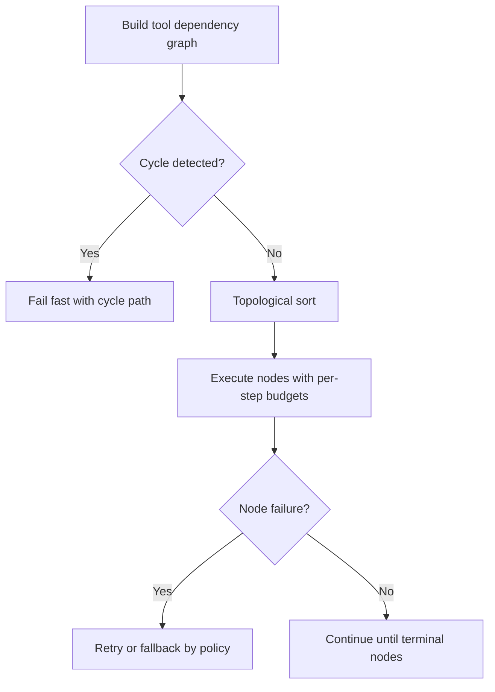
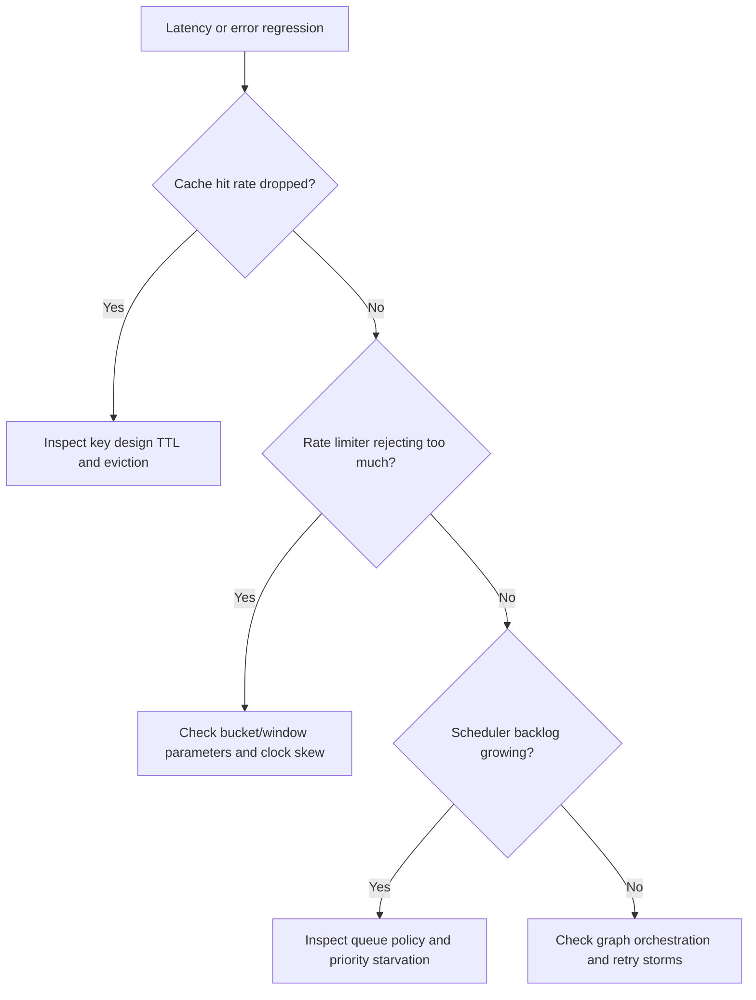

# DSA Patterns for AI Backends

## Why This Matters in 2026
DSA questions in GenAI interviews are now system-shaped: not just "solve this problem," but "design this cache, limiter, scheduler, or workflow graph under real constraints." Strong answers connect complexity analysis to reliability and production operations.

## Mapping Model
Use this translation:
- array/hash map -> state tables and dedup registries
- heap/priority queue -> top-k and scheduler priority logic
- deque/monotonic queue -> windows and streaming stats
- linked map -> LRU and TTL caches
- graph -> tool DAGs and dependency planners

Figure: How to frame DSA in production interviews.

## 1. Hash Maps and Sets in Production State

### Typical Usage
- idempotency keys for dedup writes
- in-flight request registry
- tenant-scoped counters and quotas

### Design Questions Interviewers Ask
- what is memory growth over 24 hours?
- how is stale-key cleanup handled?
- what is the conflict policy under concurrent updates?

### Practical Guidance
Prefer bounded maps with TTL and periodic cleanup. For multi-instance services, move shared state to Redis or another distributed store.

## 2. Heaps and Priority Queues

### Typical Usage
- top-k retrieval postprocessing
- priority scheduling (interactive > batch)
- aging queues to avoid starvation

### Complexity Discussion
- insertion/removal: O(log n)
- peek best item: O(1)

Interview edge case: tie-breaking and fairness policy when scores are equal or stale.

## 3. Sliding Window Patterns and Rate Control

### Why It Matters
Rate limits protect model and tool dependencies. Poor implementation either blocks healthy traffic or lets abuse through.

### Approaches
- fixed window: simple but bursty at boundaries
- sliding window log: accurate but memory heavy
- token bucket: practical burst handling and low overhead

Choose based on accuracy vs memory budget and expected traffic shape.

## 4. Linked Structures for LRU and TTL Caching
Classic map + doubly linked list gives near O(1) get/put/evict.

Production caveats:
- lock granularity under high concurrency
- TTL plus LRU interaction
- cache stampede protection

Instrument hit ratio, eviction rate, and stale-read rate.

## 5. Graphs and DAG Execution for Agent Workflows

### Typical Usage
- tool dependency planning
- workflow stage orchestration
- partial re-execution after failure

### Critical Properties
- cycle detection before execution
- deterministic topological ordering
- per-node timeout and retry policy

Figure: DAG execution control flow for tool orchestration.

## 6. Concurrency and Contention Patterns
DSA solutions in interviews must include concurrency assumptions:
- single-threaded event loop vs multi-thread worker pool
- lock scope and contention hotspots
- atomicity and race condition handling

A correct single-thread algorithm can fail in multi-thread deployments without synchronization design.

## 7. Complexity to Cost Translation
Translate complexity into operational impact:
- O(n) scans at high QPS increase tail latency
- unbounded map growth increases memory spend and OOM risk
- expensive per-request sort can exceed p95 latency budget

Interviewers reward candidates who bridge algorithmic complexity to SLO and cost outcomes.

## Debugging Decision Tree

Figure: Fast diagnosis for DSA-backed backend regressions.

## Practical Implementation Lab (Advanced)
Goal: build a utility package that mirrors common AI backend requirements.

1. Implement token bucket limiter with tenant and global scopes.
2. Implement thread-safe LRU+TTL cache with metrics.
3. Implement top-k stream tracker with bounded memory.
4. Implement DAG executor with cycle checks and per-node budgets.
5. Add benchmark harness and stress tests.

Track:
- limiter rejection false-positive rate
- cache hit ratio and eviction churn
- scheduler backlog depth
- DAG execution success rate

## Common Pitfalls
- Discussing only asymptotic complexity, not memory and contention.
- Unbounded in-memory maps in long-lived services.
- Ignoring fairness and starvation in priority queues.
- No metrics on cache or limiter behavior.

## Interview Bridge
- Related interview file: [python-and-dsa-ai-systems-questions.md](../interviews/python-and-dsa-ai-systems-questions.md)
- Questions this explainer supports:
  - Design per-user and global limiters under bursty load.
  - Build thread-safe LRU with near O(1) operations.
  - Execute DAG workflows with cycle safety and fallback policy.

## References
- System design primer: https://github.com/donnemartin/system-design-primer
- Python data structures docs: https://docs.python.org/3/tutorial/datastructures.html
- Redis rate-limiting patterns: https://redis.io/learn/howtos/ratelimiting
