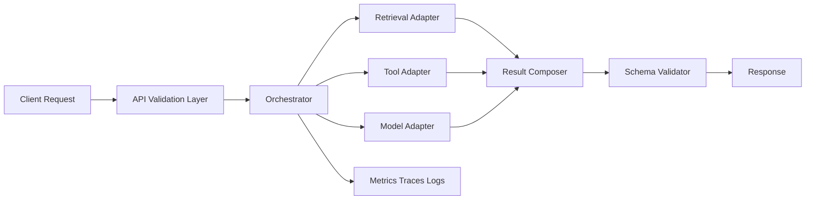
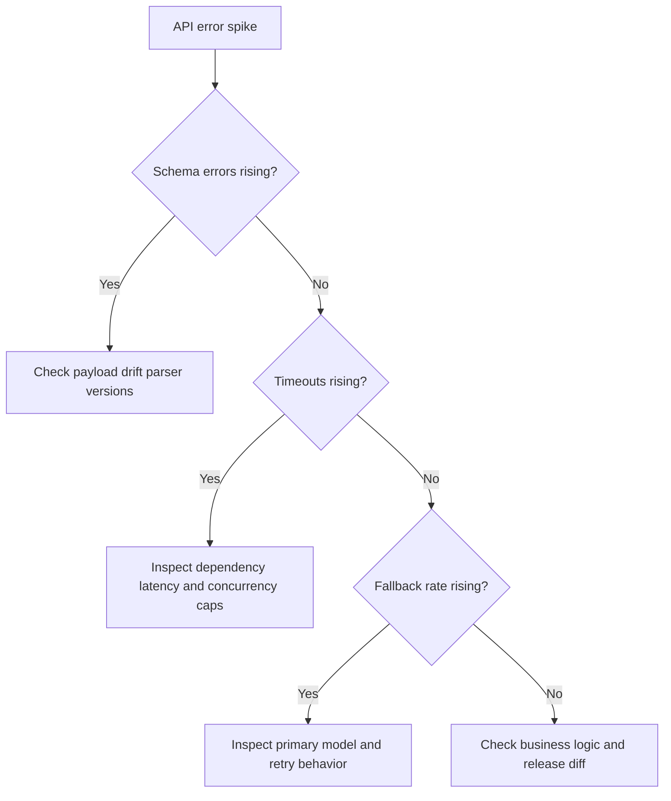

# Python for AI Systems (Beyond Syntax)

## Why This Matters in 2026
LLM products succeed or fail on systems engineering around the model: concurrency limits, contract stability, retry discipline, and observability. Most production incidents are Python runtime and integration issues, not core model failures.

## Operating Model
Think of your service as three enforced contracts:
1. Interface contract: validated inputs/outputs and schema guarantees.
2. Execution contract: bounded concurrency, timeout budgets, and retry policy.
3. Reliability contract: traceability, idempotency, and safe fallback behavior.

Figure: Python service control flow for an LLM-backed API.

## 1. Type Safety at Boundaries
Do not trust any external boundary:
- client request payloads
- tool inputs and outputs
- model JSON responses
- third-party API payloads

Use strict typed models and explicit validation failures. A parsing failure should be a tracked event with clear error class and request correlation ID.

Practical pattern:
1. Parse input into strict schema.
2. Execute business logic with typed objects only.
3. Parse outbound model/tool content before use.
4. Emit structured error on schema mismatch.

## 2. Async Orchestration and Concurrency Discipline

### Why Async Helps
Most GenAI app latency is I/O bound. Async can overlap:
- retrieval calls
- tool calls
- model requests
- persistence writes

### Why Async Fails in Production
Unbounded fan-out causes downstream saturation and retry storms.

Required controls:
- semaphore per dependency
- request-level deadline
- step-level timeout budgets
- cancellation propagation

If parent request is canceled, child tasks must stop quickly to avoid zombie work.

## 3. Timeouts, Retries, and Idempotency

### Timeout Budgeting
Set a total request budget and split it across critical path steps. Example:
- overall budget: 8s
- retrieval: 1.5s
- tool path: 2s
- model call: 3s
- postprocessing and buffer: 1.5s

### Retry Rules
Retry only transient classes (for example network timeout, 5xx). Do not retry validation failures or policy rejections.

### Idempotency
Any stateful action (writes, side effects, tickets, payments) must include idempotency keys so retries do not duplicate side effects.

## 4. Error Taxonomy and Fallback Design
Define explicit categories:
- user errors: invalid payload, policy blocked
- dependency errors: timeout, unavailable service
- internal errors: bug, schema drift

Fallback strategy should be deterministic:
- if retrieval fails: switch to reduced-context response mode
- if primary model fails transiently: use fallback model with quality flag
- if output schema fails repeatedly: return safe refusal with incident trace ID

## 5. Packaging and Dependency Boundaries
Recommended module layout:
- `api/`: transport and request shaping
- `services/`: orchestration and business rules
- `adapters/`: model, retrieval, tools, storage clients
- `domain/`: data models and error types
- `observability/`: logging, metrics, tracing setup

Keep adapters replaceable so model/runtime changes do not leak through business logic.

## 6. Observability You Need on Day 1
Minimum telemetry:
- request count and error rate by class
- p50/p95/p99 latency
- retries per dependency
- fallback activation rate
- output schema failure rate

Attach request ID and trace span to every downstream call.

## 7. Performance Tuning Playbook
Start with profiling, not intuition.

Typical wins:
- reuse HTTP sessions and connection pools
- batch embeddings/retrieval where safe
- avoid repeated serialization/tokenization work
- cache deterministic prompt prefixes

Always re-check quality and correctness after latency optimizations.

## 8. Security and Configuration Hygiene
Critical basics:
- store secrets in managed secret stores
- never log raw credentials or sensitive prompts
- enforce per-tenant access checks in retrieval/tool layers
- version configuration and keep rollout diffs auditable

## Debugging Decision Tree

Figure: First-pass triage for Python LLM backend incidents.

## Practical Implementation Lab (Advanced)
Goal: implement a production-grade async LLM gateway with deterministic failure handling.

1. Build strict request/response schemas and error classes.
2. Implement orchestrator with bounded async fan-out.
3. Add timeout budget propagation and transient-only retries.
4. Add idempotency key handling for stateful tool calls.
5. Add fallback model route with quality and cost flags.
6. Add OpenTelemetry traces and SLO dashboards.
7. Create failure-injection tests for timeout, 5xx, and parse errors.

Metrics to track:
- p95 latency
- error rate by class
- retry success rate
- fallback activation rate
- schema parse failure rate

## Common Pitfalls
- Treating model output as trusted JSON.
- Using global unlimited concurrency.
- Retrying non-transient failures.
- Missing request correlation in logs.
- Shipping fallback logic without quality gates.

## Interview Bridge
- Related interview file: [python-and-dsa-ai-systems-questions.md](../interviews/python-and-dsa-ai-systems-questions.md)
- Questions this explainer supports:
  - How do you design retries without duplicate side effects?
  - How do you allocate timeout budgets across nested calls?
  - How do you detect and contain schema drift quickly?

## References
- FastAPI docs: https://fastapi.tiangolo.com/
- Pydantic docs: https://docs.pydantic.dev/latest/
- Python asyncio docs: https://docs.python.org/3/library/asyncio.html
- OpenTelemetry Python: https://opentelemetry.io/docs/instrumentation/python/
