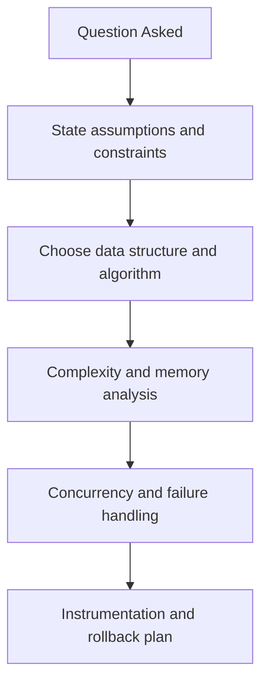
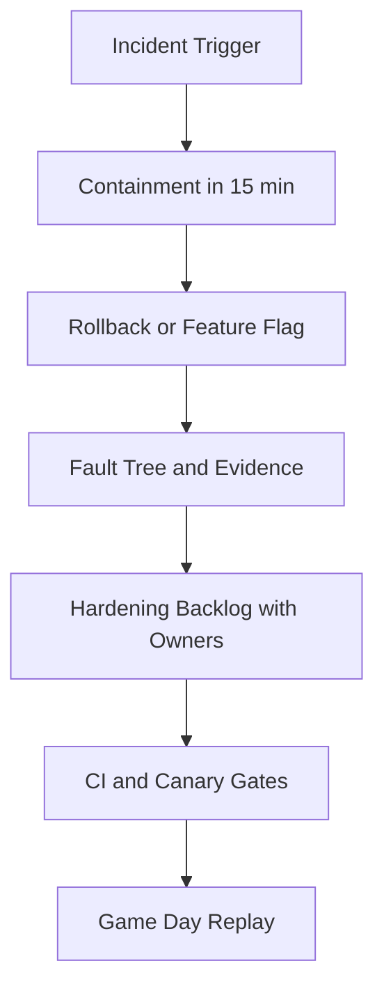

# Python and DSA for AI Systems Interview Questions

## Scope
This file targets advanced coding and backend systems interviews where Python engineering and DSA decisions are evaluated together.

## How To Use This File
- For top questions, practice four layers:
  1. short answer
  2. deep answer
  3. follow-up ladder
  4. anti-pattern answer to avoid
- Always include complexity plus production implications (latency, memory, reliability).

## Interviewer Probe Map
- Can you map algorithm design to production constraints?
- Can you reason about concurrency and partial failures?
- Can you debug with metrics instead of guesswork?



Figure: Recommended answer path for Python/DSA system interviews.

## Question Clusters
- Foundations: Q1 to Q10
- Systems and Scale: Q11 to Q20
- Debugging and Incidents: Q21 to Q30

## Foundations

### Q1: Design a thread-safe LRU cache
What interviewer is probing:
- O(1) structure design under concurrent access.

Direct answer:
Use hash map plus doubly linked list for O(1) get/put, with explicit locking strategy and eviction metrics.

Deep answer:
1. Clarify scope: single process multi-thread, or distributed.
2. Use map for key lookup and linked list for recency updates.
3. Protect composite operations with lock (or shard-level locks).
4. Define eviction, TTL policy, and stale key cleanup.
5. Instrument hit ratio and lock contention.

Follow-up variants:
- How would you shard cache to reduce contention?
- How do TTL and LRU interact under bursty traffic?

Common mistakes and red flags:
"Use dict and it is thread-safe" without lock/atomicity discussion.

Sample code or pseudocode (when relevant):
```text
# Interview outline
1) Validate inputs and constraints
2) Apply core strategy
3) Add failure handling and observability hooks
```
### Q2: Implement per-user plus global rate limiter
What interviewer is probing:
- Sliding window/token bucket correctness and fairness.

Direct answer:
Use token bucket for burst handling with separate per-user and global buckets, enforcing checks in deterministic order.

Deep answer:
1. Define fairness target and burst allowance.
2. Apply per-user gate first, then global gate.
3. Use bounded state with TTL cleanup.
4. For multi-instance services, store counters in Redis with atomic operations.
5. Export reject reasons for monitoring and tuning.

Follow-up variants:
- How do you prevent noisy-neighbor dominance?
- How do you handle clock skew in distributed limiters?

Common mistakes and red flags:
Unbounded per-user maps with no cleanup plan.

Sample code or pseudocode (when relevant):
```text
# Interview outline
1) Validate inputs and constraints
2) Apply core strategy
3) Add failure handling and observability hooks
```
### Q3: Build top-k trending intents from stream
What interviewer is probing:
- Heap plus hash map design in streaming settings.

Direct answer:
Maintain counts in hash map and bounded min-heap for top-k candidates.

Deep answer:
Use map for O(1) count updates and min-heap of size k for ranking. Discuss stale heap entries strategy (lazy deletion or index map). Explain update complexity and memory bounds.

Common mistakes and red flags:
- Naming tools or algorithms without mapping them to constraints.
- Ignoring edge cases, failure modes, or rollback triggers.
- Skipping metrics needed to prove the design works in production.

Follow-up variants:
- What changes if throughput doubles or latency budget is cut in half?
- Which single metric would trigger rollback after deployment?

Sample code or pseudocode (when relevant):
```text
# Interview outline
1) Validate inputs and constraints
2) Apply core strategy
3) Add failure handling and observability hooks
```
### Q4: Async fan-out with timeout budget
What interviewer is probing:
- Async orchestration and cancellation safety.

Direct answer:
Bound concurrency with semaphore, apply per-task timeouts, and propagate cancellation.

Deep answer:
Derive child budgets from request deadline. Start tasks with bounded fan-out, collect partial results safely, classify failures, and degrade gracefully. Ensure canceled parent request stops all child work.

Common mistakes and red flags:
- Naming tools or algorithms without mapping them to constraints.
- Ignoring edge cases, failure modes, or rollback triggers.
- Skipping metrics needed to prove the design works in production.

Follow-up variants:
- What changes if throughput doubles or latency budget is cut in half?
- Which single metric would trigger rollback after deployment?

Sample code or pseudocode (when relevant):
```text
# Interview outline
1) Validate inputs and constraints
2) Apply core strategy
3) Add failure handling and observability hooks
```
### Q5: Detect cycles in tool execution DAG
What interviewer is probing:
- Graph correctness and failure explanation.

Direct answer:
Use DFS color states or Kahn topological sort; fail fast with cycle path details.

Deep answer:
Validate graph before execution, include cycle path in error output, and prevent runtime deadlocks. Add per-node retry budget and failure policy for downstream dependencies.

Common mistakes and red flags:
- Naming tools or algorithms without mapping them to constraints.
- Ignoring edge cases, failure modes, or rollback triggers.
- Skipping metrics needed to prove the design works in production.

Follow-up variants:
- What changes if throughput doubles or latency budget is cut in half?
- Which single metric would trigger rollback after deployment?

Sample code or pseudocode (when relevant):
```text
# Interview outline
1) Validate inputs and constraints
2) Apply core strategy
3) Add failure handling and observability hooks
```
### Q6: Many duplicate requests arrive together
What interviewer is probing:
- Single-flight and idempotency control.

Direct answer:
Use a single-flight registry keyed by normalized request identity so only one worker computes the result while duplicates await the same future.

Deep answer:
1. Define idempotency key from user, operation, and normalized payload.
2. Store an in-flight promise/future in a bounded map with TTL.
3. First request executes work; followers await the same result.
4. On completion, publish result and evict in-flight key.
5. For distributed services, combine Redis lock plus short-lived result cache.

Common mistakes and red flags:
- Dedup key includes timestamps, causing near-zero dedup hit rate.
- No timeout/cleanup path for stuck in-flight entries.
- Sharing failures forever instead of limiting failure caching.

Follow-up variants:
- How do you prevent map growth from high-cardinality keys?
- When do you dedupe only writes vs dedupe all operations?

Sample code or pseudocode (when relevant):
```python
key = make_idempotency_key(req)
future = inflight.get(key)
if future is None:
  future = loop.create_future()
  inflight[key] = future
  try:
    future.set_result(await handle(req))
  except Exception as exc:
    future.set_exception(exc)
  finally:
    inflight.pop(key, None)
return await future
```
### Q7: Parse unreliable model JSON safely
What interviewer is probing:
- Typed contracts and safe fallback behavior.

Direct answer:
Validate model output against a strict schema, attempt bounded repair once, and fall back to safe defaults or refusal if contract checks still fail.

Deep answer:
1. Require a typed schema (for example, Pydantic model or JSON Schema).
2. Parse raw output with strict mode first.
3. If parse fails, run one deterministic repair pass (trim wrappers, fix quotes, remove trailing commas).
4. Revalidate and reject on second failure.
5. Log parse category metrics for prompt/model tuning.

Common mistakes and red flags:
- Accepting partially parsed objects silently.
- Mixing parser repair and business defaults in one step.
- Returning malformed data with HTTP 200 status.

Follow-up variants:
- How do you version schemas without breaking clients?
- How do you detect schema drift after model upgrades?

Sample code or pseudocode (when relevant):
```python
def parse_or_fail(raw: str) -> OutputModel:
  try:
    return OutputModel.model_validate_json(raw)
  except Exception:
    repaired = deterministic_repair(raw)
    return OutputModel.model_validate_json(repaired)
```
### Q8: Sliding-window max for real-time latency dashboard
What interviewer is probing:
- Monotonic queue usage and bounded memory.

Direct answer:
Use a monotonic deque of candidate maxima and evict expired indices as the window advances for O(1) amortized updates.

Deep answer:
1. Store pairs of (timestamp/index, value) in descending value order.
2. Before insert, pop from tail while tail value <= new value.
3. Push current item.
4. Evict head while it is outside the sliding window.
5. Head always equals current max.

Common mistakes and red flags:
- Recomputing max over full window each update (O(window)).
- Forgetting expiry checks before reading max.
- Using unordered containers that cannot preserve recency.

Follow-up variants:
- How does this change for time-based vs count-based windows?
- How would you shard this for high-cardinality metrics?

Sample code or pseudocode (when relevant):
```python
while dq and dq[-1].value <= value:
  dq.pop()
dq.append(Node(idx, value))
while dq and dq[0].idx <= idx - window:
  dq.popleft()
current_max = dq[0].value
```
### Q9: K-way merge for retrieval results
What interviewer is probing:
- Heap-driven merge and ranking stability.

Direct answer:
Maintain a heap with one cursor per ranked list and pop the best next candidate each step, applying stable tie-breakers and dedup by document id.

Deep answer:
1. Ensure each source list is sorted by score.
2. Push first element from each list to a heap.
3. Pop best item, append if unseen document id.
4. Advance cursor for that list and push next candidate.
5. Stop at requested top-k and track source contribution mix.

Common mistakes and red flags:
- Ignoring duplicate doc ids from multiple retrievers.
- No deterministic tie-break (unstable ranking between runs).
- Mixing incomparable score scales without normalization.

Follow-up variants:
- How do you blend BM25 and dense scores safely?
- How do you cap one source from dominating top-k?

Sample code or pseudocode (when relevant):
```python
heap = init_with_first_item_each_list(lists)
seen = set()
while heap and len(out) < k:
  item = heappop(heap)  # best score first
  if item.doc_id not in seen:
    out.append(item)
    seen.add(item.doc_id)
  push_next_from_same_list(item.list_id, item.next_idx)
```
### Q10: Retry policy design by exception taxonomy
What interviewer is probing:
- Reliability-aware Python error handling.

Direct answer:
Retry only transient failures with exponential backoff plus jitter, enforce retry budgets/deadlines, and never retry non-idempotent operations without idempotency keys.

Deep answer:
1. Classify exceptions: transient, throttling, permanent, and programmer errors.
2. Define per-class max attempts and backoff policy.
3. Attach retry budget to request deadline.
4. Emit retry metrics by exception class.
5. Add circuit breaker to prevent retry storms.

Common mistakes and red flags:
- Retrying validation errors or auth failures.
- Unbounded retries without jitter.
- Retrying writes without idempotency protection.

Follow-up variants:
- How do you tune retry policy under partner API rate limits?
- When do you fail fast instead of retrying?

Sample code or pseudocode (when relevant):
```python
for attempt in range(max_attempts):
  try:
    return await call()
  except TransientError:
    await asyncio.sleep(backoff_with_jitter(attempt))
  except PermanentError:
    raise
raise RetryExhausted()
```

## Systems and Scale
### Q11: Multi-tenant cache isolation strategy
What interviewer is probing:
- Whether you can prevent noisy neighbors without exploding operational cost.

Direct answer:
Use tenant-scoped keys, per-tenant admission budgets, and weighted eviction. Enforce fairness at write time, not only during eviction, so one hot tenant cannot push everyone else out.

Deep answer:
1. Namespace every key as `tenant_id:feature:hash` to make isolation explicit.
2. Keep per-tenant memory budgets (`maxmemory-policy allkeys-lfu` plus tenant quotas in app logic).
3. Admit writes only if tenant is below its hotset budget; otherwise degrade to shorter TTL.
4. Separate shared global cache from tenant-private cache to avoid cross-tenant pollution.
5. Track fairness metrics: p95 latency by tenant, hit-rate by tenant, eviction-rate by tenant.

Common mistakes and red flags:
- Using one global keyspace with no tenant quota.
- Relying only on TTLs and hoping fairness emerges.
- Forgetting to include model/version in keys, causing stale cross-version hits.

Follow-up variants:
- How would you handle enterprise tenants with paid burst capacity?
- What should happen when Redis memory is near 95 percent?

Sample code or pseudocode (when relevant):
```python
def cache_key(tenant_id: str, model: str, prompt_hash: str) -> str:
  return f"{tenant_id}:{model}:{prompt_hash}"

def admit_write(tenant_usage_bytes: int, tenant_budget_bytes: int) -> bool:
  return tenant_usage_bytes < tenant_budget_bytes
```
### Q12: Queue design with priority aging
What interviewer is probing:
- Whether you can keep urgent work fast without starving background jobs.

Direct answer:
Use weighted priority queues with aging. High-priority jobs start first, but waiting time continuously increases effective priority of older low-priority jobs.

Deep answer:
1. Keep separate queues by class: interactive, async, maintenance.
2. Define effective priority as `base_priority + age_factor * wait_seconds`.
3. Dispatch using weighted round robin with a max burst cap per class.
4. Add dead-letter queue for repeatedly failing tasks.
5. Measure starvation directly: max wait time by class and age percentile.

Common mistakes and red flags:
- Strict priority with no aging (eventual starvation).
- One queue for all traffic classes.
- Retrying poison messages forever in main queue.

Follow-up variants:
- How do you tune aging for bursty interactive traffic?
- When should a task be demoted to dead-letter instead of retried?

Sample code or pseudocode (when relevant):
```python
def effective_priority(base: int, enqueued_at: float, now: float, age_factor: float) -> float:
  return base + age_factor * (now - enqueued_at)

# pop max effective priority across queues
```
### Q13: Bounded in-flight request registry design
What interviewer is probing:
- Concurrency control and single-flight correctness under load.

Direct answer:
Use a bounded in-memory single-flight map keyed by normalized request fingerprint and TTL. New identical requests attach to the same future; cap map size and evict expired entries.

Deep answer:
1. Fingerprint key should include tenant, model, prompt hash, and critical params.
2. On first request, allocate a Future and execute work.
3. On duplicate request, await existing Future.
4. Remove map entry on completion/failure with finally block.
5. Protect with asyncio.Lock or sharded locks to avoid races.
6. Enforce capacity cap to avoid memory blow-up during spikes.

Common mistakes and red flags:
- Missing cleanup on exceptions, leaking in-flight entries.
- Key includes timestamp/request id, defeating dedup.
- No cap on in-flight map size.

Follow-up variants:
- How would you distribute single-flight across multiple pods?
- What should happen if the leader request is cancelled?

Sample code or pseudocode (when relevant):
```python
inflight: dict[str, asyncio.Future] = {}

async def single_flight(key: str, fn):
  fut = inflight.get(key)
  if fut:
    return await fut
  fut = asyncio.get_running_loop().create_future()
  inflight[key] = fut
  try:
    val = await fn()
    fut.set_result(val)
    return val
  except Exception as e:
    fut.set_exception(e)
    raise
  finally:
    inflight.pop(key, None)
```
### Q14: Distributed rate limiter with Redis
What interviewer is probing:
- Whether you can implement a limiter that is both correct and cheap at scale.

Direct answer:
Use Redis Lua for atomic token-bucket updates. Keep separate keys for global and tenant limits, and make admission decision from both in one script call.

Deep answer:
1. Token bucket supports short bursts while enforcing long-term rate.
2. Store `tokens` and `last_refill_ms` per scope key.
3. Refill and consume atomically in Lua to avoid race conditions.
4. Return `allowed`, `remaining`, and `retry_after_ms` for clients.
5. Add fallback mode if Redis is degraded: local emergency limiter + shed non-critical traffic.

Common mistakes and red flags:
- Multi-roundtrip `GET` then `SET` (race-prone).
- Fixed windows causing cliff effects at minute boundaries.
- Not including clock skew tolerance in distributed setups.

Follow-up variants:
- How do you support per-endpoint and per-tenant limits together?
- When do you choose leaky-bucket over token-bucket?

Sample code or pseudocode (when relevant):
```lua
-- KEYS[1] = bucket key, ARGV = now_ms, refill_rate, capacity, cost
-- returns: allowed(0/1), remaining, retry_after_ms
```
### Q15: Backpressure design in async pipelines
What interviewer is probing:
- End-to-end overload control across producers, queues, and workers.

Direct answer:
Bound queue size, bound worker concurrency, and fail fast when queue delay exceeds SLO budget. Backpressure should propagate to the caller instead of silently buffering forever.

Deep answer:
1. Set max queue length from memory budget, not guesses.
2. Use semaphore for in-flight worker limit.
3. Track queue wait time and reject or degrade when above threshold.
4. Split critical and best-effort traffic into separate queues.
5. Add admission shedding policy for non-critical work during incidents.

Common mistakes and red flags:
- Unlimited queues that hide overload until OOM.
- Scaling workers without checking downstream capacity.
- Measuring only throughput, ignoring queue delay.

Follow-up variants:
- How would you set queue thresholds from SLO targets?
- Which requests should be dropped first during shedding?

Sample code or pseudocode (when relevant):
```python
if queue.qsize() > MAX_Q or queue_wait_ms > MAX_WAIT_MS:
  raise HTTPException(status_code=429, detail="server_busy")

async with worker_sem:
  await process(item)
```
### Q16: Choosing data structures for p95 latency SLO
What interviewer is probing:
- Whether you can map big-O and constants to real latency budgets.

Direct answer:
Pick structures by operation mix and p95 targets: hash map for O(1) lookup, heap for top-k, deque for sliding windows, and preallocation when GC churn hurts tail latency.

Deep answer:
1. Start from critical path ops and per-request budget.
2. Build microbenchmarks with realistic key distributions and batch sizes.
3. Compare median and p95, not only average.
4. Include memory footprint and CPU cache locality in tradeoff.
5. Promote data structure only after canary verifies p95 improvement.

Common mistakes and red flags:
- Quoting big-O while ignoring Python object overhead.
- Optimizing cold path code.
- No perf test with production-like payload sizes.

Follow-up variants:
- When would you move a hotspot to C extension or Rust?
- How do you validate no regression in memory pressure?

Sample code or pseudocode (when relevant):
```python
ops = ["lookup", "topk", "insert", "expire"]
budget_ms = {"lookup": 1.5, "topk": 4.0}
# benchmark candidates under skewed key distributions
```
### Q17: Safe schema evolution in Python services
What interviewer is probing:
- Versioning discipline across producers and consumers.

Direct answer:
Use additive changes first, keep old fields readable, and gate removals behind version negotiation plus telemetry proving zero legacy traffic.

Deep answer:
1. Introduce `schema_version` and default values for new fields.
2. Deploy reader compatibility before writer changes.
3. Log unknown/missing field counters by client version.
4. Roll out writer canary, monitor parse failures.
5. Remove deprecated fields only after burn-in and explicit migration window.

Common mistakes and red flags:
- Breaking rename instead of additive migration.
- Strict parser in hot path without fallback mapping.
- No compatibility tests between service versions.

Follow-up variants:
- How do you migrate schemas across event replay pipelines?
- Which compatibility mode would you choose for mobile clients lagging upgrades?

Sample code or pseudocode (when relevant):
```python
class ReqV2(BaseModel):
  schema_version: int = 2
  prompt: str
  temperature: float = 0.2

def parse_request(payload: dict):
  if payload.get("schema_version", 1) == 1:
    payload["temperature"] = payload.get("temp", 0.2)
  return ReqV2.model_validate(payload)
```
### Q18: Designing bounded retries to avoid retry storms
What interviewer is probing:
- Whether you can prevent retries from becoming the outage.

Direct answer:
Retry only transient classes, cap attempts and total retry time, use exponential backoff with jitter, and enforce a per-request retry budget.

Deep answer:
1. Classify errors into transient, throttling, and permanent.
2. Attach `deadline_ms` and decrement budget each retry.
3. Use full jitter to prevent synchronized retries.
4. Trip circuit breaker on sustained failure ratio.
5. Stop retries when downstream returns deterministic 4xx.

Common mistakes and red flags:
- Retrying parser or auth errors.
- Layered retries at gateway and client causing amplification.
- No retry budget metric per endpoint.

Follow-up variants:
- How do you coordinate retries when both SDK and server can retry?
- How would you protect a shared downstream from all tenants simultaneously?

Sample code or pseudocode (when relevant):
```python
for attempt in range(max_attempts):
  try:
    return await call()
  except TransientError:
    if deadline_ms() <= 0:
      break
    await asyncio.sleep(jittered_backoff(attempt))
raise RetryExhausted()
```
### Q19: Memory leak investigation in long-lived workers
What interviewer is probing:
- Practical leak triage in Python services under sustained load.

Direct answer:
Capture allocation snapshots over time, correlate growth with request classes, and fix retained references first (global dicts, task closures, unbounded caches). Validate with soak tests.

Deep answer:
1. Confirm leak vs expected cache growth using RSS and object counts.
2. Use tracemalloc snapshots and compare top diffs by traceback.
3. Inspect asyncio tasks not completing and references in closures.
4. Check cache cardinality and TTL behavior.
5. Add watchdog restart only as temporary mitigation, not root fix.

Common mistakes and red flags:
- Calling periodic pod restarts a "fix".
- Ignoring Python allocator fragmentation effects.
- Running profiler only in dev with unrealistic load.

Follow-up variants:
- Which leak patterns are common with async generators?
- How do you prove leak is fixed, not just slowed?

Sample code or pseudocode (when relevant):
```python
import tracemalloc

tracemalloc.start()
snap_a = tracemalloc.take_snapshot()
# run load for N minutes
snap_b = tracemalloc.take_snapshot()
for stat in snap_b.compare_to(snap_a, "lineno")[:10]:
  print(stat)
```
### Q20: Caching prompt prefixes without stale output bugs
What interviewer is probing:
 - Cache correctness with model/tokenizer/version boundaries.

Direct answer:
Cache only deterministic prefix artifacts keyed by model id, tokenizer version, system prompt hash, and decoding parameters that affect logits. Treat any mismatch as cache miss.

Deep answer:
1. Separate prefill cache from final response cache.
2. Build key from all semantics-changing inputs: model, tokenizer, system prompt, tools schema, temperature/top_p.
3. Add cache metadata for creation timestamp and source model.
4. Invalidate on model rollout or tokenizer migration.
5. Verify correctness with replay tests before enabling broad traffic.

Common mistakes and red flags:
- Key missing decoding params, causing subtle behavior drift.
- Reusing cache across models with different vocabularies.
- Not versioning prompt template changes.

Follow-up variants:
- Which fields are safe to omit from cache key for cost reasons?
- How do you canary prefix cache rollout safely?

Sample code or pseudocode (when relevant):
```python
key = hash_tuple(
  tenant_id,
  model_id,
  tokenizer_ver,
  system_prompt_hash,
  tools_schema_hash,
  temperature,
  top_p,
  prefix_tokens_hash,
)
```

## Debugging and Incidents
### Q21: p95 latency spike but p50 stable
What interviewer is probing:
- Tail-latency diagnosis instead of average-based debugging.

Direct answer:
Check queue wait, cold starts, and slow dependency percentiles first. Stable p50 with rising p95 usually means a minority path is degraded, not total capacity collapse.

Deep answer:
1. Break end-to-end latency into queue, compute, downstream I/O.
2. Compare distributions by tenant, region, and endpoint.
3. Inspect long-tail contributors: retries, large prompts, cache misses.
4. Confirm if autoscaler lag or connection pool exhaustion is present.
5. Apply targeted mitigation: queue caps, warm pools, per-tenant limits.

Common mistakes and red flags:
- Scaling everything up without identifying tail driver.
- Looking only at average latency.
- Ignoring request size distribution changes.

Follow-up variants:
- How do you prove queueing is the dominant contributor?
- What rollback trigger would you set for a new model release?

Sample code or pseudocode (when relevant):
```python
if p95_ms > 2 * baseline_p95_ms and p50_ms < 1.2 * baseline_p50_ms:
  alert("tail_regression")
```
### Q22: Error rate spike after parser update
What interviewer is probing:
- Safe rollout and fast triage under schema drift.

Direct answer:
Segment errors by parser version and payload shape, then rollback if parse-failure ratio breaches guardrail. Keep dual-parser compatibility during migration windows.

Deep answer:
1. Add version tag to every parser error metric.
2. Reproduce failures from production samples in a staging replay job.
3. Identify exact field/contract mismatch (missing field, type drift, enum drift).
4. Roll back parser or enable compatibility adapter.
5. Add contract tests to prevent repeat regressions.

Common mistakes and red flags:
- Rolling forward blindly without root cause.
- Logging full sensitive payloads.
- Deploying strict parser before all producers are upgraded.

Follow-up variants:
- How do you do safe canary for parser changes?
- What parser metrics belong in CI release gates?

Sample code or pseudocode (when relevant):
```python
try:
  req = parse_v2(payload)
except ValidationError:
  req = parse_v1_compat(payload)
  metrics.inc("parser_fallback_total")
```
### Q23: Limiter rejects too much good traffic
What interviewer is probing:
- Fairness and limiter calibration under real traffic distributions.

Direct answer:
Verify if limiter is keying too broadly, refill too slowly, or using fixed-window cliffs. Shift to token-bucket with per-tenant keys and tune from observed burst profiles.

Deep answer:
1. Compare reject rates by tenant, route, and request class.
2. Validate key cardinality (user vs tenant vs IP).
3. Replay sampled traffic through limiter simulator.
4. Adjust bucket capacity/refill to match expected burstiness.
5. Add soft-limit mode for low-risk endpoints.

Common mistakes and red flags:
- One limiter key for all tenants.
- Tuning limits from intuition, not traffic traces.
- No `retry-after` guidance to clients.

Follow-up variants:
- How do you prevent abuse while reducing false rejects?
- When should you use hierarchical limits (global + tenant + user)?

Sample code or pseudocode (when relevant):
```python
limit_key = f"{tenant_id}:{route_id}"
allowed, remaining, retry_after_ms = token_bucket(limit_key, now_ms)
```
### Q24: Cache hit rate collapses after deploy
What interviewer is probing:
- Cache key compatibility and rollout hygiene.

Direct answer:
Check key schema changes first. Most sudden hit-rate drops come from accidental key version drift, missing normalization, or TTL policy changes during deploy.

Deep answer:
1. Compare pre/post deploy key templates and cardinality.
2. Inspect model/version fields added to key and whether they changed for all traffic.
3. Check serializer changes (ordering, whitespace, float formatting).
4. Validate TTL and eviction policy shifts.
5. Roll back key schema change or add compatibility read path.

Common mistakes and red flags:
- Blaming Redis capacity before checking key drift.
- Using raw JSON dumps without canonicalization.
- Ignoring warm-up strategy after major schema shifts.

Follow-up variants:
- How do you roll out a key schema change without cold-cache shock?
- Which metric distinguishes cache miss from backend slowness?

Sample code or pseudocode (when relevant):
```python
def canonical_json(obj: dict) -> str:
  return json.dumps(obj, sort_keys=True, separators=(",", ":"))
```
### Q25: Async tasks keep running after client disconnect
What interviewer is probing:
- Cancellation propagation and resource cleanup in asyncio.

Direct answer:
Propagate cancellation from request scope to child tasks using task groups and deadlines. Ensure every worker handles `CancelledError` and closes external resources in `finally`.

Deep answer:
1. Tie spawned tasks to request lifecycle (TaskGroup in Python 3.11+).
2. On disconnect, cancel group and stop downstream calls.
3. Ensure drivers honor cancellation (HTTP clients, DB libraries).
4. Add timeout budget to avoid orphan tasks.
5. Track `orphan_task_count` and cleanup latency.

Common mistakes and red flags:
- Creating detached background tasks in request handlers.
- Swallowing `CancelledError` and continuing work.
- No cleanup path for streaming sockets.

Follow-up variants:
- How would you safely continue some work after disconnect (audit logging)?
- Which libraries are cancellation-hostile and how do you defend?

Sample code or pseudocode (when relevant):
```python
async with asyncio.TaskGroup() as tg:
  tg.create_task(stream_llm())
  tg.create_task(write_audit())
# disconnect triggers cancellation of group
```
### Q26: Duplicate writes observed during retries
What interviewer is probing:
- Idempotency and write-path safety across retries/timeouts.

Direct answer:
Require idempotency keys on side-effecting endpoints and persist result state (`PENDING`, `DONE`, `FAILED`) so retries return prior outcome instead of re-executing writes.

Deep answer:
1. Client sends deterministic idempotency key per logical operation.
2. Server stores key and status atomically before executing side effect.
3. Retries with same key read existing status.
4. Use TTL for idempotency records based on business replay window.
5. Guard multi-step writes with outbox or transactional boundaries.

Common mistakes and red flags:
- Generating random idempotency key per retry.
- Storing key only in memory (lost on restart).
- Treating network timeout as guaranteed failure.

Follow-up variants:
- How do you handle concurrent first-writes for same key across pods?
- What is the right TTL for idempotency records in payments vs analytics?

Sample code or pseudocode (when relevant):
```python
state = idem_store.get(key)
if state == "DONE":
  return idem_store.get_result(key)
if state is None:
  idem_store.put_if_absent(key, "PENDING")
  result = perform_write()
  idem_store.commit(key, result)
```
### Q27: Scheduler starvation for low-priority queue
What interviewer is probing:
- Fair scheduler design under mixed workloads.

Direct answer:
Add minimum service guarantees and aging. Even low-priority queues should receive a guaranteed share of execution slots to prevent unbounded starvation.

Deep answer:
1. Define SLO per class: interactive, batch, maintenance.
2. Use weighted fair queuing with floor guarantees.
3. Increase effective priority by waiting time.
4. Cap high-priority burst depth.
5. Monitor starvation KPIs: max wait time and dropped jobs per queue.

Common mistakes and red flags:
- Equating low priority with no guarantee.
- No policy-level SLA per queue.
- Scheduling by queue length only.

Follow-up variants:
- How do you keep interactive latency low while preserving batch progress?
- Which signals indicate aging factor is too aggressive?

Sample code or pseudocode (when relevant):
```python
weights = {"interactive": 8, "batch": 2, "maintenance": 1}
min_share = {"batch": 0.1, "maintenance": 0.05}
```
### Q28: CPU usage spikes under moderate QPS
What interviewer is probing:
- Hot-path profiling and algorithmic inefficiency detection.

Direct answer:
Profile before tuning. Moderate QPS spikes often come from accidental O(n^2) loops, repeated serialization, regex backtracking, or excessive JSON parsing in hot paths.

Deep answer:
1. Capture CPU profiles under representative traffic (py-spy/perf).
2. Identify top stack frames and per-request CPU cost.
3. Remove repeated work: memoize normalization, precompile regex, batch serialization.
4. Replace expensive structures/algorithms in hotspots.
5. Validate gains with canary and compare CPU per request, not total CPU only.

Common mistakes and red flags:
- Tuning thread count before fixing algorithmic bottleneck.
- Using synthetic microbenchmarks that miss real payload diversity.
- Ignoring GIL contention patterns in CPU-heavy sections.

Follow-up variants:
- When should you split CPU-heavy work to process pool?
- How do you prove optimization did not regress correctness?

Sample code or pseudocode (when relevant):
```python
import cProfile

pr = cProfile.Profile()
pr.enable()
run_representative_load()
pr.disable()
pr.print_stats(sort="tottime")
```
### Q29: Partial failures hide behind success status
What interviewer is probing:
- API contract honesty and observability design.

Direct answer:
Return explicit partial-success semantics (`206` or `200` with failure map), include per-substep status, and emit metrics for hidden failures so success rate is not inflated.

Deep answer:
1. Model response as structured outcome: completed, failed, degraded components.
2. Record downstream call outcomes and propagate them to caller when safe.
3. Distinguish user-visible failure from internal degraded mode.
4. Add SLOs for partial failures, not only hard failures.
5. Ensure retries only for failed sub-components when idempotent.

Common mistakes and red flags:
- Returning 200 with silent dropped tool calls.
- One aggregate boolean with no component visibility.
- Dashboards counting only HTTP 5xx as failures.

Follow-up variants:
- What should clients do when completion text is returned but citations failed?
- How do you keep backward compatibility when adding partial status fields?

Sample code or pseudocode (when relevant):
```python
return {
  "status": "partial_success",
  "result": text,
  "components": {
    "retrieval": "ok",
    "reranker": "timeout",
    "citation_builder": "failed"
  }
}
```
### Q30: Post-incident hardening plan for Python backend
What interviewer is probing:
- Whether you can turn one incident into systemic resilience gains.

Direct answer:
Produce a hardening plan with concrete owners, deadlines, and measurable gates: detection improvements, blast-radius reduction, automated rollback rules, and regression tests tied to incident signatures.

Deep answer:
1. Write timeline and fault tree within 24 hours.
2. Classify root causes: detection gap, design gap, operational gap.
3. Define preventive controls: stricter admission, safer defaults, idempotency guardrails.
4. Add CI and canary gates mapped to incident metrics.
5. Run game-day replay using captured traffic patterns and verify recovery time objective.

Common mistakes and red flags:
- Action items with no owner or due date.
- Fixing symptom only (for example, raising timeout) without root cause.
- No validation plan to prove recurrence risk decreased.

Follow-up variants:
- Which three controls would you prioritize if budget is limited?
- How would you convince leadership to fund reliability work after incident calm-down?

Sample code or pseudocode (when relevant):
```python
hardening_plan = {
  "alerts": ["queue_wait_p95", "retry_amplification", "partial_failure_rate"],
  "release_gates": {"max_error_rate": 0.02, "p95_regression": 0.15},
  "owners": {"admission_control": "platform", "parser_contract": "api"},
}
```



Figure: Incident-to-hardening lifecycle for Python AI backends.

## Rapid-Fire Round
- Two reasons p95 can degrade while p50 looks healthy.
- One safe retry policy for a write path.
- Two ways to prevent cache stampede.
- One sign your limiter is overblocking.

## Company Emphasis
- Amazon:
  - complexity plus operational outcomes.
  - measurable rollback and guard conditions.
- Google:
  - deeper edge-case rigor and algorithmic follow-ups.
  - stronger emphasis on formal complexity reasoning.
- Startup:
  - pragmatic implementation speed with reliability basics.
  - clear tradeoffs under limited infrastructure.

## References
- [python-for-ai-systems.md](../explainers/python-for-ai-systems.md)
- [dsa-patterns-for-ai-backends.md](../explainers/dsa-patterns-for-ai-backends.md)
- Python asyncio docs: https://docs.python.org/3/library/asyncio.html
- Python TaskGroup docs: https://docs.python.org/3/library/asyncio-task.html#task-groups
- Pydantic v2 docs: https://docs.pydantic.dev/latest/
- Redis programmability and Lua: https://redis.io/docs/latest/develop/programmability/
- SRE book, handling overload: https://sre.google/sre-book/handling-overload/
