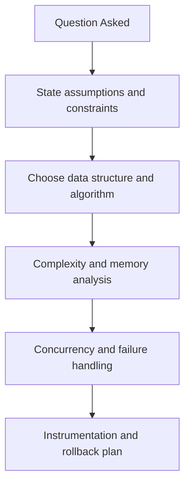
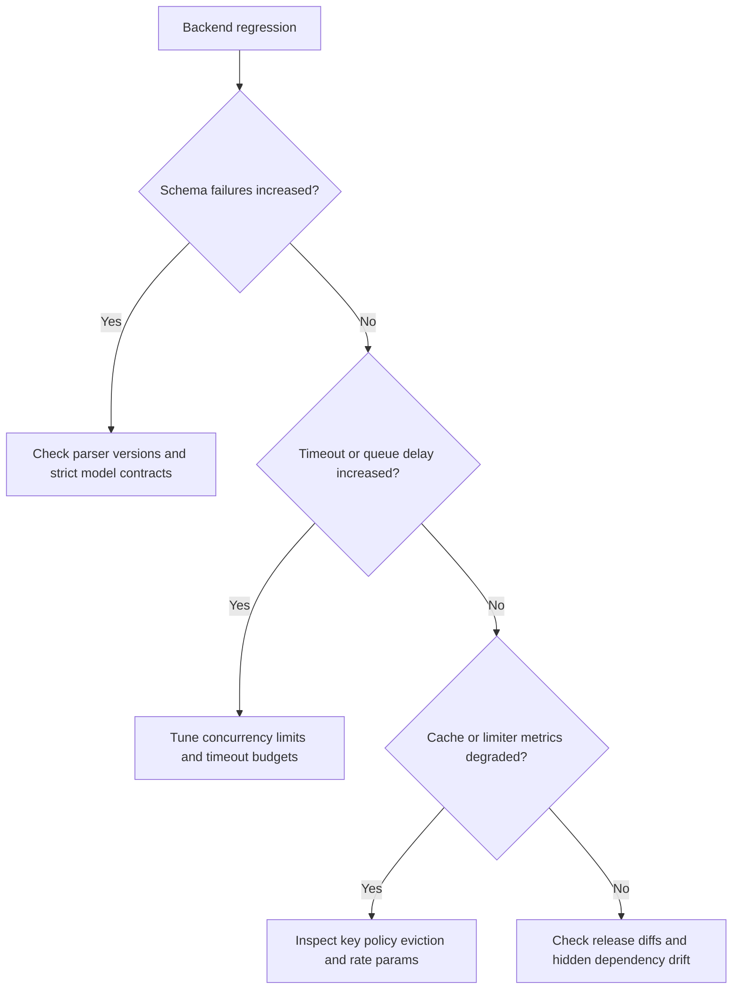

# Python and DSA for AI Systems Interview Questions

## Scope
This file targets advanced coding and backend systems interviews where Python engineering and DSA decisions are evaluated together.

## How To Use This File
- For top questions, practice four layers:
  1. short answer
  2. deep answer
  3. follow-up ladder
  4. anti-pattern answer to avoid
- Always include complexity plus production implications (latency, memory, reliability).

## Interviewer Probe Map
- Can you map algorithm design to production constraints?
- Can you reason about concurrency and partial failures?
- Can you debug with metrics instead of guesswork?

Figure: Recommended answer path for Python/DSA system interviews.

## Question Clusters
- Foundations: Q1 to Q10
- Systems and Scale: Q11 to Q20
- Debugging and Incidents: Q21 to Q30

## Foundations

### Q1: Design a thread-safe LRU cache
What interviewer is probing:
- O(1) structure design under concurrent access.

Short answer:
Use hash map plus doubly linked list for O(1) get/put, with explicit locking strategy and eviction metrics.

Deep answer:
1. Clarify scope: single process multi-thread, or distributed.
2. Use map for key lookup and linked list for recency updates.
3. Protect composite operations with lock (or shard-level locks).
4. Define eviction, TTL policy, and stale key cleanup.
5. Instrument hit ratio and lock contention.

Follow-up ladder:
- How would you shard cache to reduce contention?
- How do TTL and LRU interact under bursty traffic?

Anti-pattern answer:
"Use dict and it is thread-safe" without lock/atomicity discussion.

### Q2: Implement per-user plus global rate limiter
What interviewer is probing:
- Sliding window/token bucket correctness and fairness.

Short answer:
Use token bucket for burst handling with separate per-user and global buckets, enforcing checks in deterministic order.

Deep answer:
1. Define fairness target and burst allowance.
2. Apply per-user gate first, then global gate.
3. Use bounded state with TTL cleanup.
4. For multi-instance services, store counters in Redis with atomic operations.
5. Export reject reasons for monitoring and tuning.

Follow-up ladder:
- How do you prevent noisy-neighbor dominance?
- How do you handle clock skew in distributed limiters?

Anti-pattern answer:
Unbounded per-user maps with no cleanup plan.

### Q3: Build top-k trending intents from stream
What interviewer is probing:
- Heap plus hash map design in streaming settings.

Short answer:
Maintain counts in hash map and bounded min-heap for top-k candidates.

Deep answer:
Use map for O(1) count updates and min-heap of size k for ranking. Discuss stale heap entries strategy (lazy deletion or index map). Explain update complexity and memory bounds.

### Q4: Async fan-out with timeout budget
What interviewer is probing:
- Async orchestration and cancellation safety.

Short answer:
Bound concurrency with semaphore, apply per-task timeouts, and propagate cancellation.

Deep answer:
Derive child budgets from request deadline. Start tasks with bounded fan-out, collect partial results safely, classify failures, and degrade gracefully. Ensure canceled parent request stops all child work.

### Q5: Detect cycles in tool execution DAG
What interviewer is probing:
- Graph correctness and failure explanation.

Short answer:
Use DFS color states or Kahn topological sort; fail fast with cycle path details.

Deep answer:
Validate graph before execution, include cycle path in error output, and prevent runtime deadlocks. Add per-node retry budget and failure policy for downstream dependencies.

### Q6: Many duplicate requests arrive together
What interviewer is probing:
- Single-flight and idempotency control.

### Q7: Parse unreliable model JSON safely
What interviewer is probing:
- Typed contracts and safe fallback behavior.

### Q8: Sliding-window max for real-time latency dashboard
What interviewer is probing:
- Monotonic queue usage and bounded memory.

### Q9: K-way merge for retrieval results
What interviewer is probing:
- Heap-driven merge and ranking stability.

### Q10: Retry policy design by exception taxonomy
What interviewer is probing:
- Reliability-aware Python error handling.

## Systems and Scale

### Q11: Multi-tenant cache isolation strategy
What interviewer is probing:
- Data isolation and eviction fairness.

### Q12: Queue design with priority aging
What interviewer is probing:
- Throughput-fairness tradeoff reasoning.

### Q13: Bounded in-flight request registry design
What interviewer is probing:
- Memory safety and dedup effectiveness.

### Q14: Distributed rate limiter with Redis
What interviewer is probing:
- Atomicity and consistency in shared counters.

### Q15: Backpressure design in async pipelines
What interviewer is probing:
- Overload containment.

### Q16: Choosing data structures for p95 latency SLO
What interviewer is probing:
- Complexity-to-SLO translation.

### Q17: Safe schema evolution in Python services
What interviewer is probing:
- Backward compatibility and runtime stability.

### Q18: Designing bounded retries to avoid retry storms
What interviewer is probing:
- Failure amplification controls.

### Q19: Memory leak investigation in long-lived workers
What interviewer is probing:
- Runtime diagnostics and cleanup strategy.

### Q20: Caching prompt prefixes without stale output bugs
What interviewer is probing:
- Correctness boundaries for cache keys.

## Debugging and Incidents

### Q21: p95 latency spike but p50 stable
What interviewer is probing:
- Queueing and tail-latency diagnosis.

### Q22: Error rate spike after parser update
What interviewer is probing:
- Contract drift and rollback decision-making.

### Q23: Limiter rejects too much good traffic
What interviewer is probing:
- Parameter tuning and fairness debugging.

### Q24: Cache hit rate collapses after deploy
What interviewer is probing:
- Key design and invalidation diagnosis.

### Q25: Async tasks keep running after client disconnect
What interviewer is probing:
- Cancellation propagation correctness.

### Q26: Duplicate writes observed during retries
What interviewer is probing:
- Idempotency key enforcement and side-effect safety.

### Q27: Scheduler starvation for low-priority queue
What interviewer is probing:
- Fairness controls and queue policy.

### Q28: CPU usage spikes under moderate QPS
What interviewer is probing:
- Data-structure inefficiencies and hot loops.

### Q29: Partial failures hide behind success status
What interviewer is probing:
- Response semantics and observability integrity.

### Q30: Post-incident hardening plan for Python backend
What interviewer is probing:
- Systemic prevention and regression test strategy.

Figure: Triage tree for Python and DSA backend incidents.

## Rapid-Fire Round
- Two reasons p95 can degrade while p50 looks healthy.
- One safe retry policy for a write path.
- Two ways to prevent cache stampede.
- One sign your limiter is overblocking.

## Company Emphasis
- Amazon:
  - complexity plus operational outcomes.
  - measurable rollback and guard conditions.
- Google:
  - deeper edge-case rigor and algorithmic follow-ups.
  - stronger emphasis on formal complexity reasoning.
- Startup:
  - pragmatic implementation speed with reliability basics.
  - clear tradeoffs under limited infrastructure.

## References
- [python-for-ai-systems.md](../explainers/python-for-ai-systems.md)
- [dsa-patterns-for-ai-backends.md](../explainers/dsa-patterns-for-ai-backends.md)
- Python asyncio docs: https://docs.python.org/3/library/asyncio.html
