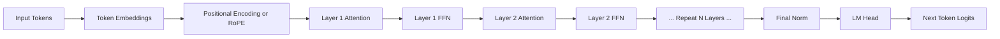
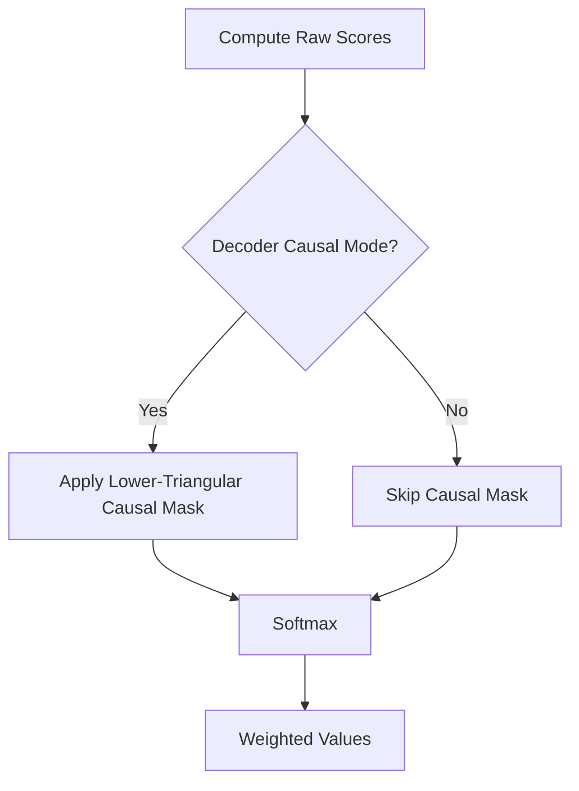
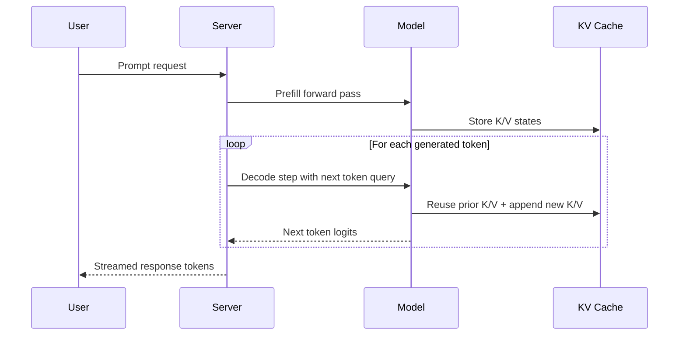

# Attention and Transformer Internals

## Why This Matters in 2026
If you cannot explain attention from first principles, you cannot reliably debug transformer behavior, tune serving latency, choose model architecture, or defend tradeoffs in interviews. Modern GenAI roles expect both theory fluency and production intuition.

## Prerequisites
- Basic linear algebra: vectors, matrix multiplication, dot product.
- Optimization intuition: gradients, softmax behavior, numerical stability.
- Familiarity with tokenization and context windows.

## Mental Model
Each transformer layer does two things:
1. Context mixing via attention: each token gathers information from other tokens.
2. Feature transformation via FFN: each token representation is nonlinearly transformed.

Stacking layers alternates these two operations, progressively refining token states for prediction.



Figure: High-level decoder-only transformer data path.

## Deep Technical Breakdown

### 1. From Recurrence to Attention
RNN-style models process sequence elements step by step. This creates a training bottleneck because time steps cannot be parallelized effectively. Attention-based models trade sequential recurrence for dense token-token interaction, enabling strong accelerator utilization during training.

Key tradeoff:
- Training: attention is highly parallelizable.
- Inference: autoregressive decoding is still sequential over output tokens.

Common misconception:
- "Transformers are fully parallel, so inference is always fast."

Production implication:
- Tail latency in generation is dominated by decode loop behavior and KV cache efficiency, not only raw FLOPs.

### 2. Q, K, V Geometry
For each token representation x:
- Query q asks "what context do I need?"
- Key k advertises "what context do I offer?"
- Value v carries the information to aggregate.

Attention scores are computed from query-key interactions, then used to weight values.

### 3. Scaled Dot-Product Attention and Stability
Core equation:

$$
\mathrm{Attention}(Q, K, V) = \mathrm{softmax}\left(\frac{QK^T}{\sqrt{d_k}} + M\right)V
$$

Where:
- d_k is key/query dimension.
- M is mask (causal and/or padding).

Why divide by $\sqrt{d_k}$:
- Dot-product magnitude grows with dimension.
- Large magnitudes cause softmax saturation.
- Saturated softmax hurts gradient flow.

Interview-safe derivation intuition:
- If q and k components are roughly independent with unit variance, variance of q.k scales with d_k.
- Dividing by $\sqrt{d_k}$ normalizes scale and keeps logits in a trainable range.

```mermaid
flowchart LR
    X[Token States X] --> Q[Q = XWq]
    X --> K[K = XWk]
    X --> V[V = XWv]
    Q --> S[Scores = QK^T]
    K --> S
    S --> T[Scale by 1/sqrt(dk)]
    T --> U[Add Mask]
    U --> P[Softmax]
    P --> O[Weighted Sum with V]
    V --> O
```

Figure: Scaled dot-product attention pipeline.

### 4. Masking and Information Leakage
Decoder-only models require strict causal masking so position i cannot attend to future positions j > i.

If masking is wrong:
- Training can leak future tokens.
- Validation may look deceptively good.
- Generation fails in real inference.



Figure: Masking decision in attention flow.

### 5. Multi-Head Attention and Head Diversity
Multi-head attention runs multiple low-dimensional attention operations in parallel.

Formal structure:

$$
\mathrm{MHA}(Q,K,V)=\mathrm{Concat}(h_1,\dots,h_m)W^O
$$

Where each head h_i is attention over head-specific projections.

Why this helps:
- Different heads can capture different relational patterns.
- Improves representational capacity without one very wide single-head map.

Production note:
- More heads do not automatically mean better latency-quality tradeoff.
- Head count should be tuned with architecture and hardware constraints.

### 6. Residual Paths, LayerNorm, and RMSNorm
Residual connection:

$$
x_{l+1}=x_l+F_l(x_l)
$$

Residual pathways support gradient propagation through deep stacks.

LayerNorm normalizes per token across feature dimensions, improving training stability. Many modern models use RMSNorm variants to reduce compute overhead.

Common misconception:
- "Normalization and residuals are minor details."

Reality:
- These are structural stability components in deep transformers.

### 7. Feed-Forward Networks (FFN) and Hidden Expansion
FFN is applied independently to each position after attention mixing:

$$
\mathrm{FFN}(x)=W_2\,\sigma(W_1x+b_1)+b_2
$$

Typical architecture expands dimensionality then projects back. FFN often contributes large parameter share and substantial compute.

Activation choice (GELU, SwiGLU variants) influences convergence and quality.

### 8. Positional Information: Absolute, Relative, and Rotary
Self-attention alone is permutation-invariant. Position information must be injected.

Common families:
- Absolute learned embeddings.
- Sinusoidal absolute encodings.
- Relative schemes (including RoPE/rotary behavior).

Production implication:
- Positional strategy affects long-context behavior and extrapolation quality.

### 9. Decoder-Only vs Encoder-Decoder Tradeoffs
Decoder-only dominates current LLM deployment due to strong generative performance and simpler serving path.

Encoder-decoder still matters for some seq2seq tasks but adds architectural complexity.

Interview framing:
- Do not claim one is universally superior.
- Tie architecture choice to task and operational constraints.

### 10. Inference Pipeline: Prefill vs Decode
Serving has two distinct phases:
- Prefill: process prompt tokens.
- Decode: generate new tokens iteratively.

Long prompts increase prefill cost. Long outputs increase decode cost.



Figure: Prefill and decode lifecycle with KV cache reuse.

### 11. Complexity and Bottleneck Intuition
Attention interaction cost over sequence length scales approximately with pairwise token interactions, which becomes expensive at long context.

Practical bottlenecks:
- Prompt-heavy workloads: prefill pressure.
- Generation-heavy workloads: decode loop and cache bandwidth pressure.

### 12. Debugging Playbook for Transformer Behavior
When outputs degrade, debug in order:
1. Tokenization and prompt template sanity.
2. Masking correctness.
3. Sequence length and truncation handling.
4. KV cache correctness in serving path.
5. Quantization or precision regressions.

Symptoms and likely causes:
- Repetitive loops: decoding params, sampling strategy, cache bugs.
- Sudden hallucination rise: retrieval/prompt mismatch, truncation, wrong context composition.
- Latency spikes: batching imbalance, queue pressure, long prefill inputs.

## Practical Implementation Lab
- Goal: move from toy attention implementation to performance-aware transformer understanding.
- Lab A: Core attention correctness
  1. Build single-head attention in PyTorch.
  2. Extend to multi-head attention and verify tensor shapes.
  3. Add causal mask and write assertions to prevent leakage.
- Lab B: Stability and scaling behavior
  1. Compare scaled vs unscaled logits.
  2. Track softmax entropy and gradient norms.
- Lab C: Inference behavior
  1. Simulate prefill and decode phases.
  2. Measure latency as prompt length and generated length vary.
  3. Track memory growth with KV cache.
- Metrics to track:
  - shape correctness and mask correctness checks
  - per-phase latency (prefill and decode)
  - cache memory growth by sequence length
  - output quality regression under precision changes

## Production Tradeoffs
- Latency:
  - Longer context can dominate prefill.
  - Decode speed depends on cache and scheduler efficiency.
- Cost:
  - Token volume and model size dominate serving spend.
  - Poor prompt hygiene can waste tokens without quality gain.
- Reliability:
  - Mask or cache bugs produce hard-to-detect regressions.
  - Versioned eval gates are required before rollout.
- Safety:
  - Architecture-level understanding helps identify brittle failure modes early.
  - Context control and schema constraints reduce unsafe output risk.

## Common Pitfalls
- Explaining formulas without connecting to production consequences.
- Treating context-window growth as free quality improvement.
- Ignoring truncation and tokenization mismatch during debugging.
- Overlooking prefill vs decode split when tuning latency.
- Evaluating architecture changes without fixed eval sets.

## Interview Bridge
- Related interview file: [transformers-and-tokenization-questions.md](../interviews/transformers-and-tokenization-questions.md)
- Key follow-up questions:
  - Derive and explain scaling by $\sqrt{d_k}$ in practical terms.
  - Why can larger context windows hurt quality in some setups?
  - How do you isolate a KV cache bug from a prompting bug?
  - When would you choose RAG instead of increasing context length?

## References
- Attention Is All You Need: https://arxiv.org/abs/1706.03762
- Hugging Face Transformers docs: https://huggingface.co/docs/transformers/main/en/index
- vLLM PagedAttention overview: https://blog.vllm.ai/2023/06/20/vllm.html
- vLLM docs: https://docs.vllm.ai/en/latest/
- FlashAttention paper: https://arxiv.org/abs/2205.14135
- RoPE paper: https://arxiv.org/abs/2104.09864
- ALiBi paper: https://arxiv.org/abs/2108.12409
