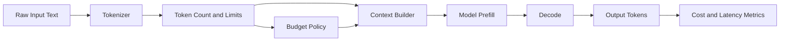
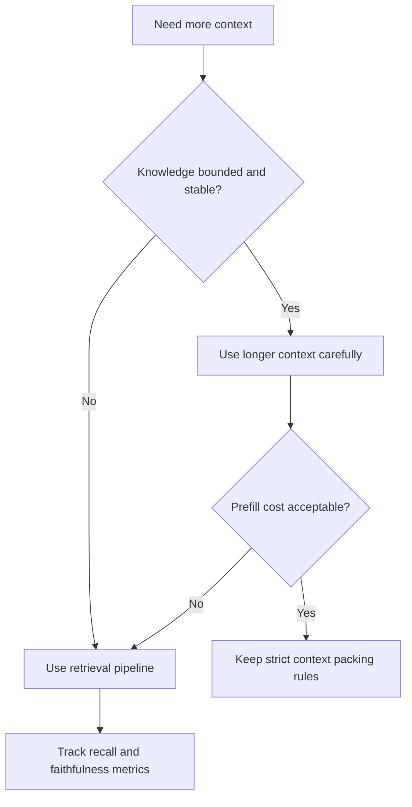
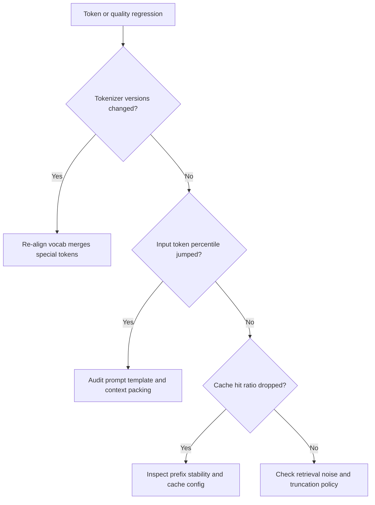

# Tokenization, Context Window, and Cost Engineering

## Why This Matters in 2026
Many GenAI outages and budget overruns are token engineering failures: tokenizer mismatch, context over-packing, and missing token guardrails. Teams that treat token budget as a core systems resource ship faster and cheaper with fewer regressions.

## Mental Model
Token budget is a constrained systems budget.

Operationally:
- more input tokens increase prefill latency and cost
- more output tokens increase decode latency and cost
- irrelevant context increases both spend and hallucination risk

Figure: Token lifecycle from text to runtime cost.

## 1. Tokenization Internals You Need

### Why Token Count Surprises Happen
Tokenizers are subword systems, not word counters. Equivalent human-length strings can map to very different token counts based on:
- language and script
- punctuation density
- code/log syntax
- whitespace conventions

### Common Families
- BPE-style: merge frequent symbol pairs.
- Unigram/SentencePiece-style: probabilistic subword selection.

In interviews, explain that tokenizer choice affects sequence length distribution, which directly affects serving economics.

## 2. Tokenizer Parity and Compatibility
Tokenizer mismatch between training, eval, and serving is a major hidden regression source.

Keep these version-locked:
- vocabulary file
- merges/tokenization rules
- special tokens and template markers
- truncation and padding policy

If parity is broken, quality failures can look like model drift while root cause is preprocessing drift.

## 3. Context Window: Capacity vs Utility
Large window capacity does not guarantee better answers.

Failure modes at long context:
- critical evidence pushed out by noisy context
- attention dilution on weakly relevant chunks
- sharp prefill latency and cost growth

Treat context as ranked evidence, not a dumping area.

## 4. Prompt Packing Strategy
A high-efficiency prompt pack usually contains:
1. minimal system policy block
2. compact instruction and format contract
3. highest-signal retrieved evidence only
4. explicit citation/uncertainty rule

Avoid duplicate evidence and repeated policy fragments across turns.

## 5. Context Strategy Decision: Long Window vs RAG
Use long window when knowledge is bounded and stable. Use RAG when knowledge is large, dynamic, or private.

Figure: Decision path for context expansion versus retrieval.

## 6. Cost Model and Budget Controls
Practical cost decomposition should track:
- input tokens
- output tokens
- cached prefix tokens
- retry tokens from failures

Add policy limits per endpoint and user tier:
- max input tokens
- max output tokens
- hard reject vs safe summarize fallback

Budget guardrails are as important as latency SLOs.

## 7. Caching and Reuse
Prefix/prompt caching can significantly reduce repeated prefill work when shared prompt prefixes are stable.

Good cache policy requires:
- stable canonical prompt prefixes
- cache hit/miss observability
- explicit invalidation when policy text changes

## 8. Monitoring and Alerting
Minimum token dashboard:
- input/output token percentiles
- cached token ratio
- token cost per successful task
- truncation count and overflow count
- token distribution by endpoint and language

Alerts should trigger on sudden token-shape shifts, not only average cost drift.

## 9. Debugging Playbook

### Symptom: Cost spike without traffic spike
Likely causes:
- prompt template bloat
- repeated context insertion
- retry storms

### Symptom: Quality drop after tokenizer update
Likely causes:
- vocab/merge mismatch
- changed special token handling
- inconsistent truncation rules

### Symptom: Latency spike only on multilingual requests
Likely causes:
- tokenization expansion for certain scripts
- missing routing or budget adaptation by language

Figure: Fast triage for tokenization and context regressions.

## Practical Implementation Lab (Advanced)
Goal: build a token governance layer for a production assistant endpoint.

1. Log token breakdown per request stage.
2. Add tokenizer parity check in CI.
3. Implement endpoint-level token budget guards.
4. Add prompt packing rules with deduplication.
5. Compare long-context and RAG variants on fixed eval slices.
6. Add alerting for token distribution drift.

Track:
- tokens per successful task
- p95 latency
- cost per request
- truncation/overflow rate
- answer faithfulness under budgeted prompts

## Common Pitfalls
- Assuming bigger context always improves quality.
- Ignoring tokenizer version pinning across environments.
- Missing token guardrails in API layer.
- Measuring only average tokens, not distribution tails.

## Interview Bridge
- Related interview file: [transformers-and-tokenization-questions.md](../interviews/transformers-and-tokenization-questions.md)
- Questions this explainer supports:
  - How do you cut token cost without quality collapse?
  - When should you choose RAG over long context windows?
  - How do you detect tokenizer drift quickly?

## References
- Hugging Face tokenizers docs: https://huggingface.co/docs/tokenizers/en/index
- SentencePiece paper: https://arxiv.org/abs/1808.06226
- OpenAI eval guides: https://platform.openai.com/docs/guides/evals
- vLLM prefix caching: https://docs.vllm.ai/en/latest/features/automatic_prefix_caching/
