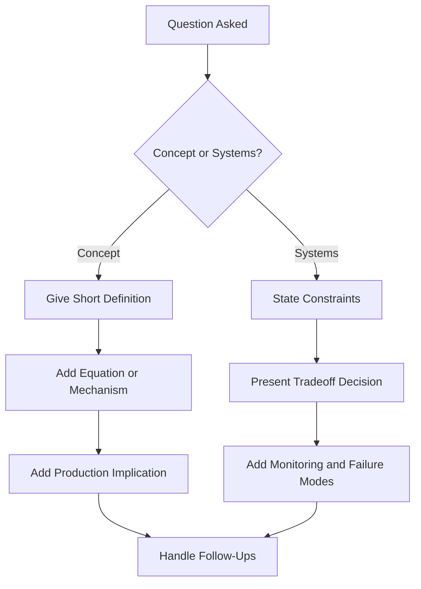
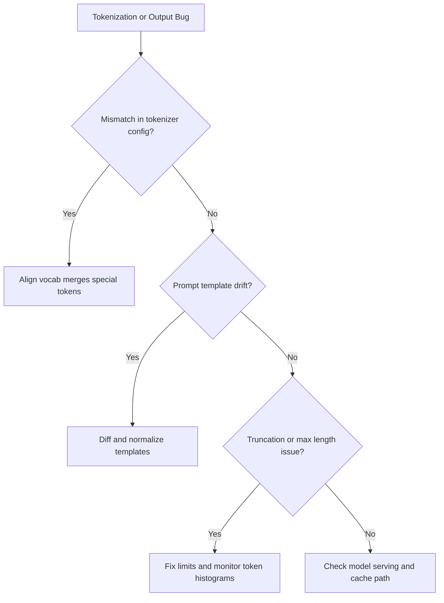
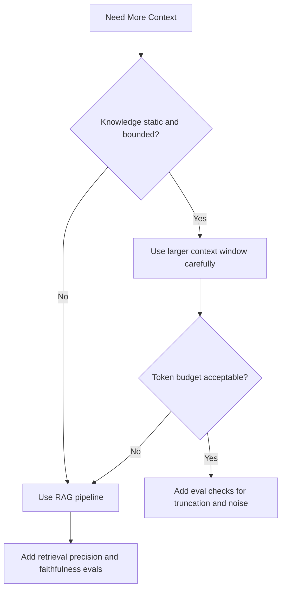

# Transformers and Tokenization Interview Questions

## Scope
This file prepares deep technical interviews on transformer internals, tokenization behavior, and production tradeoffs.

## How To Use This File
- Start with Foundation cluster.
- For top questions, practice all four answer layers:
  1. short answer
  2. deep answer
  3. follow-up ladder
  4. anti-pattern answer to avoid
- Use linked explainers for concept refresh before mocks.

## Interviewer Probe Map
- Can you derive attention behavior, not just define it?
- Can you connect architecture choices to latency, cost, and reliability?
- Can you debug transformer/tokenization failures systematically?
- Can you defend tradeoffs for different company environments?

Figure: Recommended answer flow during transformer interviews.

## Question Clusters
- Foundation: Q1 to Q10
- Systems and Production: Q11 to Q20
- Debugging and Optimization: Q21 to Q30

## Core Questions

### Q1: Walk through scaled dot-product attention
What interviewer is probing:
- Correct conceptual and tensor-level understanding from first principles.

Short answer:
Attention computes token-token relevance scores from queries and keys, normalizes with softmax, and uses these weights to aggregate values.

Deep answer:
1. Input token states X are projected into Q, K, V.
2. Score matrix is QK^T.
3. Scores are scaled by 1/sqrt(d_k) to prevent softmax saturation.
4. Add mask M (causal or padding).
5. Apply softmax over key dimension.
6. Multiply normalized weights with V to produce context-aware outputs.
7. Multi-head repeats this in parallel subspaces then concatenates and projects.

Follow-up ladder:
- Level 1: Why is scaling required?
- Level 2: Where do masking bugs appear in outputs?
- Level 3: How does this affect long-context latency?
- Level 4: How do fused kernels change practical performance?

Anti-pattern answer:
"Attention is when the model focuses on important words" without formula path, masking, or production implications.

Common mistakes:
- Ignoring causal mask in decoder contexts.
- Formula-only answer with no operational meaning.

### Follow-up: Why divide by sqrt(d_k)?
What interviewer is probing:
- Numerical stability and optimization intuition.

Short answer:
Scaling normalizes logit magnitude so softmax does not saturate as dimensions grow.

Deep answer:
If q and k components are roughly independent with unit variance, q.k variance grows with d_k. Large unscaled logits create near one-hot softmax outputs and poor gradient flow. Dividing by sqrt(d_k) keeps logits in a trainable regime and improves convergence stability.

Follow-up ladder:
- What if scaling is omitted?
- How does mixed precision amplify the problem?

Anti-pattern answer:
"The paper does it" with no statistical intuition.

### Q2: Why multi-head attention?
What interviewer is probing:
- Representation diversity and architecture tradeoff reasoning.

Short answer:
Multiple heads let the model learn different relational patterns in parallel low-dimensional projections.

Deep answer:
Single-head attention compresses all interaction patterns into one score map. Multi-head attention decomposes this into parallel subspaces, allowing local, long-range, and structural relationships to co-exist. Practical benefit appears in richer features and improved quality at manageable compute cost.

Follow-up ladder:
- Why do some heads become redundant?
- Would more heads always help?

Anti-pattern answer:
"More heads means more accuracy" without discussing diminishing returns.

### Q3: Decoder-only vs encoder-decoder choice
What interviewer is probing:
- Architecture tradeoff reasoning.

Short answer:
Decoder-only is simpler and dominant for generative LLM serving; encoder-decoder can still be better for some seq2seq workloads.

Deep answer:
Decoder-only models unify prompt and generation in one autoregressive path and align well with next-token pretraining. Encoder-decoder models separate encoding and decoding, useful in translation or tightly structured transformation tasks. In production, decoder-only often wins for ecosystem support and serving simplicity, but architecture should be tied to task shape and latency budget.

Follow-up ladder:
- Which architecture better reuses encoded context?
- How does this impact tool-calling systems?

Anti-pattern answer:
Declaring one architecture universally best.

### Q4: Tokenization mismatch bug diagnosis
What interviewer is probing:
- Production debugging mindset.

Short answer:
Check tokenizer parity and special-token settings first, then compare train and inference token sequences directly.

Deep answer:
1. Verify tokenizer version, vocab, merges, and special tokens are identical across training and inference.
2. Diff tokenized outputs for representative samples.
3. Validate prompt templates and system-prefix changes.
4. Confirm truncation and max-length policies.
5. Re-run eval subset after fixes.

Follow-up ladder:
- How would mismatch show in metrics?
- How do you prevent recurrence in CI?

Anti-pattern answer:
Assuming mismatch is model drift without checking tokenization artifacts.

### Q5: Context window vs RAG decision
What interviewer is probing:
- Cost/quality tradeoff judgment.

Short answer:
Use larger context when relevant evidence is bounded and stable; use RAG when knowledge is large, dynamic, or private.

Deep answer:
Larger context increases prefill cost and may add noise. RAG isolates relevant evidence and improves grounding for changing corpora. Decision factors: document churn, required citation fidelity, latency SLO, and token budget. In most enterprise workloads, RAG plus controlled context beats brute-force long prompts.

Follow-up ladder:
- How do you detect over-context degradation?
- What metrics prove RAG is helping?

Anti-pattern answer:
"Always use the largest context model available."

### Q6: Token budget optimization strategy
What interviewer is probing:
- Systems-level optimization and prioritization.

Short answer:
Optimize context composition, caching, and retrieval quality before reducing output quality.

Deep answer:
Track per-request token cost and break it into system prompt, retrieved context, and generated output. Remove redundant prompt boilerplate, enforce top-k evidence constraints, use prefix caching, and add routing so simple queries avoid expensive paths. Validate quality with regression evals after each change.

Follow-up ladder:
- Which component usually dominates cost?
- How do you keep optimization from hurting faithfulness?

Anti-pattern answer:
Blindly lowering max tokens without quality checks.

### Q7: Explain causal masking failure impact
What interviewer is probing:
- Data leakage awareness and model correctness.

Short answer:
Incorrect causal masking leaks future information during training and creates unrealistic evaluation performance.

Deep answer:
If future tokens leak into current-token predictions, loss decreases artificially and the model learns dependencies unavailable at inference time. This mismatch causes generation instability and rapid quality drop in production.

### Q8: Prefill vs decode bottleneck diagnosis
What interviewer is probing:
- Serving pipeline understanding.

Short answer:
Prompt-heavy requests stress prefill; long generation stresses decode and cache bandwidth.

Deep answer:
Measure latency split per phase. High prompt length with moderate output suggests prefill optimization (prompt compression, caching). Long output with modest prompt points to decode efficiency, scheduler policy, and KV-cache pressure.

### Q9: Explain KV cache in one production paragraph
What interviewer is probing:
- Practical inference acceleration reasoning.

Short answer:
KV cache stores prior key/value states so each decode step reuses history instead of recomputing full attention over all previous tokens.

Deep answer:
Without cache, decode would repeatedly recompute historical attention states, exploding cost. With cache, each new token computes incremental states and attends over cached history. Tradeoff is memory growth proportional to sequence length, which requires careful cache management and batching policies.

### Q10: Positional encoding choices
What interviewer is probing:
- Long-context behavior reasoning.

Short answer:
Positional strategies inject order information and influence long-context quality and extrapolation behavior.

Deep answer:
Absolute learned embeddings are simple but can be less robust beyond trained lengths. Relative and rotary schemes better preserve position relationships under context growth. Choice should reflect target context length, hardware constraints, and model family compatibility.

## Systems and Production Questions

### Q11: Why does latency grow faster than expected at long context?
What interviewer is probing:
- Complexity and serving realism.

Strong answer framework:
1. Check attention complexity effects and prefill burden.
2. Check batching and queue delay.
3. Check cache memory pressure and fallback behavior.

### Q12: How do you benchmark transformer serving safely?
What interviewer is probing:
- Experiment design discipline.

Strong answer framework:
1. Fix workload distributions (prompt/output lengths).
2. Track p50, p95, p99, throughput, and error rate.
3. Add quality regression checks for each optimization.

### Q13: Quantization rollout strategy for production
What interviewer is probing:
- Quality-risk management under optimization pressure.

### Q14: How do you detect context truncation regressions?
What interviewer is probing:
- Observability and evaluation design.

### Q15: Batch size tuning under strict p95 SLO
What interviewer is probing:
- Throughput vs tail latency tradeoffs.

### Q16: Long prompt injection defense in context-heavy systems
What interviewer is probing:
- Security controls tied to architecture.

### Q17: Which metrics trigger rollback after model swap?
What interviewer is probing:
- Production ownership and incident response.

### Q18: When should you use smaller specialist model routing?
What interviewer is probing:
- Cost/performance optimization judgment.

### Q19: How do you isolate model regression from retrieval regression?
What interviewer is probing:
- Layered debugging methodology.

### Q20: How do you choose model families for multilingual and code-heavy traffic?
What interviewer is probing:
- Tokenization-aware product design.

## Debugging and Optimization Questions

### Q21: Repetition loops during generation
What interviewer is probing:
- Decoding control and stability debugging.

### Q22: Sudden token cost spike week-over-week
What interviewer is probing:
- Monitoring and change attribution.

### Q23: High p95 with healthy p50
What interviewer is probing:
- Tail latency bottleneck reasoning.

### Q24: Model performs well offline but fails in production
What interviewer is probing:
- Distribution shift and integration gaps.

### Q25: Inconsistent outputs across seemingly same prompts
What interviewer is probing:
- Hidden variable detection (temperature, templates, truncation).

### Q26: Tool-call JSON malformed intermittently
What interviewer is probing:
- Structured output constraints and parsing resilience.

### Q27: Attention head visualizations look noisy
What interviewer is probing:
- Interpretability caution and proper conclusions.

### Q28: RAG context improves recall but hurts answer quality
What interviewer is probing:
- Context noise and reranking decisions.

### Q29: Tokenizer upgrade broke backward compatibility
What interviewer is probing:
- Migration strategy and regression controls.

### Q30: Streaming output stalls under load
What interviewer is probing:
- Backpressure and scheduler diagnosis.

Figure: Tokenization and output debugging decision tree.

Figure: Context-window versus RAG decision path.

## Rapid-Fire Round
- Why bigger context can reduce quality in practice.
- KV cache role in decode speed.
- Three ways to reduce token cost quickly.
- One sign your masking is wrong.
- Two causes of high p95 but normal p50.

## Company Emphasis
- Amazon:
  - prioritize tradeoff articulation and operational impact.
  - emphasize measurable rollout and rollback criteria.
- Google:
  - expect deeper theory follow-ups and derivation clarity.
  - justify architecture choices with stronger first-principles reasoning.
- Startup:
  - prioritize pragmatic fixes, velocity, and cost discipline.
  - show fast diagnosis and iterative improvement loops.
- AI labs:
  - emphasize frontier reasoning and architecture nuance.
  - connect design choices to scaling behavior.

## References
- [attention-and-transformer-internals.md](../explainers/attention-and-transformer-internals.md)
- [tokenization-context-window-and-cost.md](../explainers/tokenization-context-window-and-cost.md)
- Attention Is All You Need: https://arxiv.org/abs/1706.03762
- vLLM docs: https://docs.vllm.ai/en/latest/
- OpenAI eval guidance: https://developers.openai.com/api/docs/guides/evals
